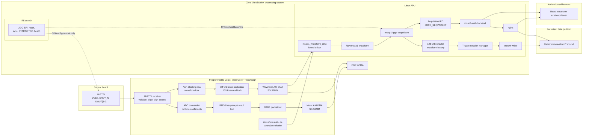
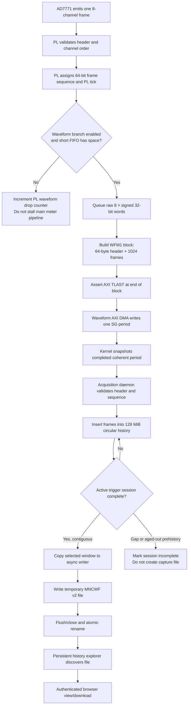
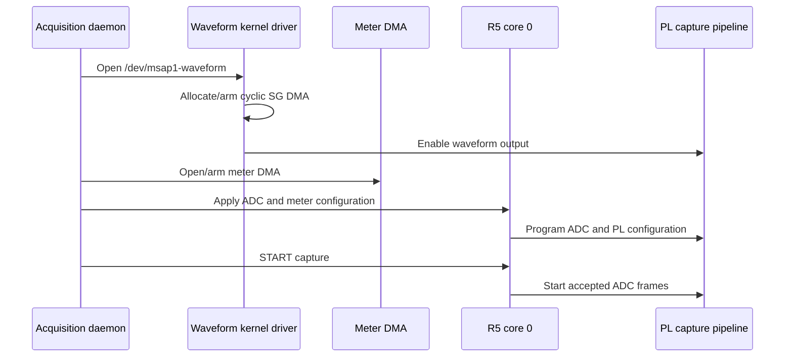
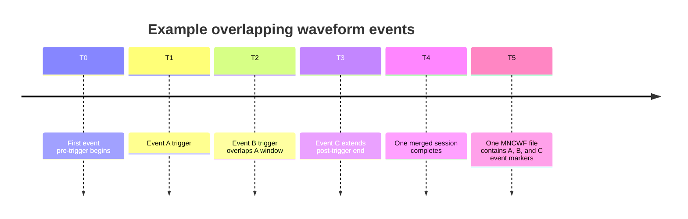
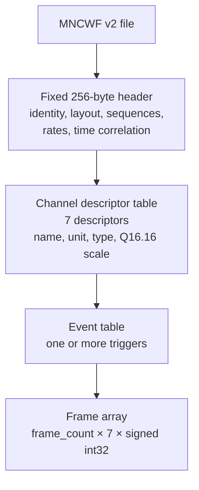
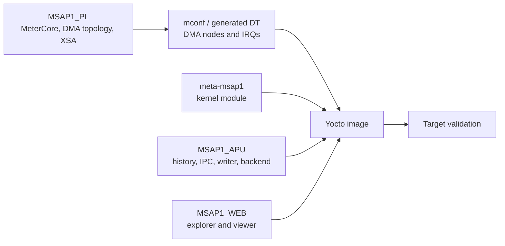

# MSAP1 waveform capture architecture and implementation

## Document purpose

This document describes the implemented MSAP1 waveform capture subsystem from
the AD7771 sample interface to persistent waveform files and the Web viewer. It
is intended as source material for a future developer guide.

The document covers:

- why waveform capture is separate from the periodic meter-result path;
- ownership and responsibilities in PL, RPU, Linux/APU, Web, and Yocto;
- the live `WFM1` DMA transport and persistent `.mncwf` file formats;
- continuous history, pre-trigger capture, overlapping triggers, and file
  materialization;
- timestamp correlation between the PL and Linux;
- storage, authentication, reliability, and diagnostics;
- extension points for future PQ-event triggers and waveform processing.

The canonical byte-level `.mncwf` specification remains:

```text
applications/MSAP1_APU/docs/MNCWF_FILE_FORMAT.md
```

This document explains the complete system around that format. If a byte offset
or binary-layout detail differs between these documents, the canonical format
specification and the implementation source are authoritative.

---

## 1. Introduction

An electricity meter needs two data products with very different behavior:

1. **Periodic meter results**

   Voltage RMS, current RMS, frequency, counters, and future power/energy/PQ
   results are calculated in PL and sent to Linux as compact periodic `MTR1`
   records.

2. **High-resolution waveforms**

   Raw samples are required for debugging and for events that need the signal
   before and after a trigger. A waveform may contain hundreds of thousands or
   millions of frames, so it uses an independent streaming path and DMA engine.

The waveform system continuously sends raw ADC frames to a Linux-owned circular
history. A trigger does not start ADC sampling. Instead, it selects a time
window from the history:

```text
                   trigger
                      |
       pre-trigger    |    post-trigger
    <-----------------+----------------->
```

This is similar to a dash camera:

- sampling and history collection are continuous;
- the requested pre-trigger interval already exists when the event occurs;
- the system waits for the post-trigger interval;
- the selected longest window is written as a persistent `.mncwf` file.

This design avoids large on-chip history memory, keeps high-rate samples off
RPMsg, and permits multiple event sources to share one continuous capture
pipeline.

---

## 2. Design goals

The implementation follows these principles:

- **Never stall metering.** Waveform collection is an observational branch. A
  stopped Linux reader or full waveform FIFO must not backpressure AD7771
  capture, conversion, RMS, frequency, or `MTR1` generation.
- **Use an independent DMA.** Meter results and waveform samples have separate
  AXI DMA engines, interrupts, device-tree consumers, and Linux character
  devices.
- **Keep high-rate data out of RPMsg.** RPMsg remains a low-rate ADC
  configuration, capture-control, and health channel.
- **Capture before the trigger.** Linux maintains a 128 MiB waveform history
  ring so manual and future PQ-event triggers can request pre-trigger data.
- **Merge overlapping triggers.** Multiple events whose windows overlap are
  represented by one longest capture file, with every event retained in the
  event table.
- **Preserve raw samples.** Persistent files store raw signed ADC counts plus
  conversion metadata. A viewer can display raw counts or engineering units
  without storing two copies of every waveform.
- **Make failure explicit.** A transport gap intersecting a requested window
  produces an `incomplete` session; it must not silently produce a corrupt
  waveform file.
- **Use persistent product storage.** Completed captures are placed below
  `/data/mnc/waveform`, not in the root filesystem or volatile `/run`.
- **Protect waveform access.** Listing, viewing, downloading, and deleting
  captures are authenticated and role checked.

---

## 3. System ownership

| Layer | Owns | Does not own |
|---|---|---|
| PL | AD7771 frame reception; raw waveform fork; `WFM1` block generation; waveform control/status registers; AXI4-Stream source | DDR allocation, DMA descriptors, capture files, Web sessions |
| R5 core 0 | AD7771 SPI, reset, synchronization, operating point, capture START/STOP, ADC health | Meter DMA, waveform DMA, waveform triggers, history, files |
| R5 core 1 | Other product responsibilities | AD7771 and waveform capture |
| Linux kernel | Waveform AXI DMA S2MM, SG descriptors, coherent transport ring, interrupt handling, PL time-correlation ioctl | Long history, trigger policy, files, plotting |
| APU acquisition daemon | Sole waveform device owner; 128 MiB history; trigger/session management; timestamp correlation; `.mncwf` materialization | Direct ADC SPI access |
| Web backend | Authenticated waveform API and authorization decisions | DMA access and binary plotting |
| nginx | Authenticated delivery of large waveform files | Capture lifecycle and format interpretation |
| React frontend | Explorer, trigger UI, parser, raw/converted waveform plotting | Direct filesystem, RPMsg, or DMA access |
| Yocto/meta-msap1 | Device tree, driver, services, permissions, persistent mount, nginx routes, package integration | Product capture algorithms |

The ownership boundary is deliberate. In particular:

> The RPU controls whether the ADC capture pipeline is running, but waveform
> samples, triggers, history, timestamps, and files never travel through the
> RPU or RPMsg.

---

## 4. Structural architecture



The meter and waveform branches share the accepted ADC frame at their source,
then remain independent:

- `M_AXIS_METER` feeds the existing meter DMA.
- `M_AXIS_WAVEFORM` feeds a separate waveform DMA.
- Linux uses `/dev/msap1-meter` for meter results.
- Linux uses `/dev/msap1-waveform` for raw waveform blocks.

---

## 5. End-to-end waveform dataflow



The transport has two intentionally different formats:

| Format | Purpose | Lifetime | Channel count |
|---|---|---|---:|
| `WFM1` | Fixed-size PL-to-Linux DMA transport block | Live only | 8 |
| `.mncwf` | Self-describing persistent capture archive | Persistent | 7 in v2 |

`WFM1` is optimized for deterministic DMA periods. `.mncwf` is optimized for
long-term storage, tooling, conversion metadata, event annotation, and format
evolution.

---

## 6. PL implementation

### 6.1 Location and hierarchy

The waveform PL implementation is part of `MeterCore`, while the independent
waveform DMA remains system infrastructure in `TopDesign.bd`.

Primary files:

```text
applications/MSAP1_PL/SourceData/DesignFile/MeterCore/
├── meter_waveform.vhd
├── meter_waveform_axi_regs.vhd
├── meter_core.vhd
└── MeterCore_Wrapper.vhd

applications/MSAP1_PL/SourceData/BlockDesign/TopDesign/TopDesign.bd
applications/MSAP1_PL/SourceData/Script/AI_gen/integrate_waveform_capture.tcl
```

The wrapper exposes:

```text
M_AXIS_WAVEFORM     32-bit AXI4-Stream
S_AXI_WAVEFORM      Linux-owned AXI-Lite control/status
```

The waveform branch receives the original raw frame from conversion metadata:

```text
converted_source.user(383 downto 128)
```

This is the eight-channel, 256-bit raw frame:

```text
CH0, CH1, CH2, CH3, CH4, CH5, CH6, CH7
8 channels × 32-bit signed storage = 256 bits
```

### 6.2 Non-blocking fork

`meter_waveform.vhd` observes `frame_accept` and never drives the upstream AXI
`ready` signal. Each accepted ADC frame increments the global 64-bit waveform
sequence, even when:

- waveform output is disabled;
- the short PL waveform FIFO is full; or
- Linux is not accepting waveform AXI traffic.

When enabled and space is available, the module writes a 449-bit FIFO entry:

```text
raw samples                 256 bits
frame sequence               64 bits
PL tick                      64 bits
configuration generation     32 bits
measured frame rate          32 bits
frame-rate-valid               1 bit
                            --------
                             449 bits
```

The FIFO uses AMD XPM:

```text
xpm_fifo_sync
depth = 256 frames
read mode = FWFT
```

If the FIFO is full, the frame is intentionally dropped from the waveform
branch and the PL waveform drop counter increments. Meter calculation
continues. The sequence discontinuity makes the loss detectable by Linux.

### 6.3 PL timebase

The waveform module maintains:

- a free-running 64-bit PL tick incremented on every `aclk`;
- a 64-bit accepted-frame sequence incremented on every `frame_accept`.

The system PL clock is approximately:

```text
99,999,001 Hz
```

The exact live relationship to Linux `CLOCK_TAI` is measured by the kernel
correlation ioctl rather than inferred from a nominal constant.

### 6.4 WFM1 block packetizer

The packetizer emits one fixed block per 1024 frames:

```text
64-byte header
+ 1024 frames × 8 channels × 4 bytes
= 32,832 bytes
```

The AXI stream width is 32 bits. `TLAST` is asserted on the last word of the
1024th frame.

#### WFM1 header

All words are little-endian 32-bit values.

| Word | Field | Description |
|---:|---|---|
| 0 | Magic | `0x314D4657`, ASCII `WFM1` in little-endian storage |
| 1 | Version | `0x00010000` |
| 2 | Block bytes | `32832` |
| 3 | Frame count | `1024` |
| 4 | Frame bytes | `32` |
| 5 | First sequence low | Low 32 bits |
| 6 | First sequence high | High 32 bits |
| 7 | First PL tick low | Low 32 bits |
| 8 | First PL tick high | High 32 bits |
| 9 | Measured frame rate | Frames per second |
| 10 | Configuration generation | Active metering configuration |
| 11 | Status | Bit 0 rate valid; bit 1 PL waveform drops observed |
| 12 | Drop count | Cumulative PL waveform-branch drops |
| 13 | Block number | Cumulative emitted WFM1 blocks |
| 14 | Reserved | Zero |
| 15 | Reserved | Zero |

Following the header are 1024 frames. Every live frame contains:

| Position | Signal | Product meaning |
|---:|---|---|
| CH0 | ADC channel 0 | `Ia` |
| CH1 | ADC channel 1 | `Ib` |
| CH2 | ADC channel 2 | `Ic` |
| CH3 | ADC channel 3 | `In` |
| CH4 | ADC channel 4 | `Vc` |
| CH5 | ADC channel 5 | `Vb` |
| CH6 | ADC channel 6 | `Va` |
| CH7 | ADC channel 7 | Internal/debug channel |

CH7 remains available in live transport for diagnostics but is not stored in
new product waveform archives.

### 6.5 Waveform AXI-Lite control and correlation registers

The Linux-owned waveform register bank is mapped at:

```text
0xB007_0000, 64 KiB
```

Important offsets:

| Offset | Register | Description |
|---:|---|---|
| `0x00` | Version | `0x00010000` |
| `0x04` | Identifier | `0x31434657`, `WFC1` |
| `0x08` | Control | Bit 0 enable; write bit 1 latch correlation; bit 2 clear statistics |
| `0x0C` | Status | Live waveform state |
| `0x10` | Latched tick low | Correlation sample |
| `0x14` | Latched tick high | Correlation sample |
| `0x18` | Latched sequence low | Correlation sample |
| `0x1C` | Latched sequence high | Correlation sample |
| `0x20` | Live tick low | Current PL tick |
| `0x24` | Live tick high | Current PL tick |
| `0x28` | Live sequence low | Current frame sequence |
| `0x2C` | Live sequence high | Current frame sequence |
| `0x30` | Drop count | PL waveform FIFO drops |
| `0x34` | Block count | WFM1 blocks emitted |
| `0x38` | Block bytes | `0x00008040`, 32,832 bytes |

These registers are distinct from the waveform AXI DMA control registers:

```text
Waveform DMA AXI-Lite:       0xB006_0000
Waveform correlation/control: 0xB007_0000
```

### 6.6 TopDesign waveform DMA

`TopDesign.bd` contains an independent SG-enabled AXI DMA configured as:

```text
MM2S/read channel             disabled
S2MM/write channel            enabled
Scatter-Gather                enabled
Control/status stream         disabled
AXI address width             32 bits
S_AXIS_S2MM width             32 bits
M_AXI_S2MM width              128 bits
Maximum burst                 16
DRE/unaligned transfers       disabled
```

Connections:

```text
MeterCore/M_AXIS_WAVEFORM
    → Waveform_DMA/S_AXIS_S2MM

Waveform_DMA/M_AXI_S2MM
Waveform_DMA/M_AXI_SG
    → DMA memory SmartConnect
    → PS S_AXI_HP0_FPD
    → low DDR
```

The meter DMA and waveform DMA share the DDR memory interconnect but have
independent AXI masters and SG descriptor chains.

Interrupts are concatenated:

```text
bit 0  meter DMA S2MM interrupt
bit 1  waveform DMA S2MM interrupt
```

The Linux device tree maps them to separate GIC interrupts. The waveform DMA
uses SPI 90; the meter DMA uses SPI 89.

---

## 7. RPU implementation and deliberate non-participation

There is no waveform data implementation in `MSAP1_RPU`.

R5 core 0 continues to own:

- AD7771 SPI register access;
- ADC reset and synchronization;
- sample-rate and PGA programming;
- capture START/STOP;
- ADC register readback and health.

R5 core 1 does not own the ADC.

The waveform subsystem starts receiving frames only after the normal ADC
capture pipeline is started. Stopping ADC capture naturally stops new waveform
frames. However, the RPU does not:

- configure either Linux-owned DMA engine;
- allocate waveform buffers;
- issue waveform triggers;
- calculate Linux timestamps;
- maintain pre-trigger history;
- write or enumerate `.mncwf` files;
- carry waveform samples through RPMsg.

The APU may use the existing RPMsg capture control while starting or stopping
the complete acquisition service. Manual Web/CLI waveform triggers are local
APU operations and require no new RPMsg wire ABI.

This boundary is important because RPMsg is appropriate for low-rate commands
and health, not a multi-megabyte-per-second sample stream.

---

## 8. Linux kernel and DMA transport

### 8.1 Device-tree integration

The product device-tree fragment is:

```text
yocto-build/sources/meta-monutchee/meta-msap1/
    conf/dtsi/msap1-meter-dma.dtsi
```

It describes:

- the waveform AXI DMA S2MM channel;
- the DMA interrupt;
- the Linux-owned waveform AXI-Lite register bank;
- the DMA consumer node and `dma-names = "rx"`;
- the PL fabric clock relationship.

Linux access to RPU-owned ADC SPI and MeterCore configuration banks remains
disabled. The waveform control bank is intentionally Linux-owned.

The waveform buffers use Linux DMA/CMA allocation. There is no fixed waveform
reserved-memory region.

### 8.2 Kernel driver

The product-specific driver is:

```text
yocto-build/sources/meta-monutchee/meta-msap1/
    recipes-kernel/msap1-waveform-dma/files/msap1_waveform_dma.c
```

It exposes:

```text
/dev/msap1-waveform
```

The device is a pollable, single-reader character device. The acquisition
daemon is its sole production owner.

The driver allocates a 64-period coherent cyclic DMA ring:

```text
period size       = 32,832 bytes
period count      = 64
total allocation  = 2,101,248 bytes
```

One period can be the active hardware write target. The driver therefore
exposes only completed safe periods and retains 63 periods of usable transport
slack.

Before returning a block to userspace, the driver copies the completed coherent
period into a per-open staging buffer. This prevents a sleeping userspace
reader from observing a DMA period while hardware overwrites it.

The driver tracks:

- produced periods;
- consumed periods;
- kernel transport overruns;
- ring size and current transport status.

Kernel transport overruns are distinct from:

- PL waveform FIFO drops;
- malformed WFM1 blocks;
- userspace sequence gaps;
- capture file materialization failures.

### 8.3 Correlation ioctl

The kernel correlation operation:

1. reads Linux `CLOCK_TAI` before the PL access;
2. writes the PL latch command;
3. reads the latched 64-bit PL tick and sequence using a stable
   high-low-high sequence;
4. reads `CLOCK_TAI` after the PL access;
5. returns the PL tuple and the bracketed Linux times.

The acquisition daemon can use the midpoint of the Linux time bracket as the
best estimate of the Linux time corresponding to the latched PL tuple.

No timestamp is added to every waveform frame. One correlation tuple plus the
64-bit sequence and measured frame rate is enough to locate trigger events and
derive frame time without expanding every frame.

---

## 9. APU userspace implementation

### 9.1 Process ownership

The waveform implementation is part of:

```text
msap1-fpga-acquisition
```

Primary files:

```text
applications/MSAP1_APU/
├── include/msap1/waveform_capture.hpp
├── src/waveform_capture.cpp
├── include/msap1/acquisition_ipc.hpp
├── src/acquisition_ipc.cpp
├── apps/acquisition/main.cpp
└── apps/cli/
```

The daemon is the only process that opens `/dev/msap1-waveform`. Other clients
use the acquisition IPC socket:

```text
/run/monutchee/fpga-acquisition.sock
```

The socket uses local `SOCK_SEQPACKET` IPC. It supports waveform status, list,
trigger, and delete operations without exposing DMA or internal memory to each
client.

### 9.2 Startup and shutdown order

The normal startup order is:



On shutdown:

1. request RPU capture STOP;
2. stop receiving new PL frames;
3. stop meter and waveform DMA;
4. close devices and IPC;
5. complete or mark active sessions according to available data.

Arming Linux DMA before capture prevents the PL from immediately overflowing
when the ADC starts.

### 9.3 WFM1 validation

For every kernel block, userspace validates:

- magic;
- format version;
- exact block size;
- frame count;
- frame size;
- sequence ordering.

Invalid headers increment `invalid_blocks`. A discontinuity between the
expected first sequence and the received first sequence increments
`sequence_gaps` by the number of missing frames.

Old or duplicate blocks are rejected rather than inserted out of order.

### 9.4 Circular history

The daemon maintains:

```text
128 MiB / 32 bytes per live frame = 4,194,304 frames
```

Frames are stored by:

```text
history_index = sequence % history_capacity_frames
```

The ring tracks the oldest and newest available sequence. When the ring wraps,
new frames replace the oldest frames. A pre-trigger request can succeed only
when its requested first sequence has not aged out.

History duration depends on sample rate:

| Sample rate | Approximate 128 MiB history |
|---:|---:|
| 32 kframe/s | 131.072 seconds |
| 64 kframe/s | 65.536 seconds |
| 128 kframe/s | 32.768 seconds |

The trigger API accepts intervals up to 120 seconds, but the actually available
pre-trigger duration is limited by the current history duration.

### 9.5 Trigger lifecycle

A trigger contains:

- source: manual CLI, manual Web, or future PQ event;
- requested pre-trigger milliseconds;
- requested post-trigger milliseconds;
- event timestamp and correlation information.

At trigger time, the daemon anchors the event to the latest available sequence
and computes:

```text
first_sequence = trigger_sequence - pre_trigger_frames
last_sequence  = trigger_sequence + post_trigger_frames
```

The session remains `capturing` until `last_sequence` arrives.

#### Overlapping events

When a new trigger window overlaps or directly touches an active session, the
daemon merges the windows:

```text
session.first = min(existing.first, new.first)
session.last  = max(existing.last,  new.last)
```

Every trigger is preserved in the file event table. This yields one longest
waveform rather than multiple largely duplicated files.



#### Completion versus incomplete

A session becomes `complete` only when:

- its last requested sequence has arrived;
- its first requested sequence remains in history;
- no known sequence gap intersects the requested interval;
- the writer successfully materializes the file.

If the history has overwritten the requested pre-trigger frames, or a PL,
kernel, or userspace transport gap intersects the interval, the session becomes
`incomplete`. An incomplete session is visible to diagnostics but does not
produce a misleading waveform file.

### 9.6 Asynchronous file materialization

Copying and writing a long waveform may take measurable time. The acquisition
loop therefore:

1. copies the completed sequence window into a writer job;
2. queues the job to a writer thread;
3. immediately continues draining DMA;
4. writes a temporary file;
5. flushes/closes the file and atomically renames it.

Disk I/O never runs in the main epoll/DMA-drain path.

The final filename is human readable and UTC based:

```text
waveform-<session-id>-YYYY-MM-DD_HH-MM-SS-mmm.mncwf
```

Example:

```text
waveform-12-2026-07-30_20-52-08-006.mncwf
```

The daemon scans the persistent directory at startup, validates known
`.mncwf` files, and reconstructs completed-session history after reboot.

---

## 10. Persistent MNCWF archive

### 10.1 Storage location

Completed waveform files are written below:

```text
/data/mnc/waveform/
```

`/data` is a separate persistent filesystem mounted by:

```text
msap1-data-mount/data.mount
```

The current product configuration mounts:

```text
What=/dev/sda1
Where=/data
```

Yocto tmpfiles policy creates the waveform directory with group-controlled
permissions. The acquisition service runs with the required `msap1-data`
group and a restrictive umask.

### 10.2 Version 2 structure

The current product archive is `.mncwf` version 2:



New v2 files store:

```text
CH0 Ia
CH1 Ib
CH2 Ic
CH3 In
CH4 Vc
CH5 Vb
CH6 Va
```

CH7 is intentionally omitted from persistent product captures. The PL and live
WFM1 transport still retain CH7 so a future diagnostic format can expose it
without changing ADC capture.

Legacy version 1 files with eight channels remain readable by the Web parser.

### 10.3 Raw and converted values

Each stored sample remains the original signed 32-bit ADC count. The channel
descriptor contains:

- channel name;
- engineering quantity type;
- engineering unit;
- validity flags;
- Q16.16 micro-unit-per-count conversion coefficient.

Conversion is:

```text
micro_units = raw_count × scale_q16 / 65536

engineering_units =
    raw_count × scale_q16
    / (65536 × 1,000,000)
```

Examples:

- current channels convert to amperes;
- voltage channels convert to volts.

Storing raw samples plus conversion metadata has several benefits:

- no duplicate raw and converted sample arrays;
- later tools can inspect exact ADC counts;
- engineering display uses the configuration active at capture time;
- a format reader does not need the current system configuration file;
- floating-point conversion remains outside the PL transport and file writer.

### 10.4 Integrity limits

The current v2 format does not provide:

- compression;
- encryption;
- cryptographic authentication;
- a whole-file checksum.

Readers must still perform strict structural validation:

- magic and supported version;
- bounded offsets and lengths;
- channel and frame counts;
- expected exact file size;
- safe integer arithmetic before allocating or indexing.

The browser parser and APU discovery path implement these checks.

---

## 11. Timestamp and event correlation

Waveform frames originate in PL, while manual/Web/PQ events originate in Linux
or software. A correlation tuple connects the domains:

```text
PL tick
PL frame sequence
CLOCK_TAI before latch
CLOCK_TAI after latch
CLOCK_REALTIME event timestamp
```

### Why use CLOCK_TAI?

`CLOCK_TAI` is monotonic with respect to leap seconds and is suitable for
correlating measurement time. `CLOCK_REALTIME` is also recorded for
human-readable filenames and display.

### Why not send a millisecond timestamp per frame?

Per-frame timestamps would:

- increase waveform bandwidth and file size;
- require timestamp generation for every sample;
- still need a synchronization policy.

A 64-bit sequence, measured frame rate, and periodic/trigger-time correlation
provide sufficient information:

```text
frame_time ≈ correlated_time
           + (frame_sequence - correlated_sequence) / measured_frame_rate
```

The 64-bit sequence avoids practical wraparound and keeps event ordering stable
across long uptimes.

---

## 12. Web backend implementation

### 12.1 API responsibilities

The Web backend never opens the DMA device and never parses high-rate live
blocks. It sends low-rate requests to the acquisition daemon over the local IPC
socket.

Primary API operations:

```text
GET    /api/v1/waveforms
POST   /api/v1/waveforms/trigger
DELETE /api/v1/waveforms
```

Typical role policy:

| Operation | Minimum role |
|---|---|
| List/status | Authenticated viewer |
| View saved waveform | Authenticated viewer |
| Download saved waveform | Authenticated viewer |
| Manual trigger | Administrator |
| Delete session/file | Administrator |

The backend validates:

- session identifiers;
- trigger pre/post ranges;
- capture state;
- authenticated role;
- filename safety before constructing protected paths.

### 12.2 nginx protected file delivery

Large waveform files are served by nginx after an authorization subrequest,
rather than being copied through the backend process.

Protected routes:

```text
/protected/waveforms/view/<safe-name>.mncwf
/protected/waveforms/download/<safe-name>.mncwf
```

Both routes use `auth_request`. The download route also supplies:

```text
Content-Disposition: attachment
```

nginx aliases the authenticated request to:

```text
/data/mnc/waveform/<safe-name>.mncwf
```

This separation provides:

- backend authorization and role policy;
- nginx range/streaming efficiency for large binary files;
- no public static alias to the waveform directory;
- safe browser viewing and explicit download behavior.

---

## 13. Web frontend implementation

The product frontend is in:

```text
applications/MSAP1_WEB
```

Waveform code is modular:

```text
src/waveform/
├── WaveformExplorer.tsx
├── WaveformViewer.tsx
├── waveformFile.ts
└── waveform.css
```

### 13.1 Explorer

The waveform explorer:

- polls waveform status and session history;
- shows active, complete, and incomplete sessions;
- opens complete captures in the viewer;
- exposes authenticated downloads;
- exposes delete only to permitted users;
- continues to show completed files rediscovered after reboot.

### 13.2 Browser parser

`waveformFile.ts`:

- recognizes legacy v1 and current v2;
- validates all offsets and sizes before reading;
- treats samples as little-endian signed 32-bit values;
- reads channel names and conversion metadata;
- exposes raw and engineering-unit sample helpers;
- performs bounded min/max envelope generation for large files.

The parser does not change `.mncwf`; it interprets the canonical format.

### 13.3 Interactive viewer

`WaveformViewer.tsx` provides:

- individual channel enable/disable;
- one color per channel;
- raw ADC-count and converted ampere/volt display modes;
- auto vertical scaling for the visible window;
- fixed per-channel scaling from the whole capture;
- mouse-wheel zoom centered at the pointer;
- drag-to-pan;
- zoom-in, zoom-out, fit, and at-trigger controls;
- trigger marker and event count;
- cursor line and value-at-cursor display;
- large-file min/max envelope rendering.

The wheel handler is installed as a non-passive native listener while the
pointer is over the plot. It calls `preventDefault()` so waveform zoom does not
also scroll the whole Web page.

The viewer downsamples to a min/max envelope rather than drawing every sample
as one giant browser SVG path. This preserves narrow peaks while keeping
multi-million-frame captures responsive.

---

## 14. Yocto and system integration

The `meta-msap1` layer integrates the complete Linux side:

```text
yocto-build/sources/meta-monutchee/meta-msap1/
```

Responsibilities include:

- device-tree waveform DMA and control nodes;
- `msap1_waveform_dma` kernel module;
- module autoload;
- APU application and acquisition service;
- `/data` mount;
- waveform storage directory and permissions;
- nginx protected waveform routes;
- Web frontend package;
- service ordering and runtime groups.

Important files:

```text
conf/dtsi/msap1-meter-dma.dtsi

recipes-kernel/msap1-waveform-dma/
├── msap1-waveform-dma_1.0.bb
└── files/msap1_waveform_dma.c

recipes-support/msap1-apu-app/files/
├── msap1-fpga-acquisition.service
├── msap1-nginx.conf
└── msap1-runtime.conf

recipes-core/msap1-data-mount/files/data.mount
recipes-core/images/msap1-image.bb
```

The acquisition service is configured with:

```text
--waveform-directory /data/mnc/waveform
```

The system image must deploy the PL bitstream/XSA-derived overlay, driver,
APU daemon/backend, and Web frontend as a coordinated set because the following
contracts must match:

- waveform DMA base address and interrupt;
- waveform control base address;
- WFM1 block size;
- MNCWF format reader/writer;
- IPC structures;
- Web API fields.

---

## 15. Capacity and bandwidth

### 15.1 Live transport bandwidth

Each live frame is:

```text
8 channels × 4 bytes = 32 bytes
```

Raw payload rates:

| Sample rate | Payload rate |
|---:|---:|
| 32 kframe/s | 1,024,000 bytes/s |
| 64 kframe/s | 2,048,000 bytes/s |
| 128 kframe/s | 4,096,000 bytes/s |

Each WFM1 block adds 64 bytes per 32,768-byte payload, approximately 0.195%
transport overhead.

WFM1 block rates:

| Sample rate | Blocks per second |
|---:|---:|
| 32 kframe/s | 31.25 |
| 64 kframe/s | 62.5 |
| 128 kframe/s | 125 |

### 15.2 Kernel ring slack

The usable 63 completed periods provide approximately:

| Sample rate | Kernel transport slack |
|---:|---:|
| 32 kframe/s | 2.016 seconds |
| 64 kframe/s | 1.008 seconds |
| 128 kframe/s | 0.504 seconds |

The acquisition daemon must drain the kernel device within this interval to
avoid an overrun.

### 15.3 Userspace history

The 128 MiB userspace history holds 4,194,304 live eight-channel frames.

| Sample rate | History duration |
|---:|---:|
| 32 kframe/s | 131.072 seconds |
| 64 kframe/s | 65.536 seconds |
| 128 kframe/s | 32.768 seconds |

### 15.4 Persistent v2 file size

Version 2 stores seven channels:

```text
7 channels × 4 bytes = 28 bytes/frame
```

Ignoring the small fixed header, descriptor, and event tables:

| Capture | 32 kframe/s | 128 kframe/s |
|---|---:|---:|
| 5 seconds | 4.48 MB | 17.92 MB |
| 10 seconds | 8.96 MB | 35.84 MB |
| 30 seconds | 26.88 MB | 107.52 MB |

Persistent retention policy and available `/data` capacity therefore matter
for production.

---

## 16. Reliability and health model

Waveform health is divided into stages so one counter identifies where data was
lost:

| Counter/state | Layer | Meaning |
|---|---|---|
| PL drop count | PL | Non-blocking waveform FIFO was full |
| WFM1 status drop flag | PL transport | PL has observed at least one waveform drop |
| Kernel transport overrun | Kernel | Userspace did not drain the 64-period DMA ring in time |
| Invalid blocks | APU | WFM1 header/layout validation failed |
| Sequence gaps | APU | Missing frame sequences were detected |
| Incomplete sessions | APU | Requested interval intersected a gap or aged-out history |
| File write failures | APU/storage | Persistent materialization failed |
| Completed sessions | APU | Valid files materialized successfully |

The system intentionally distinguishes:

- a historical gap counter that remains nonzero after one past event;
- a current DMA-running state;
- whether a particular requested capture is complete.

A gap outside a future requested interval does not automatically corrupt that
future capture. A gap inside its interval makes that session incomplete.

### Backpressure policy

Waveform backpressure is absorbed in this order:

1. short PL XPM FIFO;
2. AXI DMA and 64-period kernel ring;
3. continuous userspace drain;
4. 128 MiB userspace history;
5. asynchronous materialization queue.

If PL itself cannot queue a frame, it drops only the waveform copy and
increments a counter. The main meter pipeline remains operational.

---

## 17. Operator and developer diagnostics

### 17.1 CLI commands

Inspect live status:

```sh
mnc waveform status
```

List recent sessions:

```sh
mnc waveform list
```

Trigger a capture with 2 seconds before and 3 seconds after the event:

```sh
mnc waveform trigger --pre-ms 2000 --post-ms 3000
```

Check a completed file:

```sh
stat -c '%n: %s bytes' /data/mnc/waveform/*.mncwf
```

Machine-readable diagnostic clients can use the supported JSON output mode for
commands advertised by:

```sh
mnc --output json machine describe
```

### 17.2 Expected healthy status

A healthy running system should show:

- waveform DMA running;
- increasing DMA block count;
- increasing history frame/range;
- zero current kernel transport overruns;
- zero invalid blocks;
- no new sequence gaps;
- completed captures after the post-trigger interval;
- persistent files below `/data/mnc/waveform`.

### 17.3 Kernel checks

Useful checks include:

```sh
ls -l /dev/msap1-waveform
lsmod | grep msap1_waveform_dma
dmesg | grep -Ei 'waveform|dma|overrun'
cat /proc/interrupts | grep -Ei 'xilinx|dma'
```

### 17.4 Service checks

```sh
systemctl status msap1-fpga-acquisition --no-pager -l
journalctl -u msap1-fpga-acquisition -b --no-pager
mnc log --component fpga-acquisition
```

---

## 18. Build and deployment impact

Waveform changes cross several repositories.



For a PL interface, address, clock, reset, or interrupt change:

1. validate `TopDesign.bd`;
2. synthesize and implement;
3. export a bitstream-inclusive XSA;
4. regenerate the machine configuration/device-tree overlay;
5. rebuild the Linux driver/image;
6. deploy matching APU and Web components;
7. validate both meter and waveform DMA paths.

The RPU must be rebuilt only when its ADC/configuration interface changes. A
waveform-only Linux trigger/file/viewer change does not require an RPMsg change.

---

## 19. Verification strategy

### PL verification

- Verify channel order and raw sign extension.
- Verify sequence and tick increment behavior.
- Verify WFM1 header fields and block length.
- Verify exactly 1024 frames per block.
- Verify `TLAST` only at the last block word.
- Apply output backpressure and verify the main meter stream does not stall.
- Fill the waveform FIFO and verify the drop counter increments.
- Verify waveform AXI-Lite latch returns a coherent sequence/tick pair.

### Kernel verification

- Probe the waveform DMA and create `/dev/msap1-waveform`.
- Verify exact 32,832-byte reads.
- Verify poll wakeup and coherent period snapshots.
- Delay the reader deliberately and verify explicit overrun reporting.
- Verify only one opener is permitted.
- Verify the correlation ioctl returns stable 64-bit values and bracketed
  `CLOCK_TAI`.

### APU verification

- Run continuously at 32, 64, and 128 kframe/s.
- Verify WFM1 validation and monotonically increasing history.
- Trigger pre/post captures near history wrap.
- Trigger overlapping events and verify one merged session with all events.
- Inject a sequence gap and verify an intersecting session becomes incomplete.
- Verify a non-intersecting later session can complete.
- Verify file writing does not interrupt DMA draining.
- Restart the daemon and verify completed files are rediscovered.
- Verify delete refuses active sessions and safely removes complete files.

### File-format verification

- Verify v2 stores seven channels and 28 bytes per frame.
- Verify channel names and Q16.16 coefficients match the active configuration.
- Verify raw and converted values agree with the conversion equation.
- Verify trigger sequence, event table, sample rate, generation, and time
  correlation.
- Verify strict readers reject truncated, oversized, or malformed files.
- Retain reader compatibility with legacy v1 eight-channel captures.

### Web verification

- Verify unauthenticated waveform list, view, and download are rejected.
- Verify viewer users can list/view/download.
- Verify only administrators can trigger/delete.
- Verify encoded filenames cannot escape the waveform directory.
- Verify raw and converted plotting.
- Verify pan, pointer-centered zoom, vertical scaling, cursor readout, and
  trigger marker.
- Verify wheel zoom does not scroll the page.
- Verify multi-million-frame captures remain responsive.

### Sustained target verification

- Run 128 kframe/s waveform DMA long enough to wrap userspace history.
- Require zero new PL drops, kernel overruns, invalid blocks, and sequence gaps.
- Trigger and materialize a long capture.
- Confirm meter DMA, RMS, frequency, RPU health, Web, and logging remain
  responsive throughout.

---

## 20. Known constraints

- `/dev/msap1-waveform` supports one production reader; the acquisition daemon
  is that reader.
- The 128 MiB history duration shrinks as sample rate increases.
- Trigger intervals are bounded to 120 seconds, but available prehistory may be
  shorter.
- IPC returns a bounded recent-session set rather than an unlimited database.
- A writer job temporarily duplicates the selected waveform window in
  userspace memory.
- Persistent storage retention and automatic cleanup are not yet a complete
  product policy.
- MNCWF v2 has no compression, checksum, encryption, or file authentication.
- CH7 is not stored in new v2 product captures.
- Correlation accuracy is limited by the Linux time bracket and measured frame
  rate; it is not IEEE 1588 hardware timestamping.
- Future PQ detection must request a trigger through the APU session manager or
  an equivalent bounded interface. It must not independently write waveform
  files or consume the DMA device.

---

## 21. Future extensions

The architecture deliberately leaves room for:

### PQ-event triggers

The trigger source enumeration already includes a PQ-event source. A future
event detector can submit:

```text
event source
event sequence/time
pre-trigger duration
post-trigger duration
event-specific metadata
```

Overlapping events will continue to share one longest capture.

### Retention management

A future policy may limit:

- total bytes;
- total file count;
- maximum file age;
- protected/locked captures;
- automatic export before deletion.

Retention should run outside the DMA drain path.

### Additional channel metadata

Future format versions can add:

- diagnostic CH7 on demand;
- calibration identifiers;
- phase mapping;
- sensor/profile identifiers;
- per-channel quality flags.

### Compression and integrity

A future file version may add block compression and checksums. It should retain
streamable, bounded parsing and explicit versioning rather than changing v2 in
place.

### External tools

The `.mncwf` contract supports:

- a Python desktop viewer;
- browser visualization;
- CSV export;
- automated PQ analysis;
- an MCP/AI diagnostic reader.

All tools should consume the same canonical file specification.

---

## 22. Implementation reference map

| Area | Repository | Primary implementation |
|---|---|---|
| Raw waveform fork and packetizer | `MSAP1_PL` | `SourceData/DesignFile/MeterCore/meter_waveform.vhd` |
| Waveform control/correlation registers | `MSAP1_PL` | `SourceData/DesignFile/MeterCore/meter_waveform_axi_regs.vhd` |
| MeterCore integration | `MSAP1_PL` | `meter_core.vhd`, `MeterCore_Wrapper.vhd` |
| DMA topology | `MSAP1_PL` | `TopDesign.bd`, `integrate_waveform_capture.tcl` |
| ADC ownership/control | `MSAP1_RPU` | R5c0 ADC control and RPMsg health/control code |
| Waveform data structures | `MSAP1_APU` | `include/msap1/waveform_capture.hpp` |
| History, triggers, writer | `MSAP1_APU` | `src/waveform_capture.cpp` |
| Local client protocol | `MSAP1_APU` | `acquisition_ipc.hpp/.cpp` |
| Acquisition lifecycle | `MSAP1_APU` | `apps/acquisition/main.cpp` |
| Canonical file format | `MSAP1_APU` | `docs/MNCWF_FILE_FORMAT.md` |
| Web backend routes | `MSAP1_APU` | Web backend API implementation |
| Waveform explorer | `MSAP1_WEB` | `src/waveform/WaveformExplorer.tsx` |
| Browser parser | `MSAP1_WEB` | `src/waveform/waveformFile.ts` |
| Interactive viewer | `MSAP1_WEB` | `src/waveform/WaveformViewer.tsx` |
| Device tree | `meta-monutchee/meta-msap1` | `conf/dtsi/msap1-meter-dma.dtsi` |
| Kernel DMA consumer | `meta-monutchee/meta-msap1` | `msap1_waveform_dma.c` |
| Persistent mount | `meta-monutchee/meta-msap1` | `msap1-data-mount/files/data.mount` |
| Service and storage permissions | `meta-monutchee/meta-msap1` | acquisition service and tmpfiles configuration |
| Protected file serving | `meta-monutchee/meta-msap1` | `msap1-nginx.conf` |

---

## 23. Summary

MSAP1 waveform capture is a separate high-rate data plane built alongside the
compact meter-result path:

1. PL receives and validates AD7771 frames.
2. A non-blocking fork keeps raw eight-channel frames without stalling meter
   calculation.
3. PL packages 1024 frames into fixed `WFM1` DMA blocks.
4. An independent Linux-owned SG S2MM DMA writes the live stream through a
   64-period kernel ring.
5. The acquisition daemon continuously drains DMA into a 128 MiB circular
   history.
6. Manual Web/CLI and future PQ triggers select pre/post windows from that
   history.
7. Overlapping triggers merge into one longest session.
8. Contiguous completed windows become persistent, self-describing `.mncwf`
   v2 files under `/data/mnc/waveform`.
9. The backend and nginx enforce authenticated access.
10. The modular React viewer displays raw counts or converted engineering
    units with interactive navigation.

The RPU remains the exclusive ADC control and health owner, while Linux remains
the exclusive DMA, history, session, file, and Web owner. This separation keeps
the high-rate waveform path efficient, preserves meter responsiveness, and
provides a clear foundation for future PQ-event capture.
