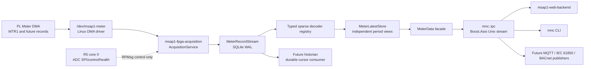
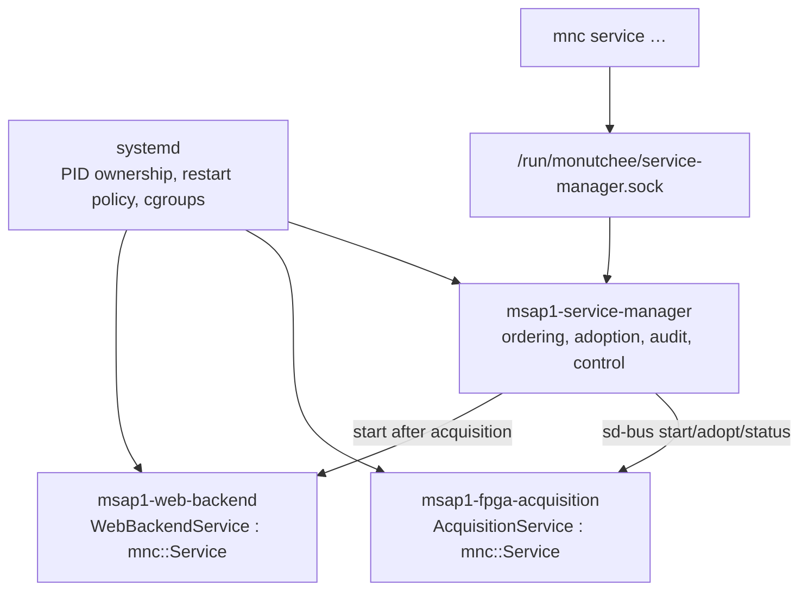

# MSAP1 service, IPC, and durable meter-data architecture

## Document purpose

This document describes the implemented service refactor delivered by the
`feat/reamp_service` branch. The branch name is retained for traceability; the
feature is an architectural revamp of the MSAP1 Linux/APU service layer.

It is source material for a future developer guide. It explains how a PL meter
record becomes durable data, a typed current view, and an API response without
allowing a Web client, CLI command, or future publisher to interfere with ADC
acquisition.

The detailed implementation reference remains:

```text
applications/MSAP1_APU/docs/IPC_SERVICE_ARCHITECTURE.md
```

If this document conflicts with that implementation reference or the source
code, the implementation reference and source code are authoritative.

---

## 1. Why the service architecture changed

The early prototype was sufficient for a single local client, but it had three
limitations:

1. **The IPC endpoint was product-specific.** A client needed intimate
   knowledge of socket behavior and message layouts, making the transport hard
   to reuse for a new service.
2. **The newest measurement was the only application-level view.** A client
   could display the latest value but could not safely consume every accepted
   record after a restart or independently from another consumer.
3. **Service responsibility was implicit.** Acquisition, Web serving, and
   future publisher processes needed a consistent lifecycle, readiness, health,
   restart, and dependency model.

The refactor separates those concerns:

| Concern | Implementation | Main property |
|---|---|---|
| Transport | `mnc::ipc` | Reusable framed Boost.Asio Unix-stream transport |
| Product protocol | `msap1::acquisition::protocol` | Explicit MSAP1 messages and authorization policy |
| Durable record path | `MeterRecordStream` | Ordered, replayable, at-least-once records in SQLite WAL |
| Latest-state path | `MeterData` / `MeterLatestStore` | Non-blocking latest reading for display and publishers |
| Process lifecycle | `mnc::Service` | Standard start, reload, stop, readiness, watchdog behavior |
| Service coordination | `mnc::ServiceManager` | Dependency-aware systemd control and health audit |

The refactor does **not** move metering calculations to Linux. RMS, frequency,
power, energy, demand, and power-quality calculations remain PL
responsibilities. The APU validates, persists, decodes, distributes, and
displays the records produced by PL.

---

## 2. Ownership and end-to-end data flow



### 2.1 Layer responsibilities

| Layer | Owns | Must not own |
|---|---|---|
| PL | Meter calculations, record production, DMA AXI-stream source | Linux buffer allocation, persistent database, Web clients |
| R5 core 0 | ADC SPI, reset, synchronization, capture control, ADC health | Meter DMA, durable records, Web transport |
| Linux kernel | DMA descriptors, interrupts, `/dev/msap1-meter` | Meter algorithms, product presentation |
| Acquisition service | DMA ownership, record validation, durability boundary, RPU lifecycle coordination, latest-state publication | Web presentation, direct ADC SPI |
| Web backend | Authenticated API, persistent acquisition IPC client, nginx lifecycle | DMA or RPMsg ownership |
| CLI | Human and machine-readable client interface | Long-running data ownership |
| Future historian | Lossless record-stream consumption | Blocking acquisition or the latest-state path |
| Future publisher | Latest state and optional update events | Blocking acquisition or consuming DMA directly |
| systemd | Process PID ownership, restart policy, cgroups, logs | Product protocol and meter-data interpretation |
| Service manager | Service dependency order, status audit, bounded control | Replacing systemd process supervision |

The critical rule is that the acquisition service is the sole Linux owner of
the meter DMA device. Every other Linux process obtains data through the IPC
or durable-record interfaces.

---

## 3. The durability boundary: `MeterRecordStream`

The acquisition service validates an incoming PL record before it enters the
application data flow. The record is first committed by:

```cpp
MeterCursor cursor = record_stream.append(record);
```

Only after `append()` succeeds may the service decode and publish that record.
This makes the SQLite commit the publication boundary:

```text
validated DMA record
        │
        ▼
SQLite commit succeeds
        │
        ├──► typed decoder / MeterData / IPC subscribers
        └──► durable consumers may replay from their own cursor
```

The database is located at:

```text
/data/mnc/meter/record-stream.sqlite3
```

It is configured for SQLite WAL mode with `synchronous=FULL`. The persistent
`/data` partition is required because an accepted meter record must survive an
acquisition-service restart and a system reboot.

### 3.1 Stream API and delivery guarantee

`MeterRecordStream` provides four main operations:

| Operation | Purpose |
|---|---|
| `append(record)` | Commit one validated PL record and return its monotonic stream cursor |
| `read_after(cursor, limit)` | Read an ordered bounded batch after a known cursor |
| `register_consumer(name)` | Create a durable, independently tracked consumer |
| `acknowledge(name, cursor)` | Persist the consumer's completed cursor |

The intended guarantee is **at-least-once delivery** for durable consumers.
After a restart, a consumer resumes from its last acknowledged cursor and may
receive an already processed record again. Consumer code must therefore make
its own sink idempotent or deduplicate by stream cursor/source sequence.

`prune()` removes only records that every registered durable consumer has
acknowledged and whose configured safety window has elapsed. This permits a
future historian to be lossless without making the Web dashboard retain every
record forever.

### 3.2 Failure behavior

Storage failure is a critical acquisition fault. Continuing to advertise fresh
values after a failed durable append would silently lose accepted PL data.
Therefore, the acquisition service stops accepting new records rather than
pretending the meter is healthy.

This is intentionally stricter than latest-state publishing:

- a slow Web browser may miss intermediate updates;
- a disconnected publisher may reconnect and request the latest view;
- a durable historian must replay every record from `MeterRecordStream`.

---

## 4. Typed multi-period meter data

PL results do not all have to arrive at the same update interval. The APU
models each update interval separately:

```cpp
enum class UpdatePeriod : std::uint8_t {
    ms200,
    s1,
    s3,
    s10,
    min10,
    h2,
};
```

The currently implemented `MTR1` record decodes as a 200 ms fundamental
update. Future PL record types can add power, energy, demand, or
power-quality values at their own periods without changing the IPC transport.

### 4.1 Sparse typed updates

`MeterUpdate` identifies the source period, record kind, record sequence, and
configuration generation. It contains only the value groups present in the
incoming record. `MeterDecoderRegistry` maps a PL record format/version to its
typed decoder.

`MeterLatestStore` applies only those present groups to the matching period
view. A 200 ms update never overwrites the 1 s view, and a 1 s value never
fills in a missing 200 ms value.

Typical consumer usage is:

```cpp
using namespace std::chrono_literals;

const auto view = meter_data.latest(200ms);
if (view && view->values.fundamental.frequency.valid()) {
    const auto frequency_millihz =
        view->values.fundamental.frequency.value;
}
```

The API deliberately uses `latest(200ms)` rather than rigid names such as
`period_200ms`. New PL update periods can be added without redesigning every
consumer interface.

### 4.2 Measurement semantics

Every typed `Reading<Unit>` retains:

- exact integer engineering value and unit;
- measurement quality;
- PL source sequence;
- time of receipt/measurement;
- sample count and calculation-window duration.

`MeasurementQuality::unavailable` is distinct from a valid reading whose
value is zero. This is essential for fields such as current: `0 A` can be a
correct measurement, while an unavailable reading means the device did not
publish a usable result.

### 4.3 Latest-state subscriptions

`MeterData::subscribe()` is designed for lossy display-style consumers. Each
subscriber owns a small worker with one pending period view. If the consumer is
slow, a newer view replaces the unread view. This is intentional:

- Web, MQTT, IEC 61850, and BACnet publishers receive the current state;
- a temporary slow client cannot backpressure the DMA or acquisition loop;
- a historian requiring every record uses the durable stream instead.

---

## 5. `mnc::ipc`: reusable framed Boost.Asio transport

`mnc::ipc` is a product-neutral C++23 library. It uses:

```cpp
boost::asio::local::stream_protocol
```

This is an `AF_UNIX`, `SOCK_STREAM` connection. A stream socket does not
preserve message boundaries, so `mnc::ipc` supplies explicit framing instead
of assuming one read equals one message.

### 5.1 MNCI envelope

Every frame starts with a fixed 24-byte, little-endian envelope:

| Offset | Size | Field |
|---:|---:|---|
| 0 | 4 | Magic `MNCI` |
| 4 | 2 | Envelope version |
| 6 | 2 | Frame kind |
| 8 | 4 | Product-defined message type |
| 12 | 4 | Payload size |
| 16 | 8 | Correlation ID |

Frame kinds are `request`, `response`, `event`, and `error`. The transport
does not interpret product message types or payload contents.

The reader always performs these steps:

```text
read exactly 24 header bytes
validate magic, version, kind, and payload size
read exactly payload-size bytes
deliver one complete Frame
```

The writer serializes the header and payload, queues the complete frame, and
uses `async_write` to finish it before beginning the next queued frame.

### 5.2 Safety and concurrency rules

| Concern | Behavior |
|---|---|
| Maximum payload | 1 MiB by default; configurable downward |
| Malformed/oversized/truncated input | Close the connection |
| Reads | One coroutine owns reads for each connection |
| Writes | One strand-serialized queue owns writes for each connection |
| Slow client | Bounded queued-frame and queued-byte limits; overflow closes it |
| Requests | Correlation IDs match independent outstanding responses |
| Events | Persistent clients may receive server-pushed event frames |
| Timeout | Product client uses a steady-timer and cancels expired requests |
| Authorization | Unix peer UID/GID/PID is obtained with `SO_PEERCRED` |

`ByteWriter` and `ByteReader` provide explicit little-endian field encoding.
Product protocols must never copy native C++ structs, compiler padding, native
enum storage, pointers, or floating-point layouts directly onto the socket.

### 5.3 MSAP1 acquisition protocol

MSAP1-specific message definitions remain outside the reusable transport in
`msap1::acquisition`. The public Unix socket path remains stable:

```text
/run/monutchee/fpga-acquisition.sock
```

The product protocol version is **14**. Acquisition commands cover health,
ADC configuration, waveform management, meter latest-state reads, durable
stream reads/cursor acknowledgements, and meter subscriptions.

The command-line utility uses `BlockingClient`, a synchronous facade over the
same Boost.Asio framed transport. The Web backend uses a persistent client, so
it can issue requests and receive subscribed updates without reconnecting for
every operation.

---

## 6. Service lifecycle and supervision



### 6.1 `mnc::Service`

`mnc::Service` is the reusable base class for a long-running product process.
`execute()` owns common operating-system behavior:

- signal handling;
- `sd_notify` readiness reporting;
- systemd watchdog notification;
- reload dispatch;
- exception containment and structured logging;
- one orderly shutdown path.

A derived service implements only its application work:

```cpp
virtual void on_start() = 0;
virtual void on_reload() = 0;
virtual void on_stop() noexcept = 0;
virtual ServiceHealth health() const = 0;
```

The feature converts the two current long-running applications into this
model:

| Process | Service class | Primary responsibility |
|---|---|---|
| `msap1-fpga-acquisition` | `AcquisitionService` | DMA/RPMsg lifecycle, durable records, meter IPC |
| `msap1-web-backend` | `WebBackendService` | authenticated API and nginx lifecycle |
| `msap1-service-manager` | manager daemon based on `mnc::Service` | product-service ordering and systemd status/control |

### 6.2 `mnc::ServiceManager`

The service manager registers product units and their dependencies. It can
start units in dependency order, adopt services that were already running when
the manager restarted, inspect active/sub states and restart counts, and issue
bounded start/stop/restart/reload requests through sd-bus.

The current operational commands are:

```sh
mnc service list
mnc service status fpga-acquisition
mnc service start fpga-acquisition
mnc service stop fpga-acquisition
mnc service restart web-backend
mnc service reload fpga-acquisition
```

Read-only status is available to diagnostic clients. State-changing commands
require a root Unix peer credential.

> `msap1-service-manager` is not a second init system. systemd remains the
> only owner of process IDs, restart policies, cgroups, and restart limits.
> The manager coordinates and audits product services through the documented
> systemd interface.

---

## 7. Yocto and target runtime integration

The product recipe packages the APU applications with the Boost.Asio,
SQLite, and systemd/sd-bus dependencies required by this architecture.

### 7.1 Units and directories

The relevant runtime units are:

```text
msap1-fpga-acquisition.service
msap1-web-backend.service
msap1-service-manager.service
```

The acquisition unit starts after the RPU firmware-load service and uses the
`msap1-data` group. The service-manager unit runs with `Type=notify`, journals
its output, and has a systemd watchdog interval.

`systemd-tmpfiles` creates the runtime and persistent directories:

```text
/run/monutchee                 runtime sockets
/data/mnc                      persistent product data
/data/mnc/meter                durable meter SQLite database
/data/mnc/waveform             persistent waveform files
```

The meter database must remain on persistent `/data`, not under `/run` or a
temporary work directory. The `/run/monutchee` sockets disappear at reboot and
are recreated by their owning services.

### 7.2 Logs and health

All services use the existing `mnc::logging` structured journald interface.
The lifecycle base reports ready/health state to systemd, while detailed
component/module events remain available through `mnc log` and the Web
developer log view. A service crash is visible through both journald and
systemd unit status; systemd applies the configured restart policy.

---

## 8. Operational behavior and failure handling

| Condition | Expected behavior |
|---|---|
| Web/CLI disconnects | Its IPC connection closes; acquisition and durable storage continue |
| Slow latest-state subscriber | Intermediate view is replaced by a newer view; acquisition is never stalled |
| Slow durable historian | It resumes later from its own durable cursor; old records remain until safe pruning |
| Malformed IPC frame | Connection is closed without affecting other clients |
| IPC server restart | Pending requests fail; product layer may reconnect explicitly |
| Acquisition restart | SQLite records and acknowledged consumer cursors survive; current RAM latest state is rebuilt by new records |
| SQLite append failure | Critical acquisition fault; new accepted records are not silently discarded |
| Web backend restart | Reconnects to acquisition; it does not open DMA or RPMsg devices |
| Service-manager restart | Re-adopts already-running systemd units and audits their state |
| Repeated service failure | systemd restart policy limits the loop; manager exposes failed/restart-count state |

This behavior intentionally distinguishes two classes of consumer:

```text
Lossless consumer  → MeterRecordStream cursor and acknowledgement
Latest-state user  → MeterData period view and optional event subscription
```

Do not use the latest-state path as a historian. Do not use the durable stream
as the primary Web rendering path unless a UI explicitly needs historical
record replay.

---

## 9. Verification implemented for the feature

The APU test suite covers the architectural contracts rather than only one
application path:

| Test area | Covered behavior |
|---|---|
| `ipc_test` | Split reads, combined frames, framing validation, partial writes, bounds, correlation handling, disconnects, and blocking client behavior |
| `meter_record_stream_test` | SQLite persistence, reopen/replay, consumer registration, acknowledgement, and pruning rules |
| `meter_data_test` | MTR1 fundamental decoding, independent period views, sparse updates, quality semantics, and subscriptions |
| `service_manager_test` | Dependency ordering, status inspection, unit control, and manager health behavior |

Target validation should additionally confirm:

1. `msap1-fpga-acquisition`, `msap1-web-backend`, and
   `msap1-service-manager` are active systemd units.
2. `mnc meter health` reports fresh meter data while the Web dashboard is
   connected.
3. Restarting the Web backend does not interrupt DMA acquisition.
4. The SQLite record stream survives an acquisition-service restart and can
   replay from a durable consumer cursor.
5. A deliberately slow IPC client does not increase DMA, FIFO, or record-gap
   counters.
6. `mnc service status …` reports unit state and restart counts consistently
   with `systemctl status`.

---

## 10. Extension guidance

The architecture is intended to grow without changing its core ownership
rules.

### Add a new PL record type

1. Assign a versioned PL record format and update period.
2. Add a typed decoder to `MeterDecoderRegistry`.
3. Add only the required optional value group to `MeterUpdate`/`MeterValues`.
4. Preserve exact integer units, quality, sequence, and calculation window.
5. Consumers request the desired `UpdatePeriod`; existing 200 ms consumers do
   not need to change.

### Add an external publisher

1. Implement it as an `mnc::Service` when it is a long-running process.
2. Use a persistent `mnc::ipc::RequestClient` to access MSAP1 product data.
3. Use `MeterData`/events for latest-state protocols such as MQTT, IEC 61850,
   BACnet, or Modbus-style registers.
4. Register a durable `MeterRecordStream` consumer only when the protocol or
   historian truly requires every record.
5. Keep protocol-specific payload serialization and authorization outside
   `mnc::ipc`.

### Preserve the boundary

Future services must not:

- open `/dev/msap1-meter` directly;
- own AXI DMA descriptors or Linux CMA buffers;
- access AD7771 SPI directly;
- transmit full-rate samples through RPMsg; or
- let a client backpressure the acquisition loop.

Those boundaries allow new product capabilities to be added while keeping the
measurement and durable-data pipeline understandable and reliable.

---

## 11. Summary

`feat/reamp_service` turns the APU portion of MSAP1 from a pair of cooperating
applications into a layered service platform:

```text
PL record → durable stream → typed period state → framed IPC → consumers
```

The durable stream protects lossless consumers, the latest-state API protects
acquisition from slow display/publish consumers, Boost.Asio provides a
reusable framed local transport, and systemd remains the authoritative process
supervisor. This makes the current acquisition and Web backend easier to
operate while providing a clear integration path for historian, MQTT, IEC
61850, BACnet, and future meter-record types.
