# MSAP1 implementation report: moving interval aggregation from PL to R5C1

| Field | Value |
| --- | --- |
| Document ID | DOCPR00011 |
| Feature branch | `feat/move_aggregation_to_RPU` |
| Report date | 2026-08-26 |
| Status | Post-merge implementation report; this is not a target deployment or timing-closure certificate. |

## Purpose and outcome

This report records the completed migration of MSAP1 interval aggregation from
programmable logic (PL) to the R5C1 firmware.  The feature preserves the
existing Linux meter-DMA record interface while changing where interval state,
finalization, and record construction are owned.

After this feature:

- **PL** retains acquisition, conversion, grid-cycle timing, and the
  SingleCycle sufficient-statistic calculation.  It exports each completed
  SingleCycle result through a private AXI FIFO link without being allowed to
  backpressure metrology.
- **R5C1** is the sole production authority for Basic (10/12-cycle),
  150/180-cycle, UTC-aligned 10-minute, and 2-hour interval records.  It
  validates the PL packet, runs the shared fixed-point aggregation algorithm,
  and returns complete 256-byte records to PL.
- **PL** places returned records into the existing meter AXI switch and Linux
  DMA path.  No record payload travels over RPMsg.
- **APU** continues to decode and publish meter records, and now audits R5C1
  aggregation health over a bounded control-plane request.
- **WEB** exposes the aggregation-health state and displays Basic-record
  provenance alongside the selected measurement tier.

The migration deliberately removes the PL aggregation implementation and its
runtime fallback.  A missing, mixed, corrupt, or stalled R5C1 path is a
visible health fault; it must not silently cause a second implementation in
PL to resume producing authoritative records.

`DOCPR00010_CLASS_A_150_180_CYCLE_AGGREGATION.md` remains useful for the
measurement rationale, record mathematics, and earlier MTR2 work.  Its PL
ownership and local record-bus topology describe the superseded design.  This
report supersedes those ownership and transport sections.

## Release provenance

The report was written against the named feature branch rather than the
currently checked-out workspace branch.  All four branches were merged on
2026-08-25.

| Repository | Feature tip | Merge to `main` | Main contribution |
| --- | --- | --- | --- |
| `MSAP1_RPU` | `5673b83` | PR #22, `a2614ca` | R5C1 aggregation runtime, FIFO transport, record return, and health service |
| `MSAP1_PL` | `9db87dd` | PR #33, `68faffe` | PL exporter, AXI FIFO integration, removal of the HLS aggregation IP |
| `MSAP1_APU` | `ccaeef2` | PR #52, `46ec7a0` | R5C1 health ABI, monitoring, CLI/IPC/REST publication |
| `MSAP1_WEB` | `f99748a` | PR #26, `c2cb359` | Aggregation status pill and Basic provenance presentation |

The RPU and PL branches include the initial move, completion work, and the
subsequent bounded-work, ring-pressure, and contamination fixes.  Those
stabilization commits are part of the final branch state described here.

## Architecture change

### Before the move

The PL `AggregationEngine` HLS component consumed SingleCycle results,
maintained every interval tier, constructed Basic/aggregate records, and fed
the local MTR1/MTR2 AXI-stream inputs.  R5C1 had no meter-data ownership and
the APU saw only the final DMA records.

### After the move

```mermaid
flowchart LR
    ADC["ADC capture / conversion\nPL"] --> SCYC["SingleCycleEngine\nPL sufficient statistics"]
    SCYC --> EXP["meter_r5_aggregation_export\nPL framing + CRC32C"]
    EXP --> RX["AXI FIFO MM-S RX\nR5C1"]
    RX --> RING["64-frame SPSC ring"]
    RING --> VAL["Packet validation\nCRC, layout, sequence"]
    VAL --> ENG["R5C1 aggregation engine\nBasic, 150/180, 10 min, 2 h"]
    ENG --> OUT["64-record SPSC ring"]
    OUT --> TX["AXI FIFO MM-S TX\nR5C1"]
    TX --> SW["MTR_AXI_Switch/S04_AXIS\nPL"]
    SW --> DMA["Existing Linux meter DMA"]
    DMA --> APU["APU decode / IPC / REST"]
    APU --> WEB["Web UI"]

    APU -. "health only, RPMsg" .-> R5C1["R5C1 control endpoint"]
```



The dashed control link carries a fixed health snapshot only.  It never
carries samples, SingleCycle packets, or meter records.

### Ownership and non-negotiable invariants

| Concern | Final owner | Rule preserved by the feature |
| --- | --- | --- |
| ADC capture, conversion, SingleCycle numerical inputs | PL | The R5 FIFO must never deassert SingleCycle upstream `READY`. |
| Interval state and finalization | R5C1 | One authoritative aggregation implementation; no PL fallback. |
| FIFO framing and private-link integrity | PL exporter + R5C1 decoder | PL and R5C1 are co-released; the fixed contract word detects a mixed image. |
| Meter-DMA descriptors and DDR buffers | Linux/APU | R5C1 does not touch DMA registers or meter-record DDR. |
| RPMsg | R5C0/R5C1 control endpoints | Control/health only; never a meter payload transport. |
| Public presentation | APU and WEB | APU decodes records; WEB reads the versioned JSON API only. |

## PL implementation

### Retired aggregation hardware

The PL branch deletes the production
`HLS_DesignFile/MeterProcessing/AggregationEngine` source, its packaged
`hls_aggregation_engine_ip` XCI,
`meter_aggregation_hls_shim.vhd`, and the associated record-stream test
fixtures.  This is an ownership transfer, not a dormant alternative:

- `MeterCore_Wrapper` retains its legacy `M_AXIS_MTR1` and `M_AXIS_MTR2`
  interfaces for block-design compatibility, but drives them idle.
- The legacy PL aggregation status window at processing offsets `0x78` through
  `0x94` remains mapped for software compatibility and reads zero.
- Existing fixed 256-byte DMA record geometry is unchanged.  R5C1 returns a
  64-word record with full `TKEEP` and `TLAST` on the 64th word, exactly as the
  existing DMA stream requires.

The PL continues to calculate SingleCycle sufficient statistics.  Its
221-word, little-endian packet remains the narrow shared boundary; the RPU
compiles the shared packet and metrology headers directly from
`MSAP1_PL/SourceData/HLS_DesignFile/common/include/`.

### Private PL-to-R5C1 packet

`meter_r5_aggregation_export.vhd` captures a complete SingleCycle packet and
an atomic context snapshot.  It emits exactly 239 32-bit words (956 bytes) to
the FIFO AXI-stream receiver:

| Word range | Contents |
| --- | --- |
| 0 | `0x31474741` (`AGG1`, little-endian bytes) |
| 1 | Fixed co-release contract revision (`1`) |
| 2 | Payload extent, always 234 words |
| 3 | Transport sequence; must equal SingleCycle payload word 0 |
| 4–224 | Exact 221-word SingleCycle packet |
| 225–237 | 13-word captured context |
| 238 | CRC32C over words 0–237, little-endian byte order |

The CRC32C algorithm uses reflected polynomial `0x82F63B78`, with initial and
final XOR values of `0xFFFFFFFF`; the required `123456789` check value is
`0xE3069283`.

The context makes each R5C1 calculation self-contained and coherent with the
PL cycle it represents:

| Context word(s) | Value |
| --- | --- |
| 0–1 | Active configuration generation and sample rate |
| 2 | Valid-mask, enabled, DC-removal, APPLY, grid-lock, and fallback bits |
| 3–5 | Frequency status, Q16 period, and frequency sequence |
| 6–9 | Capture frame count, header errors, overflow count, and alerts |
| 10–11 | 64-bit UTC ten-minute target sample |
| 12 | UTC target valid/update bits |

At source word zero, the exporter either reserves storage for the entire
packet plus one matching context slot or selects a whole-packet discard.  Its
4096-word result FIFO and 16-entry context FIFO permit up to 16 complete
packets.  When that capacity is exhausted it still accepts every source word,
discards exactly one complete packet, and increments the drop count only at
the final word.  Thus a congested R5 link can lose a diagnosable packet but
cannot stall SingleCycle metrology or corrupt packet alignment.

The snapshot is captured at SingleCycle word zero, not after a later FIFO
drain.  Packet credits are returned only after the framed CRC/TLAST packet is
accepted downstream.  This prevents a FIFO count race from pairing a result
with the wrong context.

### FIFO and block-design topology

The block design adds `R5_Aggregation_FIFO`, an `axi_fifo_mm_s` instance.

- `MeterCore_Wrapper/M_AXIS_R5_AGG_INPUT` connects to the FIFO
  `AXI_STR_RXD` channel.  R5C1 reads these complete 956-byte packets through
  the XLlFifo receive interface and its interrupt.
- R5C1 writes complete 256-byte records to the FIFO transmit interface.
  `AXI_STR_TXD` is connected to `MTR_AXI_Switch/S04_AXIS`, which then feeds
  the pre-existing meter DMA route.
- The FIFO interrupt is wired into the R5 domain.  Production R5C1 builds
  require both FIFO hardware and the interrupt at compile time, so a stale
  XSA cannot silently fall back to polling.

PL exposes exporter-only diagnostics at the meter-processing base
`0xB0050000`:

| Offset | Diagnostic |
| --- | --- |
| `0xB0` | exporter status |
| `0xB4` | accepted packet count |
| `0xB8` | whole-packet dropped count |
| `0xBC` | transmitted packet count |
| `0xC0` | framing-error count |
| `0xC4` | last transport sequence |
| `0xC8` | queue level |

These registers are observational.  They never feed capture control or
metrology flow control.

## R5C1 implementation

### Modular runtime

The new implementation lives below
`MSAP1_RPU/R5c1/src/MainApp/aggregation/`.  `main.cpp` composes static
objects only; transport ownership, validation, arithmetic, output, and health
accounting are intentionally separate.

| Component | Responsibility |
| --- | --- |
| `AxiFifoAggregationTransport` | Sole XLlFifo and interrupt owner; complete-frame RX and complete-record TX |
| `AggregationFrameRing` | Static 64-frame single-producer/single-consumer queue between RX and validation (~61 KiB) |
| `AggregationFrameDecoder` | Validates magic, contract, word count, sequence mirror, CRC32C, and reserved bits |
| `AggregationShadowService` | Schedules bounded RX work and validator handoff; does not own aggregation arithmetic |
| `R5AggregationEngine` | Adapts the shared HLS-compatible algorithm to packet input, complete records, and health |
| `AggregationRecordRing` | Static 64-record queue between arithmetic and FIFO TX |
| `AggregationOutputService` | Sole FIFO TX owner; retries one complete record until downstream space is available |
| `AggregationHealth` | Saturating validation, continuity, output, queue-pressure, and timing telemetry |

Several class names retain `shadow` from the staged migration work.  The final
production configuration is not shadow-only: `UserConfig.cmake` sets
`MNC_R5_AGGREGATION_EMIT_OUTPUT=1`,
`MNC_R5_AGGREGATION_REQUIRE_HARDWARE=1`, and
`MNC_R5_AGGREGATION_REQUIRE_IRQ=1`.  The health response marks this build as
authoritative.

### Tasking and bounded-work policy

The run-time ordering is designed so transport service preempts arithmetic
rather than allowing a CPU-heavy finalizer to fill the hardware FIFO.

| FreeRTOS task | Priority | Work |
| --- | ---: | --- |
| `AGG_BOOT` | 5, one shot | Starts the aggregation workers independently of Linux endpoint discovery, then deletes itself |
| RPMsg task | 4 | Existing control-plane endpoint and health response |
| `AGG_RX` | 3 | Reads FIFO packets into the input ring |
| `AGG_TX` | 2 | Returns finished records through FIFO TX |
| `AGG_VAL` | 1 | Decodes packets and runs interval arithmetic |

The FIFO ISR only acknowledges/masks receive completion and notifies
`AGG_RX`; it performs neither parsing nor arithmetic.  `AGG_RX` drains at
most four packets per activation, notifies `AGG_VAL`, then blocks for at least
one real RTOS tick.  This is essential: `taskYIELD()` only schedules tasks at
the same priority, so an unbounded higher-priority RX drain would otherwise
starve the validator and eventually fill the software and hardware queues.

The final branch also changes deferred work scheduling.  Earlier code ran a
fixed number of expensive arbitrary-precision aggregation passes after every
input, including empty passes.  The final wrapper runs one pass, then runs
additional passes only while the engine reports pending interval work, with a
hard bound of eight.  A remaining pending state is treated as an engine fault
rather than allowing unbounded execution.  This correction addresses the
observed slow-consumer path that could make PL discard whole source packets.

### Validation, continuity, and failure behavior

An input packet is used only after all framing checks pass.  A malformed
length is drained as a whole FIFO packet; a bad magic, contract word, payload
count, sequence mirror, CRC, or reserved context bit is rejected before it
reaches the aggregation engine.

The engine tracks the 32-bit transport sequence with wrap-aware logic:

- a duplicate or stale packet is never aggregated twice;
- a forward gap, malformed packet, FIFO error, or software-ring loss marks
  the next accepted SingleCycle input as discontinuous;
- the wrapper sets the established SingleCycle status bit 2 (first after a
  gap) for that input, so all affected interval tiers reset/contaminate using
  the shared rules rather than aggregating across a hidden loss.

The TX path has no silent drop policy.  If the FIFO has insufficient vacancy,
`AGG_TX` retains and retries the complete record.  If downstream failure
persists, the 64-record output ring eventually fills; the authoritative engine
then fails closed and reports the condition instead of producing a stream with
an unreported hole.

### Aggregation behavior retained by the move

The arithmetic is retained from the shared metrology implementation, now
compiled by R5C1 with the canonical record and finalizer headers.  This avoids
a second software-specific formula and keeps rounding, saturation, record
layout, and companion records aligned with the PL SingleCycle producer.

The engine maintains a tree of interval accumulators:

| Tier | Input and close rule | Output |
| --- | --- | --- |
| Basic | 10 whole cycles at 50 Hz or 12 at 60 Hz | `BASIC-v4` plus power, phasor, and unbalance companion records |
| 150/180-cycle | Exactly 15 eligible consecutive Basic blocks | `AGG-v3` plus companion records |
| 10-minute | Eligible Basic blocks accumulated directly to a UTC target; not chained from the 150/180 tier | completed ten-minute family |
| 2-hour | Exactly 12 complete aligned ten-minute intervals | completed two-hour family |
| Open previews | Optional operational views of long-period open accumulators | separately formatted, explicitly non-normative records |

The 150/180-cycle result is therefore still a cycle-defined aggregation of
Basic results, never a wall-clock three-second window or a second raw-sample
RMS calculation.  The 10-minute tier receives the PL UTC target in every
context packet and is independently fed from Basic blocks, as required by the
aggregation topology.

Every emitted record is reconstructed and checked as a 64-word, 256-byte
image before publication.  The R5 wrapper records completions by fundamental
format (`BASIC-v4`, `AGG-v3`, ten-minute, and two-hour) while the complete
record families themselves continue to include their power/phasor/unbalance
companions.

## APU changes

### Control ABI and cached monitoring

The coordinated RPU/APU control ABI increments from version 5 to version 6
and adds two message types:

| Message | Value | Direction | Purpose |
| --- | ---: | --- | --- |
| `MSAP1_RPU_MSG_AGGREGATION_HEALTH_GET` | 17 | APU → R5C1 | Request a bounded aggregation-health snapshot |
| `MSAP1_RPU_MSG_AGGREGATION_HEALTH` | 18 | R5C1 → APU | Return the 200-byte packed snapshot |

The 50-word response separates availability/readiness flags from diagnostic
counters.  It includes packet validity and continuity, CRC/format/length
errors, FIFO errors, inferred input-loss sequence range, record
queue/emission/output errors, completed-tier counters, software-ring
occupancy and high-water marks, hardware-FIFO occupancy/full edges, and input
and validator timing maxima.

`AggregationHealthMonitor` discovers the R5C1 service
`mncos-r5c1-ctrl` independently from R5C0 ADC control.  It performs a
best-effort audit every five seconds, retries failed discovery after two
seconds, caches the last successful response, and does not throw an R5C1
discovery failure into the acquisition/DMA loop.  The corresponding data is
carried in `InfoResponse`; acquisition IPC advances to version 31.

This separation is deliberate.  During staged bring-up an unavailable R5C1
endpoint is observable but does not prevent APU acquisition startup.  Once
R5C1 declares the path authoritative, its unhealthy state contributes to the
overall meter-health verdict.

### Health rules and diagnostics

For an authoritative R5C1 implementation, the APU considers the aggregation
path healthy only when the transport is initialized and input is healthy, the
engine/output are ready and active, and no reported FIFO/ring/input/output
failure disqualifies the path.  Critical software-ring pressure is also a
degradation reason.  The reportable reason codes include unavailable or
uninitialized transport, invalid input frames, FIFO errors, ring overflow or
push failure, deterministic input drops, critical pressure, engine/output
readiness failures, and output errors/drops.

The new information appears in:

- `mnc meter health` and `mnc meter health --full`, including health mode,
  sequence/drop provenance, queue pressure, and worker timing;
- the new diagnostic `mnc rpu`, which inventories remoteproc and RPMsg state
  and then reports the cached R5C1 result;
- acquisition IPC `InfoResponse` and the backend `GET /api/v1/meter/health`
  / system health DTOs;
- structured APU logs on aggregation-health state transitions.

The APU continues to decode meter records rather than recomputing an
aggregate.  Its Linux DMA ownership and 256-byte record framing remain
unchanged.

## WEB changes

The frontend adds an `aggregation` health model to the system-health API type
and renders it in the pipeline-health panel:

- a green/red RPU aggregation pill identifies whether the R5C1 path is
  authoritative or still shadow-mode;
- an unavailable endpoint is represented by a neutral state rather than being
  mistaken for a normal healthy component;
- R5C1 degradation reasons are listed alongside the existing acquisition and
  ADC reasons.

The dashboard also adds Basic provenance: cycle count, nominal frequency,
Basic block sequence, meter-record sequence, physical sample-index range, and
time quality.  This provides a direct visual correlation between the
currently displayed Basic result, the R5C1 input sequence, and APU health
diagnostics.  The frontend remains presentation-only; it does not access
RPMsg, FIFO, DMA, or the acquisition socket directly.

## Verification performed for this report

The following focused tests were run from an isolated source snapshot of the
feature branch, so the current `feat/m15_test` workspace state and its PL
generated-file modifications were not altered.

| Check | Result | What it establishes |
| --- | --- | --- |
| `bash R5c1/tests/run_aggregation_shadow_tests.sh` in `MSAP1_RPU` | **PASS** | CRC32C vector, header/context validation failures, ring order/capacity, sequence wrap/gap/repeat handling, health counters, bounded handoff model, complete-record generation, output fail-closed behavior, and deferred aggregate work |
| `vivado -mode batch -source SourceData/Script/AI_gen/check_r5_aggregation_export.tcl` in `MSAP1_PL` | **PASS** | PL exporter framing, CRC/context correctness, full `TKEEP`, `TLAST`, randomized downstream stalls, whole-packet overflow handling, retained-packet ordering, and post-overflow recovery |

The RPU host build emitted warnings from AMD/Vitis simulation headers, but the
test harness completed with exit status zero and `aggregation shadow tests
passed`.  The focused Vivado simulation completed with `PASS:
meter_r5_aggregation_export_tb (whole-packet overflow recovery)`.

The following were **not** run as part of this documentation task and remain
required for a release or target-validation claim:

- a fresh PL block-design build, synthesis, implementation, timing/CDC/DRC
  review, bitstream, and XSA export;
- R5C1 platform regeneration against that XSA and a hardware FIFO/interrupt
  target test;
- full APU CMake/CTest and WEB `npm ci && npm run build` validation;
- an end-to-end target run confirming DMA progression, record continuity, and
  clean R5C1 health counters under sustained acquisition.

## Deployment coupling and acceptance criteria

The feature is a PL/R5C1 co-release.  A compatible deployment must build and
package the PL bitstream/XSA and R5C1 firmware together; the private contract
word guards against an accidental mixed image but is not a negotiated
compatibility protocol.

Recommended release/target sequence:

1. Build PL through block-design generation, synthesis, implementation,
   bitstream, and XSA export.
2. Recreate the R5 platform from the new XSA, then build the R5C1 firmware.
3. Build APU services and the WEB distribution against wire ABI version 6.
4. Package the matching artifacts in the product image and deploy them
   together.
5. On target, verify the FIFO/IRQ is present, `mnc rpu` reports an
   authoritative healthy R5C1 path, and `mnc meter health --full` shows
   continuing input and output records.
6. Under low-rate then sustained capture, confirm zero exporter drops,
   zero R5C1 CRC/format/FIFO/ring/output faults, no inferred sequence loss,
   and monotonic Basic/aggregate completion counters.  Review high-water and
   worker-latency telemetry before accepting high-rate operation.

The key operational distinction is intentional: transient hardware or
scheduler pressure is visible through health and counters rather than being
masked by a PL aggregation fallback.  That makes a deployment failure
diagnosable while preserving the measurement-data ownership boundary.

## Source map

The principal implementation files for future maintenance are:

```text
applications/MSAP1_PL/SourceData/DesignFile/MeterProcessing/
  meter_r5_aggregation_export.vhd
  meter_r5_aggregation_pkg.vhd
  meter_processing_axi_regs.vhd
applications/MSAP1_PL/SourceData/BlockDesign/TopDesign/TopDesign.bd

applications/MSAP1_RPU/R5c1/src/MainApp/aggregation/
  aggregation_engine.cpp/.hpp
  r5_aggregation_engine.cpp/.hpp
  axi_fifo_aggregation_transport.cpp/.hpp
  aggregation_shadow_service.cpp/.hpp
  aggregation_output_service.cpp/.hpp
  aggregation_health.cpp/.hpp
applications/MSAP1_RPU/R5c1/src/MainApp/main.cpp
applications/MSAP1_RPU/R5c1/src/UserConfig.cmake

applications/MSAP1_APU/apps/MeterCore/Services/acquisition/pipeline/
  aggregation_health_monitor.cpp/.hpp
applications/MSAP1_APU/common/msap1/acquisition/rpu/rpu_control_protocol.h
applications/MSAP1_APU/common/msap1/meter/meter_health.cpp/.hpp
applications/MSAP1_APU/apps/mnc-cli/commands/rpu_commands.cpp

applications/MSAP1_WEB/src/api.ts
applications/MSAP1_WEB/src/App.tsx
```
