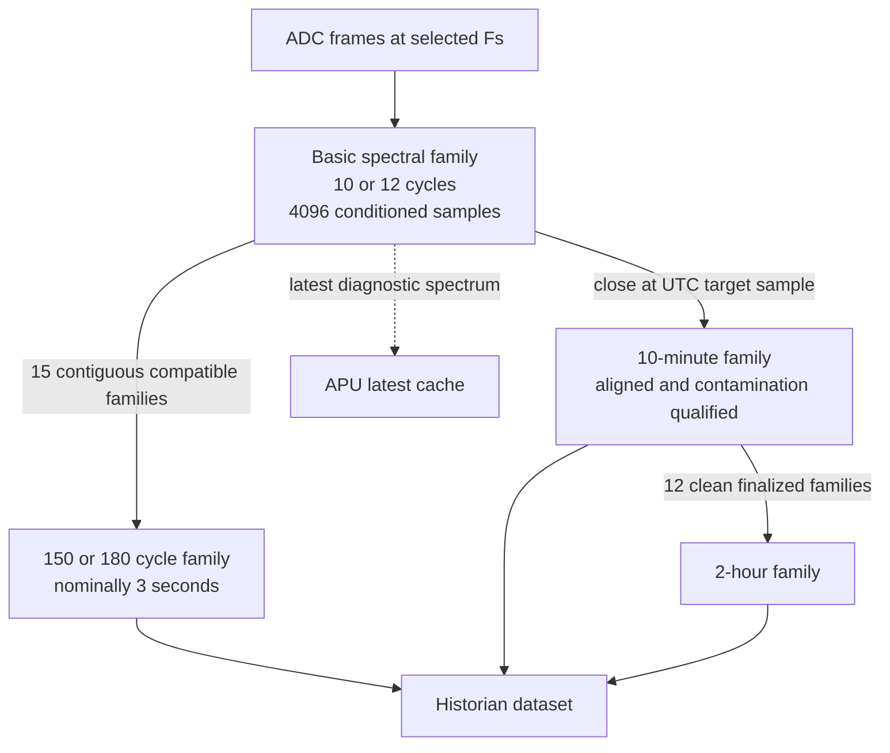
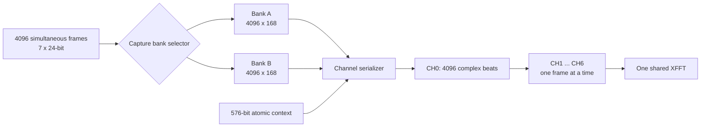
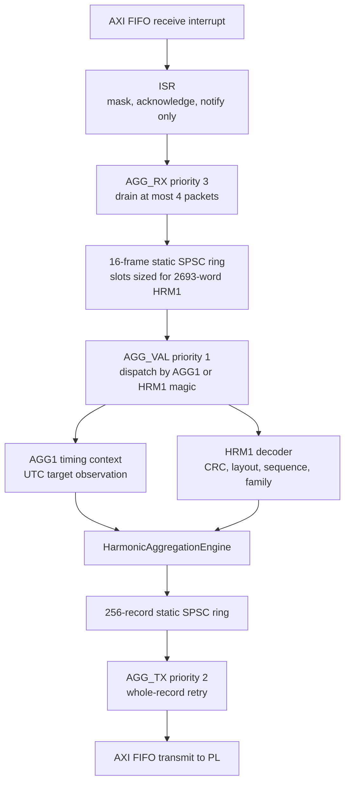
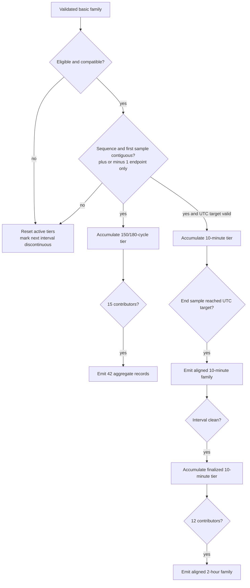
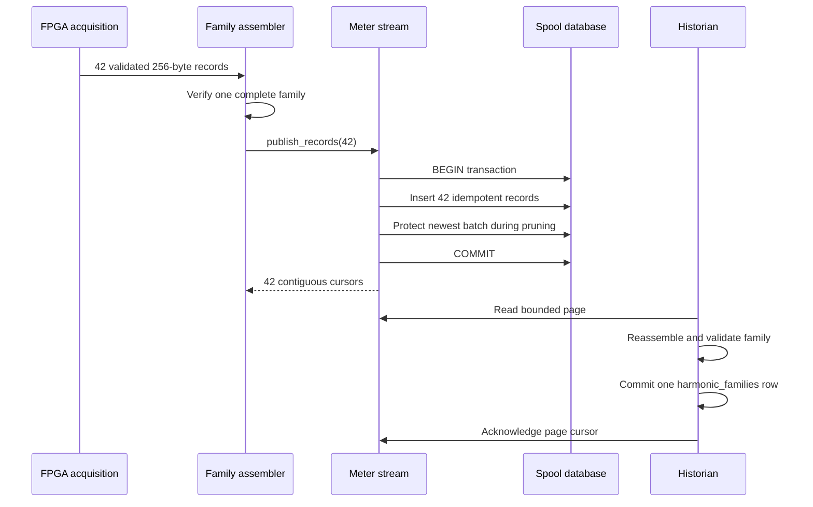

# MSAP1 M16 harmonic engine implementation report

| Field | Value |
| --- | --- |
| Document ID | DOCPR00016 |
| Milestone | M16 harmonic measurement engine |
| Report date | 2026-08-28 |
| Status | Post-merge implementation report with target acceptance evidence |
| Scope | PL spectral analysis, R5C1 interval aggregation, Linux transport and history, API, Web UI, and ADC-simulator stimulus |

## 1. Purpose and scope

This report describes the merged MSAP1 harmonic measurement implementation as
one end-to-end system. It explains how an ADC frame becomes a grid-synchronous
harmonic subgroup spectrum, how complete spectrum families cross the PL/R5 and
PL/Linux boundaries, how R5C1 produces the longer interval tiers, and how the
APU and Web UI expose the result without tearing a family.

The name **harmonic engine** is used here for the complete M16 feature. The
actual calculation is distributed deliberately:

- PL owns grid-synchronous sample conditioning, the 4,096-point XFFT, the
  basic 10/12-cycle spectrum, and deterministic record construction.
- R5C1 owns the 150/180-cycle, UTC-aligned 10-minute, and 2-hour harmonic
  aggregation tiers.
- Linux owns DMA, atomic family assembly, IPC, storage policy, history, REST,
  and CLI presentation.
- The Web application owns interactive visualization and simulator controls.

This is an implementation report, not a normative IEC conformance certificate.
The implementation uses IEC-style three-bin harmonic subgroups and the
project's Class A interval hierarchy. The source code and wire-contract headers
remain authoritative if a future change makes any detail in this report stale.

## 2. Release provenance

The coordinated M16 changes were merged through five repositories:

| Repository | Merge | M16 responsibility |
| --- | --- | --- |
| `MSAP1_PL` | PR #35, merge `ef8ab40` | Conditioner, ping-pong frontend, XFFT integration, HarmonicEngine HLS IP, base records, and PL transports |
| `MSAP1_RPU` | PR #24, merge `f06323e` | HRM1 validation, harmonic interval aggregation, angle aggregation, output records, and R5C1 health |
| `MSAP1_APU` | PR #54, merge `41c4b25` | Decode/assembly, batched meter-stream IPC, historian, REST/CLI, settings, simulator ABI, and diagnostics |
| `MSAP1_WEB` | PR #27, merge `df5f509` | Reading views, harmonic charts/tables, phasor interaction, and redesigned ADC-simulator controls |
| `meta-monutchee` | PR #57, merge `6f585be` | Device-tree integration and co-release packaging |

The implementation includes the post-integration corrections for adaptive
sample rates, FFT structural validation, DMA/IPC pressure, R5C1 stack safety,
aggregated angle preservation, simulator harmonic injection, high-order filter
qualification, historian backfill, and interval-aware rejection logging.

## 3. Executive architecture

### 3.1 End-to-end data flow

```mermaid
flowchart LR
    subgraph PL["Programmable logic - 100 MHz metrology domain"]
        ADC["AD7771 frames<br/>8 x signed 24-bit samples"]
        GRID["Grid timing and frequency<br/>10 cycles at 50 Hz<br/>12 cycles at 60 Hz"]
        COND["Adaptive spectral conditioner<br/>Fs to 20.48 kframe/s<br/>exactly 4096 frames"]
        FRONT["Two-bank spectral frontend<br/>capture simultaneous lanes<br/>serialize CH0 through CH6"]
        FFT["Xilinx XFFT v9.1<br/>4096 point BFP<br/>bit-reversed output"]
        HLS["HarmonicEngine HLS<br/>three-bin subgroup<br/>magnitude and relative angle"]
        BASE["42 HARMONIC-v1 records<br/>7 channels x 6 chunks"]
        FORK{"Lossless family fork"}
        PFIFO["4096-word packet FIFO"]
        HRM1["HRM1 exporter<br/>family header and CRC32C"]
        ARB["AGG1 / HRM1 packet arbiter"]
        MTRSW["Meter record AXI switch<br/>true round-robin on TLAST"]
    end

    subgraph R5["R5C1 firmware"]
        RX["AXI FIFO RX<br/>bounded drain"]
        DEC["Frame and family validator"]
        AGG["Harmonic aggregation engine<br/>150/180 cycle, 10 min, 2 h"]
        TX["256-record output ring<br/>AXI FIFO TX"]
    end

    subgraph APU["Linux APU"]
        DMA["AXI DMA S2MM<br/>512 x 256-byte ring"]
        ASM["Per-period atomic<br/>42-chunk assembler"]
        STREAM["One 42-record IPC batch<br/>one spool transaction"]
        HIST["Historian<br/>atomic aggregate families"]
        API["CLI and REST API"]
    end

    subgraph UI["Product presentation"]
        WEB["Reading / Harmonics<br/>chart, table, angle, percent"]
        SIM["ADC simulator controls<br/>harmonic and interharmonic slots"]
    end

    ADC --> COND
    GRID --> COND
    COND --> FRONT --> FFT --> HLS --> BASE --> FORK
    FORK --> PFIFO --> MTRSW
    FORK --> HRM1 --> ARB --> RX --> DEC --> AGG --> TX --> MTRSW
    MTRSW --> DMA --> ASM --> STREAM
    STREAM --> HIST
    ASM --> API
    HIST --> API
    API --> WEB
    SIM -.->|settings through APU and R5C0| ADC
```



### 3.2 Ownership boundaries

| Boundary | Owner | Non-negotiable rule |
| --- | --- | --- |
| ADC configuration, reset, and simulator control | R5C0 | RPMsg is control-plane only; it does not carry samples or harmonic families. |
| Raw capture, grid timing, conditioner, XFFT, basic spectrum | PL | The observation path must not backpressure ADC acquisition. |
| Long harmonic intervals | R5C1 | There is one production aggregation authority; PL does not duplicate the long-tier state. |
| AXI DMA descriptors and coherent DDR | Linux | Neither R5 core owns the Linux DMA channel or its buffers. |
| Family publication and history | APU services | A partial 42-record family must never become the latest public spectrum or a history row. |
| Visualization | `MSAP1_WEB` | The browser consumes versioned API data and does not infer missing metrology angles. |

These boundaries isolate real-time acquisition from slower storage and UI
work. They also make failures visible: a full frontend, invalid XFFT frame,
R5 transport discontinuity, incomplete Linux family, or historian backlog has
an explicit counter or health state rather than silently returning plausible
partial data.

## 4. Measurement geometry

### 4.1 Basic spectral block

Every valid basic spectrum covers one contiguous, grid-synchronous interval:

- 10 cycles for a declared 50 Hz nominal system;
- 12 cycles for a declared 60 Hz nominal system;
- nominally 200 ms in either case;
- exactly 4,096 conditioned samples across seven simultaneous product lanes;
- an effective analysis rate of 20.48 kframe/s; and
- true FFT-bin spacing of 5 Hz.

The fundamental therefore falls at bin 10 for 50 Hz or bin 12 for 60 Hz. For
harmonic order `h`, the subgroup center is:

```text
center_bin(h) = h * 10    for 50 Hz nominal
center_bin(h) = h * 12    for 60 Hz nominal
```

The transform length is part of this time/frequency contract. Zero-padding to
8,192 points would interpolate the same 200 ms spectrum but would not improve
true resolution. Capturing 8,192 real samples at 20.48 kframe/s would instead
make a 400 ms window and break the 10/12-cycle contract.

### 4.2 Interval hierarchy



The 150/180-cycle tier closes on 15 basic blocks, not on a three-second timer.
The 10-minute tier closes against the UTC target sample distributed with the
existing AGG1 timing context. The 2-hour tier closes after 12 clean 10-minute
tiers.

## 5. PL spectral pipeline

### 5.1 Input lane order

The hardware lane order is preserved through the conditioner, frontend,
XFFT, records, and R5 validation:

| Hardware channel | Product lane | Engineering unit |
| ---: | --- | --- |
| CH0 | Ia | A RMS |
| CH1 | Ib | A RMS |
| CH2 | Ic | A RMS |
| CH3 | In | A RMS |
| CH4 | Vc | V RMS |
| CH5 | Vb | V RMS |
| CH6 | Va | V RMS |

CH7 remains outside the seven-lane product harmonic family. Presentation code
reorders voltage labels into the familiar Va, Vb, Vc order; it does not change
the wire order.

### 5.2 Adaptive spectral conditioner

`meter_spectral_conditioner.vhd` converts each supported ADC sampling profile
to the fixed 20.48 kframe/s analysis lattice. Every profile uses the exact
rational ratio

```text
output_rate / input_rate = L / 25
L = 512000 / Fs
```

and turns one valid source block into exactly 4,096 output frames. A 512-frame
history ring and a 16-entry source-token/marker queue decouple frame intake
from a time-shared seven-lane MAC. At the most demanding 128 kSPS profile, the
worst output calculation is approximately 3,600 clocks, below the average
4,883-clock output budget at 99.999 MHz.

| Profile | Source rate | L | Source frames per basic block | Taps per phase | Group-delay frames | Qualified max order at 50/60 Hz |
| ---: | ---: | ---: | ---: | ---: | ---: | ---: |
| 1 | 32 kSPS | 16 | 6,400 | 65 | 32 | 127 / 127 |
| 2 | 64 kSPS | 8 | 12,800 | 129 | 64 | 127 / 127 |
| 3 | 128 kSPS | 4 | 25,600 | 257 | 128 | 127 / 127 |
| 4 | 16 kSPS | 32 | 3,200 | 69 | 34 | 127 / 106 |
| 5 | 8 kSPS | 64 | 1,600 | 69 | 34 | 64 / 53 |
| 6 | 4 kSPS | 128 | 800 | 69 | 34 | 32 / 26 |
| 7 | 2 kSPS | 256 | 400 | 69 | 34 | 16 / 13 |
| 8 | 1 kSPS | 512 | 200 | 69 | 34 | 8 / 6 |

The 32, 64, and 128 kSPS profiles share a 1,025-tap Kaiser prototype on a
512 kHz interpolation grid. Lower-rate profiles use a compact 129-row,
endpoint-inclusive fractional-delay table. A carried interpolation remainder
keeps every phase at exact Q20 unity without a separate correction ROM.

The qualified range is intentionally limited at low source rates. The engine
does not mark orders valid merely because a 4,096-point array contains a bin;
the source rate must support the project's `floor(0.4 * Fs / Fnom)`
qualification boundary.

### 5.3 The Q20 coefficient memory

`meter_spectral_conditioner_q20.mem` is the deterministic coefficient ROM for
the conditioner. It contains signed 21-bit Q20 coefficients, packed three per
63-bit ROM word. It is generated data, not unexplained runtime configuration:

- `tb/verify_spectral_conditioner.py` reproduces the characterized filter;
- its normal mode verifies that the checked-in memory is byte-for-byte equal
  to the generated design;
- `--write` regenerates the file only when the characterized filter constants
  intentionally change; and
- the verifier checks exact per-phase unity, geometry, passband ripple,
  high-rate stopbands, and low-rate image bounds.

The checked-in design reports no more than 0.001688 dB passband ripple,
high-rate stopbands below -79.65 dBFS, and low-rate image bounds below
-88.18 dBFS. Any edit to tap count, prototype cutoff/window, phase table,
rounding, coefficient width, or profile geometry requires rerunning the
verifier. Ordinary RTL control-flow or downstream record changes do not.

### 5.4 Validity and discontinuity behavior

The conditioner marks a block valid only when all of the following agree:

1. grid timing is locked;
2. the declared nominal/cycle geometry is 50 Hz/10 cycles or 60 Hz/12 cycles;
3. measured and configured source rates match a characterized profile;
4. the source block contains that profile's exact frame count; and
5. the measured fundamental frequency is valid.

The implementation accepts only the legitimate plus-or-minus-one accepted
ADC-frame endpoint choice around a qualified crossing. That tolerance covers
discrete crossing quantization; it is not a general sample-count tolerance.

Reset or APPLY flushes the conditioner transaction and any incomplete
frontend capture. The first complete block primes centered filter history and
marker alignment; publication begins only after that priming boundary.

### 5.5 Ping-pong spectral frontend

`meter_spectral_frontend.vhd` contains two 4,096 x 168-bit banks. In production
`USE_XPM=true` maps the banks into six K26 URAMs, three per bank.



The frontend has four important overload rules:

- Raw sample observation is always ready and cannot stall ADC acquisition.
- TLAST anywhere except frame 4,095 invalidates the whole input window.
- If both banks are occupied, the complete next window is consumed and
  discarded; the frontend never overwrites a bank or emits a partial window.
- The context is captured atomically with the window and emitted exactly once
  before its seven serialized FFT frames.

The context's frontend-drop field is patched with the complete-window drop
snapshot. APPLY aborts an incomplete capture but retains already complete
banks, preserving packet boundaries.

### 5.6 XFFT contract

The design uses one AMD/Xilinx XFFT v9.1 customization:

| Property | Production value |
| --- | --- |
| Transform length | 4,096 |
| Channels inside the IP | 1; the frontend serializes seven product lanes |
| Direction | Forward |
| Numeric format | 24-bit fixed point |
| Scaling | Block floating point |
| Output order | Bit reversed |
| Input/output TDATA | `{imag[23:0], real[23:0]}` |
| Output TUSER | XK_INDEX `[11:0]`, structural-fault marker at bit 12 in the shim, BLK_EXP `[20:16]` |
| TLAST | Beat 4,095 of each channel frame |

After reset, the shim holds one `s_axis_config` beat with `TDATA=0x01` until
accepted. This selects a forward transform. XFFT status is always accepted;
the harmonic calculation obtains block exponent from data TUSER.

Bit-reversed output avoids a PL reorder buffer. HarmonicEngine uses XK_INDEX,
not beat arrival order, as the bin identity. Missing or unexpected TLAST,
duplicate/missing bins, changing block exponent, or a shim-injected structural
fault invalidates the family. Channel-halt outputs are counted as integration
and backpressure observations; they are not by themselves proof that a
completed frame is numerically invalid.

### 5.7 HarmonicEngine calculation

For each channel and order, HarmonicEngine selects the center bin and its two
neighbors. With complex XFFT result `X[k]`, block exponent `E`, engineering
scale `S`, and `N=4096`, the intended subgroup magnitude is:

```text
energy(h) = |X[kh - 1]|^2 + |X[kh]|^2 + |X[kh + 1]|^2

M(h) = sqrt(energy(h)) * sqrt(2) * S * 2^E / N
```

The HLS implementation performs the calculation in fixed point and emits a
40-bit RMS magnitude in channel micro-units. The three-bin RMS sum is the
subgroup magnitude; it is not a simple sum of three scalar magnitudes.

The phase comes from the central line only. Every channel/order is referenced
to the Va fundamental:

```text
angle(channel, h) = angle(Xchannel[kh]) - h * angle(XVa[k1])  mod 360 degrees
```

The wire value is millidegrees in `[0, 360000)`. This reference makes phase
relationships stable across window placement while retaining useful harmonic
phase information for diagnostics and history.

Magnitude validity requires an enabled lane, valid grid/conditioner context,
a structurally complete FFT, all three subgroup bins, and an order no greater
than the qualified maximum. Angle validity additionally requires a nonzero
central coefficient and a valid, nonzero Va fundamental reference. Therefore
an entry may legitimately have valid magnitude and invalid angle. The browser
must display that state rather than inventing zero degrees.

The HLS synthesis estimate for the engine is 0.718 to 2.560 ms per seven-lane
family, with 14 BRAM18K, 26 DSPs, 5,702 flip-flops, and 8,466 LUTs. Those are
component estimates, not incremental post-route totals.

### 5.8 Atomic context supplied to HLS

One 576-bit context beat precedes the seven FFT frames:

| Bits | Meaning |
| --- | --- |
| 31:0 | Configuration generation |
| 63:32 | Source rate in frames/s |
| 95:64 | Source frames covered by the basic block |
| 103:96 | Active lane mask |
| 111:104 | Grid lock, conditioner valid, first-after-discontinuity, and rate-limited flags |
| 119:112 | Nominal frequency, 50 or 60 Hz |
| 127:120 | Cycle count, 10 or 12 |
| 135:128 | Qualified maximum harmonic order |
| 143:136 | Conditioner profile ID |
| 159:144 | Reserved zero |
| 191:160 | Measured fundamental frequency in millihertz |
| 255:192 | First source-sample index |
| 287:256 | Downstream complete-record drop snapshot |
| 319:288 | Complete source-window drop snapshot, patched by the frontend |
| 543:320 | Seven Q16.16 micro-unit-per-count scales |
| 575:544 | Reserved zero |

This context ensures all 42 records share one configuration and provenance
snapshot. Scaling comes from the active ADC conversion configuration; there
is no hidden conditioner correction factor because each polyphase phase has
exact Q20 unity gain.

## 6. PL records and transports

### 6.1 HARMONIC-v1 base family

The base record uses the common 64-word, 256-byte MTR1 envelope:

| Item | Value |
| --- | --- |
| Magic | `0x3152544D` (`MTR1` in little-endian bytes) |
| Format | `0x00050001` (`HARMONIC-v1`) |
| Records per family | 42 = 7 channels x 6 chunks |
| Orders per chunk | Up to 24 |
| Orders represented | H1 through H127 |
| AXI framing | Full TKEEP; TLAST on word 63 of every record |

All 42 records carry one sequence and common envelope. Words 0 through 12
contain common size, generation, rate, sample-span, lane mask, status,
first-sample, and drop provenance. The harmonic extension is:

| Word(s) | Meaning |
| --- | --- |
| 13 | Channel `[2:0]`, chunk `[6:3]`, first order `[14:7]`, entry count `[19:15]`, chunks/channel `[23:20]`, family max order `[31:24]` |
| 14 | Mean measured fundamental frequency in millihertz |
| 15 | Qualified max order, nominal Hz, cycle count, and filter profile in successive bytes |
| 16-63 | Up to 24 little-endian 64-bit harmonic entries |

Each packed entry uses:

| Bits | Meaning |
| --- | --- |
| 39:0 | Subgroup RMS magnitude in channel micro-units |
| 59:40 | Central-line relative angle in millidegrees |
| 60 | Magnitude valid |
| 61 | Angle valid |
| 63:62 | Reserved zero |

Base status bits identify arithmetic error, complete family, grid lock,
conditioner validity, FFT validity, full-range qualification,
first-after-discontinuity, and rate-limited qualification.

### 6.2 Lossless fork and Linux diagnostic path

The HLS output is forked only when both destinations can accept the same word.
One destination is a 4,096-word packet FIFO feeding
`MeterData_AXI_Switch/S03_AXIS` and the Linux meter DMA. This path preserves the
latest 10/12-cycle spectrum for diagnostics and comparison.

The packet FIFO holds more than one complete 2,688-word base family and
prevents ordinary AXI-switch arbitration from propagating into the HLS
producer. The switch has four production inputs: SingleCycle, power quality,
R5C1 return, and harmonic base. Arbitration is true round-robin and retains a
source through TLAST, so records cannot interleave.

### 6.3 HRM1 private PL-to-R5C1 family

The second fork destination wraps the byte-exact 42-record family in a private
co-release frame:

| Word(s) | Meaning |
| --- | --- |
| 0 | `0x314D5248` (`HRM1`) |
| 1 | Contract revision, currently 1 |
| 2 | Payload count, exactly 2,688 words |
| 3 | Family transport sequence |
| 4-2691 | Exact 42 x 64-word HARMONIC-v1 payload |
| 2692 | CRC32C over words 0 through 2691 |

The total is 2,693 words or 10,772 bytes. CRC32C uses reflected polynomial
`0x82F63B78`, initial/final XOR `0xFFFFFFFF`, and the standard
`123456789 -> 0xE3069283` check value.

HRM1 and the existing AGG1 single-cycle packet share one PL-to-R5 FIFO through
a two-input packet arbiter. AGG1 has input priority at an idle boundary; once
a source is selected, ownership is retained until TLAST. Payloads never travel
over RPMsg.

## 7. R5C1 harmonic aggregation

### 7.1 Runtime task model



The R5C1 aggregation workers use 2,048 FreeRTOS stack words, or 8 KiB on the
R5. Large HRM1 frames and tier state live in static storage, not on those
stacks. The receive worker never removes a complete hardware packet unless a
software-ring slot is available, and it yields after bounded work so the
validator and output worker can run.

### 7.2 HRM1 validation

The decoder rejects a frame unless all layers agree:

- exact packet length, HRM1 magic, contract revision, payload extent, and
  CRC32C;
- monotonic transport and family sequence;
- 42 exact MTR1 records with the expected HARMONIC-v1 format;
- all seven channel/six chunk coordinates exactly once;
- shared generation, rate, sample span, first sample, mask, status, measured
  frequency, nominal/cycle geometry, profile, and qualified maximum;
- correct first-order/count geometry and zero padding;
- zero reserved bits and self-consistent magnitude/angle validity; and
- no stale, duplicate, or cross-family fragment.

An AGG1 packet supplies the UTC target timing context. Keeping that timing on
the already versioned AGG1 path avoids inventing a second clock authority for
harmonic intervals.

### 7.3 Tier state machine



Compatibility requires generation, sample rate, nominal frequency, cycle
count, and conditioner profile to remain identical. Valid masks are
intersected and the qualified maximum becomes the minimum observed across the
interval. A generation change, transport gap, incompatible profile, or sample
discontinuity resets state rather than filling a missing block with a later
one.

On UTC target acquisition or resynchronization, the current 10-minute tier and
dependent 2-hour tier reset. The first aligned 10-minute interval is marked
contaminated. It is emitted for provenance but contains all-zero invalid
entries; it is not admitted to the 2-hour tier. The next aligned interval is
clean.

### 7.4 Magnitude aggregation

For `N` valid source magnitudes `Mi`, each R5 tier emits the integer RMS:

```text
Maggregate = floor(sqrt((sum Mi^2) / N))
```

Square sums use an explicit 128-bit unsigned representation, checked addition,
32-bit long division, and an exact integer square root. Arithmetic overflow is
sticky for the interval and clears result validity rather than wrapping.

The 150/180-cycle and 10-minute tiers accumulate basic families directly. The
2-hour magnitude tier aggregates 12 finalized clean 10-minute magnitudes.

### 7.5 Angle aggregation

Linear averaging is invalid on a circle: 359 degrees and 1 degree must not
produce 180 degrees. R5C1 therefore stores the magnitude-weighted vector
sufficient statistics for every channel/order:

```text
X = sum Mi * cos(theta_i)
Y = sum Mi * sin(theta_i)
theta_aggregate = atan2(Y, X) mod 360 degrees
```

The phase vectors use signed 128-bit accumulators. A tier angle is valid only
if every contributing point supplied a valid angle and the resultant vector is
nonzero after common-power-of-two scaling into the fixed-point atan2 input.
Near cancellation can therefore make an aggregate angle legitimately
unavailable even when all magnitudes are valid.

For the 2-hour angle, the engine adds the raw vector sums retained by each
10-minute accumulator. It does not reconstruct vectors from rounded
10-minute output angles, avoiding an extra quantization stage.

### 7.6 R5 aggregate record format

R5C1 returns `HARMONIC_AGG_V1` records with format `0x001F0001`. A family is
still 42 records, but aggregate records carry 23 orders per chunk so words 62
and 63 can preserve the first and last source-family sequence.

| Word(s) | Aggregate meaning |
| --- | --- |
| 0-10 | Common MTR1 envelope and first-sample provenance |
| 11-12 | 64-bit interval target sample |
| 13 | Channel/chunk/range header |
| 14 | Period `[1:0]`, contributors `[13:2]`, overshoot `[29:14]`, aligned bit 30, contaminated bit 31 |
| 15 | Qualified max order, nominal Hz, basic cycle count, and profile ID |
| 16-61 | Up to 23 packed magnitude/angle entries |
| 62-63 | First and last base-family sequence |

Period values are 1 for 150/180-cycle, 2 for 10-minute, and 3 for 2-hour.
Aggregate status reports complete, aligned, valid, magnitude valid,
full-range/rate-limited, first-after-discontinuity, and arithmetic state.

### 7.7 Stack-overflow hardening

`TierAccumulator` is approximately 15,176 bytes. An earlier whole-object reset
such as `tier = {}` caused the compiler to create a roughly 15,168-byte
temporary on an 8 KiB worker stack. FreeRTOS then entered its stack-overflow
hook, masked interrupts, and spun. Linux remoteproc still reported the core as
`running`, while IPI mailbox sends and RPMsg requests timed out.

The merged correction keeps the 8 KiB stacks and fixes the ownership error:

- `clear_tier()` resets every array and scalar in place;
- initialization, discontinuity, tier startup, and 10-minute-to-2-hour paths
  all use the in-place helper; and
- `TierAccumulator` is non-copyable and non-movable so a large implicit
  temporary cannot be reintroduced.

The ARM ELF inspection verified that the former large stack frames are gone;
harmonic-engine frames remain below 1 KiB and the image remains below the
`0x3F800000` OpenAMP boundary.

## 8. Linux acquisition and atomic publication

### 8.1 DMA and family assembly

The meter DMA ring contains 512 periods of 256 bytes, or 128 KiB. One harmonic
family is 42 periods (10,752 bytes), so the ring can absorb multiple complete
family bursts while userspace finishes a publish operation.

`decode_harmonic_record()` validates both base and aggregate records. A
separate `HarmonicFamilyAssembler` is maintained for every period. Chunks may
arrive in any order, but duplicates, stale sequence, mixed provenance, invalid
geometry, and inconsistent status are rejected. No spectrum becomes visible
until all 42 unique channel/chunk records agree.

The acquisition drain is bounded to eight DMA batches per wake. This prevents
a sustained record burst from starving IPC and health work.

### 8.2 Batched meter-stream IPC

The acquisition process stages all 42 records of a family and publishes them
with one `publish_records()` request. Meter-stream protocol version 4 supports
an atomic batch of 1 through 256 records, so a complete harmonic family fits
without fragmentation.



This change is central to backpressure control. The old failure mode was not
that SQLite performed the FFT; it was that synchronous per-record IPC and
durability work could hold the acquisition path long enough for the kernel DMA
ring to be lapped. One family now costs one IPC request and one spool
transaction rather than 42 of each.

The spool validates the complete batch before insertion, assigns contiguous
cursors, and protects the newest batch as one unit during byte-cap pruning.
The cap cannot tear the family that was just published.

### 8.3 Latest spectra and historian

The base 10/12-cycle family is latest-only. Persisting five complete base
families per second would create unnecessary write amplification. Aggregate
families use three dedicated datasets:

| Dataset | Default backend | Default retention |
| --- | --- | --- |
| `harmonic_cycles_150_180` | Memory | 24 hours, 512 MiB cap |
| `harmonic_minutes_10` | Persistent | Unlimited unless configured |
| `harmonic_hours_2` | Persistent | Unlimited unless configured |

The historian first stages validated fragments in `harmonic_pending`. When all
42 are present, it reloads, decodes, and atomically reassembles the family,
writes one `harmonic_families` row containing the complete 10,752-byte payload,
and deletes the pending fragments in the same transaction.

Historian replay is bounded and interleaves live work. The 64-record backfill
page is large enough for a complete 42-record family without allowing backlog
recovery to monopolize the service.

### 8.4 API, CLI, and rejection diagnostics

The REST endpoint is:

```text
GET /api/v1/meter/harmonics?period=cycles_150_180
```

Supported selectors include `basic`, `cycles_150_180` or `3s`, `minutes_10`
or `10m`, and `hours_2` or `2h`. The response carries family status and
provenance plus per-channel, per-order magnitude, magnitude validity, angle,
and angle validity.

The CLI provides the equivalent inspection through:

```text
mnc meter harmonics --period 3s
mnc meter harmonics --period 10m
mnc meter harmonics --period 2h
mnc meter harmonics --period base
```

Before a rejected record is fully decoded, the acquisition diagnostics inspect
the format and aggregate shape to identify the interval category. Structured
logs therefore distinguish `10/12-cycle`, `150/180-cycle`, `10-minute`, and
`2-hour` harmonic rejections instead of reporting an unqualified harmonic
error.

## 9. Web presentation

The Reading section contains Overview, Phasor Angle, and Harmonics subtabs.
The harmonic page presents one complete family at a time and supports:

- voltage grouping (Va, Vb, Vc) and current grouping (Ia, Ib, Ic, In);
- 150/180-cycle, 10-minute, and 2-hour interval selection;
- absolute RMS magnitude or percentage of that lane's H1;
- separate-lane or combined grouped-bar views;
- 32-order shortcuts: H2-H32, H33-H64, H65-H96, and H97-H127;
- zoom in/out while keeping chart and table ranges synchronized;
- a Y-axis label that follows voltage/current and magnitude/percentage mode;
- hover focus that highlights one harmonic order and dims the others; and
- tooltips containing magnitude, percentage, and angle when valid.

The percentage display is derived independently for each channel:

```text
percentage(channel, h) = Mh / M1 * 100
```

It is a presentation transform; the stored metrology value remains the
absolute RMS magnitude. If H1 is unavailable or zero, percentage is unavailable
rather than infinite or fabricated.

The separate Phasor Angle page uses the fundamental measurement family, not
harmonic H1 records. Its nominal line-to-neutral voltage setting defaults to
120 V and controls diagram scale/reference only. Hovering an arrow emphasizes
that vector, dims the others, and shows its magnitude and phase.

## 10. ADC simulator harmonic stimulus

The ADC simulator is an independent verification source for the harmonic
engine. Its Web UI separates Measurement lanes, Harmonics, and Power quality
into sub-tabs. Measurement lanes are presented in product order, including Va,
Vb, Vc, rather than raw channel order.

Up to four tone slots can be configured. Each slot contains:

| Control | Meaning |
| --- | --- |
| Frequency ratio | Greater than 1 and less than 128; integers are harmonics and fractions are interharmonics |
| Amplitude | Percentage of every selected lane's fundamental amplitude |
| Extra phase | Additional phase in degrees, wrapped to 0 through 359.999 degrees |
| Target | Voltage, current, or all product lanes |

The APU validates the ratio, amplitude, representability, channel target, and
Nyquist limit, then encodes a Q16.16 ratio, Q16 fraction/channel mask, and Q0.32
phase into the R5C0 simulator ABI. The PL HLS simulator computes each slot as:

```text
harmonic_phase = ratio * lane_fundamental_phase + extra_phase
harmonic_sample = lane_peak * fraction * sin(harmonic_phase)
```

For an integer balanced harmonic, multiplying each lane phase by the order
produces the expected sequence behavior; for example, a third harmonic is
zero-sequence without manually assigning three different extra phases.

Simulator shadow settings commit only at the frame boundary. The Web apply
dialog remains modal while the command is in progress and closes only after a
positive acknowledgement. A validation, RPU, or acquisition error is shown in
the dialog rather than being hidden behind a transient `Saving...` button.

## 11. Diagnostics and failure containment

### 11.1 PL register counters

The consolidated MeterProcessing AXI register bank exposes:

| Offset | Counter |
| ---: | --- |
| `0xCC` | Conditioned blocks completed |
| `0xD0` | Invalid conditioner blocks |
| `0xD4` | Conditioner service overruns |
| `0xD8` | Frontend windows completed |
| `0xDC` | Frontend windows dropped because both banks were occupied |
| `0xE0` | Frontend malformed windows |
| `0xE4` | XFFT structural fault cycles |
| `0xE8` | XFFT input-channel halt cycles |
| `0xEC` | XFFT output-channel halt cycles |
| `0xF0` | XFFT status-channel halt cycles |

All are observational and saturating; they do not alter the sample path.

### 11.2 Failure matrix

| Failure | Containment behavior | Operator evidence |
| --- | --- | --- |
| Unsupported or mismatched sample profile | Conditioner marks block invalid; no false qualified spectrum | Invalid block count, profile/range metadata |
| Both frontend banks occupied | Whole next source window discarded | Frontend dropped count and context drop snapshot |
| Malformed input TLAST | Whole window invalidated | Frontend malformed count |
| Missing/duplicate XFFT bin or TLAST fault | Whole spectrum family invalid | XFFT fault count and invalid status |
| PL-to-R5 corruption or mixed firmware contract | HRM1 rejected before aggregation | CRC/contract/frame-invalid health counters |
| Sequence or sample discontinuity | All active harmonic tiers reset | Discontinuity counters and first-after flag |
| R5 output ring full | Engine fails closed and health becomes unavailable | R5 aggregation health |
| Partial Linux family | Held privately or rejected; previous complete latest remains | Incomplete/rejection counters |
| Slow spool/historian | Complete families are batched; rings absorb bounded delay | IPC latency, spool lag, ring high-water marks |
| Invalid or cancelled aggregate angle | Magnitude may remain valid; angle is unavailable | Per-entry `angle_valid=false` |
| Simulator apply failure | Existing active configuration remains; modal shows error | Web dialog and structured service log |

## 12. Resource, bandwidth, and buffering summary

### 12.1 PL utilization snapshot

The tracked integrated adaptive-conditioner/XFFT build reports:

| Resource/timing | Result |
| --- | ---: |
| WNS / TNS | +0.322 ns / 0 ns |
| LUT | 50,092 / 117,120 (42.77%) |
| Registers | 71,207 / 234,240 (30.40%) |
| Physical CLBs | 10,424 / 14,640 (71.20%) |
| BRAM | 109.5 / 144 (76.04%) |
| URAM | 6 / 64 (9.38%) |
| DSP | 247 / 1,248 (19.79%) |
| DRC | 0 errors, 0 critical warnings |

These figures describe the integrated design snapshot documented beside the
PL implementation. They are not an isolated delta for the harmonic engine and
must be regenerated after any IP, block-design, device, or implementation
strategy change.

The two spectral banks deliberately use low-pressure URAM rather than adding
38 RAMB36 equivalents. BRAM remains the tighter memory resource because the
XFFT, conditioner queues/ROMs, HLS arrays, record FIFO, and unrelated meter
functions also use it. Moving a memory back to LUTRAM should be based on a
post-synthesis hierarchy report and timing/fanout, not on percentage alone.

### 12.2 Family sizes and buffering

| Buffer or transfer | Capacity |
| --- | ---: |
| Basic harmonic family | 42 x 256 bytes = 10,752 bytes |
| HRM1 transport frame | 2,693 x 4 bytes = 10,772 bytes |
| PL public record FIFO | 4,096 words = 16,384 bytes |
| R5 input frame ring | 16 complete maximum-size frames |
| R5 output record ring | 256 x 256-byte records; more than six complete families |
| Linux meter DMA ring | 512 x 256-byte periods = 128 KiB |
| Meter-stream atomic publish maximum | 256 records; one harmonic family uses 42 |

At nominal cadence, the PL produces five base families per second. Family
burstiness rather than average byte rate drives these buffer sizes, because 42
records arrive contiguously at each close.

## 13. Verification and acceptance

### 13.1 Maintained verification inventory

| Layer | Principal verification |
| --- | --- |
| Conditioner model | `verify_spectral_conditioner.py`: ROM reproduction, exact unity, geometry, passband, stopband, and image bounds |
| Conditioner RTL | `meter_spectral_conditioner_tb.sv` and `meter_spectral_profiles_tb.sv`: profiles, invalid geometry, reset/APPLY, and boundary behavior |
| Frontend RTL | `meter_spectral_frontend_tb.sv`: ping-pong scheduling, TLAST, bank pressure, and serialization |
| Harmonic HLS | `harmonic_engine_tb.cpp`: 50/60 Hz bin mapping, magnitude, angle, chunk records, range qualification, and structural faults |
| R5C1 host tests | `aggregation_engine_reference_tests.cpp`: 150/180-cycle, 10-minute, 2-hour, reinitialization, discontinuity, contamination, and angle paths |
| R5 transport tests | `aggregation_shadow_tests.cpp`: bounded receive, framing, CRC, rings, retry, and health behavior |
| APU decode | `harmonic_decode_test.cpp`: base/aggregate records, validity, provenance, and complete-family assembly |
| APU flow/storage | `acquisition_architecture_test.cpp` and `meter_stream_test.cpp`: one-family publication, atomic batches, pruning, persistence, and retention |
| Web | TypeScript production build plus interactive target checks of intervals, views, zoom, range, hover, tooltips, and simulator apply dialog |

Release builds also include HLS C simulation/synthesis/co-simulation, Vivado
block-design validation and implementation, ARM ELF stack/frame inspection,
RPU firmware build, machine-configuration generation, and Yocto packaging.

### 13.2 Target acceptance evidence

The final target check ran at 128 kSPS after the coordinated deployment. The
recorded acceptance evidence included:

- meter health PASS and authoritative R5C1 aggregation healthy;
- 84,685 of 84,685 R5 input frames valid, with no invalid frames, gaps, or
  inferred drops;
- 47,808 R5 output records queued and emitted with no errors or drops;
- 401,504 DMA periods produced and consumed with no overruns;
- advancing 150/180-cycle families with zero incomplete families;
- a clean aligned 10-minute family with 3,000 contributors, 76,800,000 source
  samples, full qualification through H127, and all 889 magnitudes valid;
- injected third-harmonic measurements near 0.300 A on phase currents and
  12.0008 V on phase voltages, including valid meaningful angles;
- expected invalid neutral-current angle when its fundamental was zero;
- 40 consecutive harmonic API requests with no failures and maximum observed
  response time of 0.353 s;
- bounded historian lag while cursors continued to advance;
- meter-stream CPU returning to approximately 0-2 percent rather than a
  sustained full core; and
- no new record rejection, sequence gap, DMA overrun, mailbox/RPMsg failure,
  IPC timeout, stack overflow, or spool-drop log messages.

The target soak lasted long enough to observe a native 10-minute close but not
a native two-hour close. The 2-hour path was covered by accelerated host tests;
a two-hour-or-longer target soak remains the direct field confirmation for
that final tier.

## 14. Build and deployment coupling

The feature crosses hardware/software contracts and must be co-released.
Relevant workflow is:

```text
./mnc HLS build
./mnc PL build
./mnc RPU build
./mnc mconf build
./mnc yocto build
```

or the equivalent full chain:

```text
./mnc all build
```

Important coupling rules are:

1. A new or renamed VHDL source must be registered in the Vivado project and
   source-registration scripts before synthesis.
2. XFFT configuration, TUSER shape, event wiring, or AXI port changes require
   block-design validation, a new bitstream-inclusive XSA, regenerated machine
   configuration/overlay, and coordinated target verification.
3. HRM1 or harmonic record layout changes require synchronized PL, RPU, and
   APU definitions and tests.
4. Simulator ABI changes require matching APU and R5C0 definitions plus the PL
   simulator engine expected by the deployed bitstream.
5. The device tree must use the generated block-design label
   `MeterLogic_Data_Computation_MeterCore_Wrapper` and preserve the 512-period
   meter DMA ring setting.

Deleting arbitrary design checkpoints is not a contract migration strategy.
Vivado output products should be regenerated through the maintained build
stages whenever source membership or block-design structure changes.

## 15. Known limits and design decisions

- Only the eight characterized sampling profiles are claimed. The fixed
  20.48 kframe/s output is adaptive across those profiles, not an arbitrary
  asynchronous resampler.
- Low source rates reduce the qualified maximum harmonic order. H127 remains
  present in the family geometry but is invalid above the profile limit.
- Angle validity is per entry and cannot be assumed from magnitude validity.
  Circular cancellation is a legitimate reason for an aggregate angle to be
  unavailable.
- The base family is intentionally latest-only; persistent history begins at
  150/180 cycles.
- The public base family and R5 aggregate family both traverse the Linux meter
  DMA. This supports diagnostics while keeping long-tier ownership on R5C1.
- Six URAMs are intentionally dedicated to the frontend. Replacing the
  ping-pong design with a stock FIFO would not remove the need for two complete
  randomly addressed 4,096-frame windows and channel serialization.
- The Web percentage mode is derived from H1; it does not alter the stored
  absolute magnitude.
- The harmonic angle is a product feature preserved at every tier. Its
  presence in the wire/history interface should not be read as a standalone
  standards-conformance claim.

## 16. Source map

### PL

```text
applications/MSAP1_PL/SourceData/DesignFile/MeterProcessing/
  meter_spectral_conditioner.vhd
  meter_spectral_conditioner_q20.mem
  meter_spectral_frontend.vhd
  meter_harmonic_hls_shim.vhd
  meter_r5_harmonic_export.vhd
  meter_r5_harmonic_pkg.vhd
  meter_axis_packet_arbiter_2to1.vhd
  meter_processing_axi_regs.vhd
  README.md

applications/MSAP1_PL/SourceData/HLS_DesignFile/MeterProcessing/HarmonicEngine/
applications/MSAP1_PL/SourceData/HLS_DesignFile/MeterCore/SimWaveEngine/
applications/MSAP1_PL/SourceData/HLS_DesignFile/common/include/measurement_record.hpp
```

### RPU

```text
applications/MSAP1_RPU/R5c1/src/MainApp/aggregation/
  harmonic_protocol.hpp
  harmonic_frame_decoder.cpp
  harmonic_aggregation_engine.cpp
  aggregation_shadow_service.cpp
  aggregation_runtime.cpp
  aggregation_record_ring.cpp
  aggregation_output_service.cpp
  README.md
```

### APU, Web, and packaging

```text
applications/MSAP1_APU/common/msap1/meter/harmonic_spectrum.cpp
applications/MSAP1_APU/common/mnc/MeterDataProvider/stream/durable_meter_spool.cpp
applications/MSAP1_APU/common/msap1/meter/history/meter_history.cpp
applications/MSAP1_APU/common/msap1/meter/MeterDataProvider/stream/meter_stream_ipc.cpp
applications/MSAP1_APU/common/msap1/meter/meter_config.cpp

applications/MSAP1_WEB/src/reading/ReadingPage.tsx
applications/MSAP1_WEB/src/reading/reading.css

yocto-build/sources/meta-monutchee/meta-msap1/conf/dtsi/msap1-meter-dma.dtsi
```

## 17. Conclusion

M16 is implemented as a bounded, failure-visible pipeline rather than a single
FFT block. PL converts every supported source profile onto one exact
grid-synchronous lattice, buffers complete windows, validates the XFFT
structure, and emits an atomic seven-channel H1-H127 base family. R5C1 validates
that family and owns deterministic RMS/circular-phase aggregation for the
150/180-cycle, 10-minute, and 2-hour tiers. Linux keeps DMA and durability work
outside the real-time domains, publishes all 42 records in one transaction,
and exposes only complete families to the API and historian. The Web UI then
provides interval-aware magnitude, percentage, and angle views, while the ADC
simulator supplies controlled harmonic/interharmonic stimuli for verification.

The merged implementation has passed its host verification, full build flow,
timing/DRC gate, and a 128 kSPS target acceptance soak through the 10-minute
tier. A native two-hour target soak is the remaining duration-dependent field
confirmation, not an unimplemented data path.
