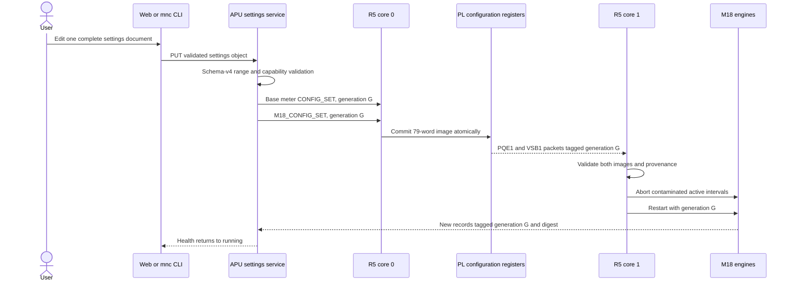
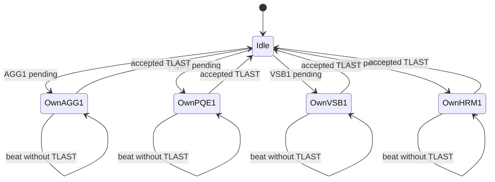
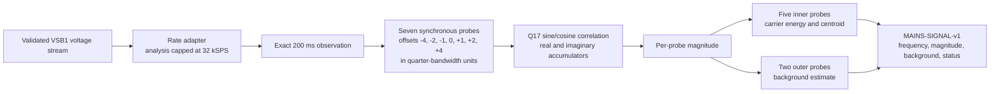
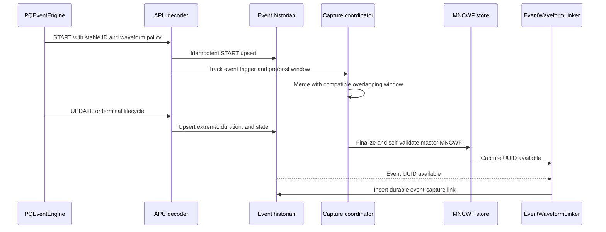
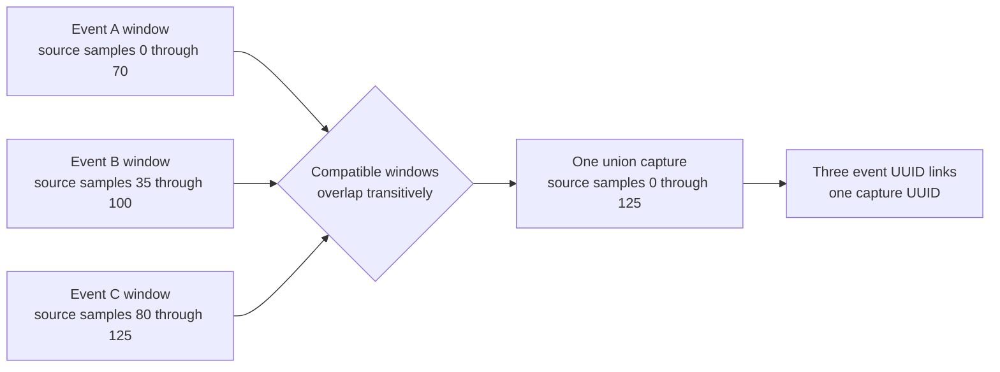
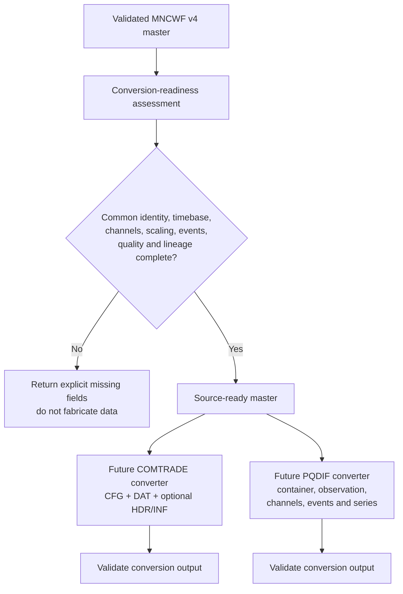
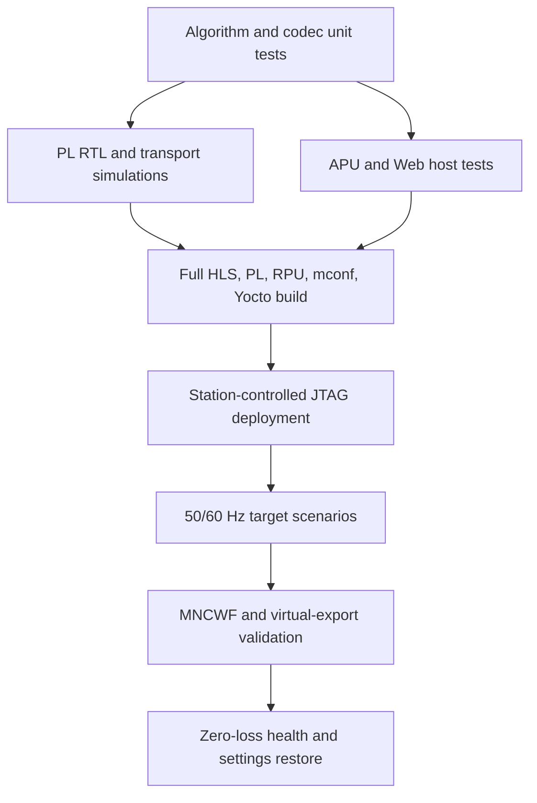

# MSAP1 M18 power-quality implementation report

| Field | Value |
| --- | --- |
| Document ID | DOCPR00018 |
| Milestone | M18 FlickerEngine `0x000E`, MainsSignalEngine `0x000F`, and PQEventEngine `0x0006` |
| Report date | 2026-08-31 |
| Status | Post-implementation report with K26 target acceptance evidence |
| Product baseline | Default ADC rate 128 kSPS; seven metrology channels; 50 Hz and 60 Hz operation |
| Scope | PL measurement transport, R5C1 engines, Linux decode/history/evidence, MNCWF v4, API/CLI, Web UI, simulator, build, deployment, and target validation |

## 1. Purpose

This report describes the implemented M18 power-quality milestone as one
coordinated system. It covers three new public metrology record families:

- `PQ-EVENT-v1`, product ID `0x00060001`;
- `FLICKER-v1`, product ID `0x000E0001`; and
- `MAINS-SIGNAL-v1`, product ID `0x000F0001`.

It explains where each calculation runs, how configuration reaches the
real-time engines, how records reach Linux without using RPMsg for sample
payloads, how event evidence is captured and linked, and how a user can test
the complete feature on a real K26 target with the ADC simulator.

M18 also completed supporting work that is necessary for a usable product:

- independent profiles for IEC voltage events and product alarms;
- event lifecycle identity and durable historian projection;
- overlapping-event capture coalescing and linked MNCWF evidence;
- MNCWF v4 metadata sufficient for later COMTRADE and PQDIF conversion;
- live and historical REST/CLI interfaces;
- Power Quality configuration and reading sub-tabs;
- a PQ Event maker in the ADC simulator;
- reusable waveform viewing, including channel overlay modes;
- manual-only waveform history and event-only evidence navigation;
- storage-policy relocation to Developer settings;
- a top-level Management page with separately confirmed clear operations;
- strict health counters and zero-loss acceptance gates; and
- a resource-driven architecture correction that restored safe K26 routing.

This is an implementation and acceptance report. It is **not** an IEC 61000-4-30,
IEC 61000-4-15, COMTRADE, or PQDIF certification statement. Published values
and lifecycle behavior were tested against deterministic references and a real
target, but formal laboratory conformity remains separate work.

## 2. Milestone outcome

### 2.1 Delivered feature summary

| Feature | Final implementation | User-visible result |
| --- | --- | --- |
| PQ event classification | Half-cycle RMS sufficient statistics in PL; lifecycle classification in R5C1 | Sag, swell, interruption, RVC, voltage/current unbalance, and current sag/swell events |
| Flicker | Shared voltage sample batches from PL; IEC-style lamp/filter/statistical pipeline in R5C1 | Per-phase live `Pinst`, 10-minute `Pst`, and 12-value `Plt` |
| Mains signalling | Shared voltage sample batches from PL; seven-probe synchronous estimator in R5C1 | Per-phase carrier magnitude, background, measured frequency, and status |
| Event evidence | Shared Linux waveform capture coordinator | Pre/post-trigger MNCWF evidence with event metadata and overlap coalescing |
| Event history | Idempotent historian lifecycle upsert plus evidence link table | Canonical event catalogue with grouped overlaps and waveform navigation |
| Waveform format | MNCWF v4 writer, reader, validator, and virtual event export | Self-contained master record ready to feed later converters |
| Simulator | Continuous waveform controls plus half-cycle event sequencer | Repeatable PQ event, flicker AM, and mains-carrier stimuli |
| Product UI | Configuration, Reading, History, Waveforms, Developer, and Management integration | End-to-end configuration, observation, evidence review, and data management |
| Diagnostics | PL/R5/Linux counters and structured logs | Invalid frames, gaps, drops, backlog, stack margin, and capture failures are visible |

### 2.2 Deliberate non-features

The following items are intentionally outside the completed M18 scope:

- Transient-voltage detection is not enabled. The ADC data path is not being
  declared incapable; the analogue frontend and supported sample profiles have
  not yet been characterized for a defensible transient specification.
- COMTRADE and PQDIF files are not generated by the device in M18. MNCWF v4 is
  the master record, and later converters will read that immutable record when
  export is requested.
- M18 does not replace the earlier `PQEVT-v1` (`0x000B0001`) live diagnostic.
  That M12 record remains a separate present-value diagnostic; `PQ-EVENT-v1`
  is the durable lifecycle product.
- Long-duration target observations in this milestone do not constitute a
  formal Class A certification campaign.

M17 remains an independent open tail for all power quadrants, fixed demand,
independent restart, and reset-transaction coverage. M18 acceptance does not
claim those M17 items are complete. Any later M17 fix touching shared meter
records, R5C1 scheduling, IPC, settings, or persistence must repeat the
affected M18 regression and target health gates.

## 3. Release provenance and co-release contract

M18 changes span four application repositories and the product packaging
layer. These components must be released together because their private
packet formats, control payloads, public records, IPC layouts, settings schema,
and Web API assumptions are versioned as one contract.

| Repository | Integration | M18 accepted tip | Responsibility |
| --- | --- | --- | --- |
| `MSAP1_PL` | PR #37, merge `411573e` | `0cf79170` | PQE1 half-cycle statistics, VSB1 voltage batches, packet arbitration, simulator extensions, PL diagnostics |
| `MSAP1_RPU` | PR #26, merge `6ed64e1` | `b596385` | RPMsg-v10 configuration, R5C1 validation, PQ lifecycle, flicker, mains signalling, output records, health |
| `MSAP1_APU` | PR #57, merge `c5c917d` | `b46a279` | Strict decode, settings schema v4, IPC v38, historian, capture/evidence, MNCWF v4, API/CLI, simulator control |
| `MSAP1_WEB` | PR #30, merge `0bab936` | `10905b6` | Configuration/readings/history/waveform/developer/management UI and tests |
| `meta-monutchee` | Co-release revision | `3d8e412` | Co-release packaging and deployable product image |

The final runtime contract versions are:

| Contract | Final version | Purpose |
| --- | ---: | --- |
| R5 control protocol | 10 | Atomic base-meter and M18 configuration with common generation |
| Acquisition IPC | 38 | Typed M18 data, waveform origin, and final health/stack telemetry |
| Settings schema | 4 | Event profiles, flicker, mains signalling, waveform policies, and migration |
| ADC simulator | 1.5 | Carrier, AM, adjacent tone, detune, noise, phase mask, and event sequencer |
| MNCWF | 4 | Portable, self-describing waveform master record and virtual event slices |

No endpoint performs version guessing. An incompatible private packet, public
record, IPC message, or file section is rejected rather than interpreted as a
different revision.

The accepted Station deployment artifact had SHA-256
`e49d8d092d7b617190822ddf22fd4f45d47e619ab6667b5b22b6144b8cf45e30`.
Installed-file fingerprints read back through the product API were:

| Installed component | Fingerprint |
| --- | --- |
| PL firmware | `eccc365229390717c16d347cd55c3d0d` |
| R5C0 firmware | `51334f8e106ea4ff7de238512a5ccb5f` |
| R5C1 firmware | `0a8ac0c68b458b4007cca8f289954dea` |
| Acquisition daemon | `ddb78a38aeade7070d55f30740d05135` |
| Web backend | `c1816d461b3747928e4d1cecc8934a87` |
| Target diagnostic CLI | `cb0c2e5854ea77b7482e34dc492af230` |

## 4. Final end-to-end architecture

### 4.1 Data and control flow

```mermaid
flowchart LR
    subgraph INPUT["Acquisition and simulation"]
        ADC["AD7771 or PL simulator<br/>128 kSPS default<br/>8 signed 24-bit channels"]
        EVTGEN["Half-cycle PQ event sequencer<br/>phase mask, scale, duration, repeat"]
        AM["AM and carrier stimulus<br/>flicker and mains-signalling tests"]
        EVTGEN -.-> ADC
        AM -.-> ADC
    end

    subgraph PL["Programmable logic"]
        CFG["Atomic 79-word<br/>configuration image"]
        PIPE["Existing metrology pipeline<br/>grid lock and converted samples"]
        RMS["Urms one-cycle engine<br/>update every half cycle"]
        PQE1["PQE1 sufficient-statistics packet<br/>69 words with CRC32C"]
        VSB["VSB1 voltage sample batcher<br/>256 frames, 1043 words, CRC32C"]
        OBS["Non-backpressuring observer<br/>integer microvolt conversion"]
        ARB["Five-input whole-packet arbiter<br/>AGG1, PQE1, VSB1, HRM1"]
        ADC --> PIPE
        PIPE --> RMS --> PQE1 --> ARB
        PIPE --> OBS --> VSB --> ARB
    end

    subgraph R5C1["R5 core 1 - arithmetic authority"]
        RX["Bounded AXI FIFO receive<br/>complete-packet ring"]
        CHECK["Magic, revision, length,<br/>reserved fields, provenance, CRC"]
        EVENT["PQEventEngine<br/>START, UPDATE, END, ABORT"]
        FLICKER["FlickerEngine<br/>Pinst, Pst, Plt"]
        MAINS["MainsSignalEngine<br/>seven synchronous probes"]
        REC["64-word public records<br/>single output ring"]
        ARB --> RX --> CHECK
        CHECK --> EVENT --> REC
        CHECK --> FLICKER --> REC
        CHECK --> MAINS --> REC
    end

    subgraph LINUX["Linux APU"]
        DMA["AXI DMA S2MM<br/>meter-record stream"]
        DEC["Strict typed decoders<br/>provenance and reserved-zero checks"]
        SPOOL["Durable meter stream<br/>before latest publication"]
        HIST["Event historian<br/>idempotent lifecycle upsert"]
        CAP["Shared waveform coordinator<br/>overlap union and continuation"]
        MNCWF["MNCWF v4 master files<br/>event links and virtual slices"]
        API["REST and mnc CLI"]
        REC --> DMA --> DEC --> SPOOL
        SPOOL --> HIST
        DEC --> CAP --> MNCWF
        HIST --> API
        MNCWF --> API
    end

    subgraph UI["Product Web UI"]
        READ["Reading / Power Quality"]
        HISTORY["History / PQ Event catalogue"]
        VIEWER["Reusable waveform viewer"]
        CONFIG["Configuration / Power Quality"]
        MANAGEMENT["Management clear operations"]
        API --> READ
        API --> HISTORY --> VIEWER
        API --> CONFIG
        API --> MANAGEMENT
    end

    R5C0["R5 core 0<br/>ADC and control owner"]
    CONFIG -.->|"REST settings"| API
    API -.->|"RPMsg-v10 control only"| R5C0
    R5C0 -.->|"indexed write and commit"| CFG
```



### 4.2 Ownership boundaries

| Function | Owner | Reason |
| --- | --- | --- |
| ADC reset, synchronization, SPI, source selection, and capture control | R5C0 | One hardware owner prevents competing control paths. |
| Sample capture, grid timing, one-cycle/half-cycle statistics, batching | PL | Deterministic work stays adjacent to the sample stream. |
| PQ event, flicker, and mains-signalling arithmetic | R5C1 | One bounded software authority avoids duplicating large engines in PL. |
| AXI DMA S2MM and coherent DDR buffers | Linux | The APU owns descriptors, interrupts, CMA memory, and multi-reader distribution. |
| Durable records, event catalogue, evidence files, REST, and CLI | Linux services | Storage and presentation cannot interfere with real-time capture. |
| Product interaction | `MSAP1_WEB` | The browser consumes typed versioned APIs and does not reconstruct metrology. |

RPMsg is exclusively a control and health path. It never carries ADC samples,
PQE1 frames, VSB1 frames, or final meter records.

### 4.3 Why Flicker and Mains Signalling run on R5C1

The first integrated design instantiated separate Flicker and Mains Signal HLS
engines in PL. It routed, but consumed almost every CLB on the K26 device:

| Resource | Initial routed architecture | Final R5C1-offload architecture |
| --- | ---: | ---: |
| LUT | 85,653 / 117,120 (73.13%) | 54,207 / 117,120 (46.28%) |
| LUTRAM | 5,580 / 57,600 (9.69%) | 5,193 / 57,600 (9.02%) |
| CLB | 14,553 / 14,640 (99.41%) | 11,010 / 14,640 (75.20%) |
| FF | 109,176 / 234,240 (46.61%) | 78,367 / 234,240 (33.46%) |
| BRAM | 126 / 144 (87.50%) | 80 / 144 (55.56%) |
| URAM | 14 / 64 (21.88%) | 12 / 64 (18.75%) |
| DSP | 457 / 1,248 (36.62%) | 270 / 1,248 (21.63%) |

At 99.41% CLB usage, minor future changes could fail placement or cause large
implementation-time variability. The final design retains small deterministic
PL producers and moves the long filter/statistical windows to R5C1. This is not
a lower-rate substitute: VSB1 still validates the complete 128 kSPS source
stream, while each engine performs a defined internal rate reduction.

## 5. Atomic configuration and APPLY behavior

### 5.1 Settings model

Settings schema v4 contains independent objects for:

- nine PQ event profiles;
- FlickerEngine enable, measured phases, lamp model, live cadence, `Pst`
  interval, and `Plt` count;
- MainsSignalEngine enable, carrier, bandwidth, observation interval,
  measured phases, and threshold; and
- manual and event waveform policies.

The APU validates the full settings document before saving it. R5C0 then sends
the base meter configuration and M18 configuration with the same nonzero
generation. The PL exposes a 79-word indexed configuration image. R5C1 accepts
data only when its packet provenance agrees with the applied generation.

### 5.2 Wire payload and PL image

The final RPMsg-v10 control sizes are fixed and guarded at compile time:

| Object | Size |
| --- | ---: |
| M18 configuration body | 316 bytes |
| Complete meter configuration payload | 352 bytes |
| Configuration acknowledgement | 8 bytes |
| Bounded R5 control frame | 384 bytes |
| Available OpenAMP payload | 496 bytes |

The message stays below the OpenAMP payload limit without fragmentation. The
PL-side indexed image is arranged as follows:

| Word range | Content |
| --- | --- |
| 0 | Common nonzero configuration generation |
| 1 | Event profile count, fixed at nine |
| 2 | Current reference |
| 3 | Voltage reference |
| 4 through 66 | Nine event profiles, seven words per profile |
| 67 through 72 | Flicker enable, model, phases, and interval contract |
| 73 through 78 | Mains-signalling enable, carrier, band, phases, threshold, and observation |

R5C0 writes the image through the indexed register interface and commits it as
one generation. A partially written image is never exposed to packet producers.

### 5.3 APPLY sequence



An APPLY may temporarily show degraded M18 health while old-generation state
is aborted and clean new-generation intervals are primed. On the accepted
target, the engines recovered in approximately five seconds. Mixing old and
new settings inside one event or measurement interval is forbidden.

### 5.4 Validation rules

The settings layer rejects, among other cases:

- empty or invalid phase masks;
- unsupported phase policy values;
- thresholds or hysteresis outside the fixed-point range;
- hysteresis greater than or equal to the corresponding threshold;
- event pre/post windows greater than 120 seconds;
- event decimation other than `/1`, `/2`, `/4`, `/8`, `/16`, or `/32`;
- flicker lamp models other than 120 V or 230 V;
- flicker cadence other than 1-second live, 600-second `Pst`, and 12-`Pst`
  `Plt`;
- mains observation intervals other than 200 ms;
- mains carrier bands at or above 12.5 kHz or outside the selected-rate
  Nyquist limit; and
- any request to enable transient voltage before the capability bit is set.

Schema migration from versions 1 through 3 preserves legacy sag, swell, and
interruption thresholds and hysteresis. Newly introduced optional profiles are
left disabled rather than silently changing behavior on upgrade.

## 6. PL implementation

### 6.1 PL responsibilities

The M18 PL path performs only work that must be synchronous with acquisition:

1. consume the existing converted metrology frames;
2. produce one-cycle RMS sufficient statistics at every half-cycle boundary;
3. observe the three voltage lanes and form bounded VSB1 batches;
4. tag each packet with configuration and sample provenance;
5. calculate a CRC32C over every complete packet; and
6. arbitrate complete private packet families toward R5C1 without interleaving.

Neither private producer is permitted to stall the ADC path.

### 6.2 PQE1 half-cycle sufficient-statistics frame

`PQE1` is the private PL-to-R5C1 input for PQEventEngine.

| Property | Value |
| --- | --- |
| Magic | `PQE1` (`0x31455150`) |
| Revision | 1 |
| Total length | 69 32-bit words |
| Header | 4 words |
| Payload | 64 words |
| Trailer | 1 CRC32C word |
| Cadence | One qualified update per half cycle after priming |

The existing sliding one-cycle RMS engine is updated on half-cycle boundaries.
It combines the preceding and current half-cycle square sums to form
`Urms(1/2)`-style one-cycle values without waiting for a second independent
RMS engine. The first boundary after a discontinuity primes state and does not
publish a misleading value.

The payload gives R5C1 enough information to classify voltage and current
profiles without receiving raw samples:

- voltage and current RMS values for phases A, B, and C;
- valid-phase and arithmetic status;
- first, last, and boundary sample anchors;
- sample rate, nominal frequency, and grid lock/fallback state;
- configuration and profile generation;
- voltage and current references;
- all profile thresholds, hysteresis, phase masks, policies, and waveform
  requests; and
- discontinuity and source-status context.

The classifier therefore consumes exact, bounded sufficient statistics; event
waveform decimation never changes classification input.

### 6.3 VSB1 voltage sample batch

`VSB1` is the shared private input for both FlickerEngine and
MainsSignalEngine.

| Property | Value |
| --- | --- |
| Magic | `VSB1` (`0x31425356`) |
| Revision | 1 |
| Frames per packet | 256 |
| Words per frame | 4 |
| Payload | 1,038 words |
| Total packet | 1,043 words |
| Nominal packet rate at 128 kSPS | 500 packets/s |
| Nominal payload traffic | About 2.09 MB/s |

Each sample frame contains signed integer-microvolt values for `Va`, `Vb`, and
`Vc`, followed by flags. The snapshot at packet start includes generation,
sample rate, union phase mask, lamp model, nominal voltage/frequency, live and
`Pst` timing, and mains reference/configuration fields.

Per-frame flags report:

- validity for phases A, B, and C;
- malformed input;
- grid lock and fallback;
- conversion saturation; and
- source continuity state.

The batch trailer carries valid-frame count, aggregate status, and final sample
anchor. A configuration change or observed gap terminates the current batch,
pads it deterministically, marks it contaminated, and marks the next batch as
having a source drop. A lost observation is visible; it cannot be converted
into a plausible clean interval.

### 6.4 Non-backpressuring observation

The voltage batcher is a passive observer. If its downstream path cannot keep
up, it increments a drop counter and records the discontinuity instead of
asserting backpressure into acquisition. This preserves the primary metrology
stream at the cost of invalidating the affected flicker or mains interval,
which is the safe failure mode.

### 6.5 Whole-packet arbitration

The final private transport shares the existing R5C1 FIFO among `AGG1`,
`PQE1`, `VSB1`, and `HRM1` producers through the proven five-input round-robin
arbiter. Input 3 is tied to constant zero for interface compatibility and is
optimized out. An owner is selected only while the arbiter is idle, and
ownership is held through `TLAST`. Therefore words from two private families
can never be interleaved.



Round-robin selection at packet boundaries supplies bounded fairness while
preserving the framing required by CRC validation.

## 7. R5C1 private transport and scheduling

### 7.1 Packet validation

R5C1 has no negotiation or fallback for the private PL protocol. For every
packet it validates:

- magic and revision;
- exact word length;
- expected `TLAST` position;
- reserved-zero fields;
- configuration generation and profile provenance;
- sequence continuity;
- source/discontinuity flags; and
- reflected CRC32C using polynomial `0x82F63B78`, initial and final XOR
  `0xFFFFFFFF`.

The standard check vector `123456789` produces `0xE3069283`. A frame that
fails any condition is counted and discarded before an arithmetic engine sees
it.

### 7.2 Bounded runtime design

R5C1 uses static storage and a 64-packet complete-frame ring. Large state is
kept out of task stacks. The task priorities are intentionally ordered:

| Task | Priority | Responsibility |
| --- | ---: | --- |
| Bootstrap | 5 | Initialize private transport and engine state |
| RPMsg/control | 4 | Receive coherent configuration and health requests |
| `AGG_RX` | 3 | Drain and validate PL packets |
| `AGG_TX` | 2 | Emit complete 64-word public records |
| `AGG_VAL` | 1 | Run bounded arithmetic and interval finalization |

The receive task drains at most four packets per activation and is serviced at
1 kHz, for a ceiling of 4,000 packets/s. The calculated peak requirement is no
more than 685 packets/s, or 754 packets/s including ten-percent headroom. I/O
therefore outranks arithmetic, and arithmetic cannot monopolize the core.

### 7.3 Shared VSB1 fan-out

After one VSB1 packet passes validation, R5C1 gives a zero-copy view of the
same payload to FlickerEngine and MainsSignalEngine. Each engine maintains its
own enable, phase mask, rate conversion, interval state, and contamination
state. Disabling one engine does not alter the other engine's stream.

### 7.4 Public record output

Every finalized M18 result becomes one fixed 256-byte public meter record:

- 64 32-bit beats;
- `TLAST` on beat 63;
- an exact product ID and revision;
- configuration generation and sequence;
- source sample anchors and quality state; and
- deterministic reserved-zero fields.

The records return through the existing R5C1-to-PL FIFO and meter-record switch
to Linux DMA. M12's direct `PQEVT-v1` diagnostic remains on its original PL
path and is not confused with the R5C1 lifecycle stream.

## 8. PQEventEngine (`0x0006`)

### 8.1 Event profile inventory

M18 defines nine independently configured profiles in fixed wire order:

| Index | Profile | Classification | Factory state | Factory threshold | Factory waveform |
| ---: | --- | --- | --- | ---: | --- |
| 0 | Voltage sag | IEC voltage phenomenon | Enabled | 90% | Enabled, 3 s pre + 3 s post, `/8` |
| 1 | Voltage swell | IEC voltage phenomenon | Enabled | 110% | Enabled, 3 s pre + 3 s post, `/8` |
| 2 | Voltage interruption | IEC voltage phenomenon | Enabled | 10% | Enabled, 3 s pre + 3 s post, `/8` |
| 3 | Rapid voltage change | IEC voltage phenomenon | Enabled | 3% delta | Enabled, 3 s pre + 3 s post, `/8` |
| 4 | Voltage unbalance | Product alarm | Disabled | 2% | Disabled |
| 5 | Current sag | Product alarm | Disabled | 90% | Disabled |
| 6 | Current swell | Product alarm | Disabled | 110% | Disabled |
| 7 | Current unbalance | Product alarm | Disabled | 10% | Disabled |
| 8 | Transient voltage | Reserved capability | Disabled/unavailable | 150% | Disabled |

The first four are identified as IEC-style voltage phenomena. The current and
unbalance profiles are explicitly product alarms, not silently presented as
IEC classifications.

### 8.2 References and phase policy

Voltage-relative thresholds use the configured nominal voltage. Current-relative
profiles require a nonzero current reference; a zero reference keeps those
alarms disarmed. Every profile also has:

- an enable;
- threshold and hysteresis;
- affected-phase mask;
- `per_phase` or `polyphase` policy; and
- independent waveform enable, pre-trigger, post-trigger, and decimation.

Per-phase policy maintains a separate state machine for A, B, and C. Polyphase
policy maintains one canonical event whose phase mask and extrema describe the
participating phases.

### 8.3 Lifecycle state machine

```mermaid
stateDiagram-v2
    [*] --> Idle
    Idle --> Active: qualified threshold crossing
    Active --> Active: still active; update extrema
    Active --> Active: one-second UPDATE due
    Active --> Ended: recovery boundary including hysteresis
    Active --> Aborted: invalid input, discontinuity, APPLY, or incompatible generation
    Ended --> Idle: terminal record emitted
    Aborted --> Idle: terminal record emitted
```



The public lifecycle consists of `START`, periodic `UPDATE`, `END`, and
`ABORT` records. `START` captures the trigger sample and initial extrema.
`UPDATE` is emitted at most once per second while maintaining the same stable
identity. `END` carries final duration and extrema after qualified recovery.
`ABORT` proves why a partially observed event did not receive a normal end.

### 8.4 Threshold and recovery behavior

The engine applies strict start comparisons:

- sag and interruption start below their thresholds;
- swell, RVC, and unbalance start above their thresholds; and
- current sag/swell follow the analogous reference-relative comparisons.

Recovery is inclusive and incorporates configured hysteresis. This prevents
noise near a threshold from producing rapid start/end chatter.

RVC compares the current one-cycle value with the value one complete cycle
earlier. It does not compare adjacent half-cycle outputs because those windows
overlap and would understate or spread a step response.

Voltage and current unbalance are calculated as the maximum phase deviation
from the three-phase average, normalized by that average. Invalid or missing
required phases invalidate the corresponding classification opportunity.

### 8.5 Stable event identity

R5C1 assigns an internal identity from its session plus a monotonic event
counter. All lifecycle records for that event carry the same identity. Linux
derives a deterministic RFC 4122 version-5 UUID from it; replaying or
re-projecting the same records therefore updates the existing event instead of
creating a duplicate row.

The event snapshot includes:

- lifecycle, type, phase mask, and trigger source;
- sequence, configuration generation, and profile generation;
- sample rate and first/last/trigger samples;
- duration in source samples;
- valid and status masks;
- threshold, hysteresis, and reference;
- per-phase minimum, maximum, and current values;
- waveform policy;
- UTC/time-quality fields assigned by Linux;
- discontinuity and update counts; and
- a digest of the exact settings that performed classification.

R5C1 deliberately does not fabricate UTC. Linux resolves sample anchors using
its timebase correlation and marks the resulting quality.

### 8.6 Classification and evidence are independent

Event detection always runs on the full-rate-derived half-cycle RMS stream.
The factory waveform decimation of `/8` affects only stored evidence:

```text
128,000 source frames/s / 8 = 16,000 stored frames/s
```

At 50 Hz this retains about 320 stored frames per cycle; at 60 Hz it retains
about 267. This is substantially more than required to see RMS events while
reducing event storage by eight times. Choosing `/16` or `/32` may be useful
for longer operational retention, but `/8` is the M18 default because it
preserves generous waveform detail for later analysis and export.

## 9. FlickerEngine (`0x000E`)

### 9.1 Product model

FlickerEngine implements separate 120 V and 230 V lamp models and produces
three kinds of `FLICKER-v1` record:

| Kind | Cadence | Meaning |
| --- | --- | --- |
| Live | 1 second | Current instantaneous perceptibility (`Pinst`) and health |
| `Pst` | 600 seconds | Short-term severity from a clean 10-minute distribution |
| `Plt` | 12 clean `Pst` values | Long-term severity using a cubic mean |

The record family ID remains `0x000E0001`; the record kind distinguishes live,
`Pst`, and `Plt` products without inventing unrelated IDs.

### 9.2 Signal-processing flow

```mermaid
flowchart LR
    VSB1["Validated VSB1<br/>Va, Vb, Vc at source rate"]
    NORM["Normalize to lamp reference<br/>120 V or 230 V"]
    DEC["Mean-square rate conversion<br/>to 2 kHz"]
    FILTER["Seven-section fixed-point<br/>lamp and weighting filter chain"]
    SQUARE["Square and lamp-memory<br/>smoothing"]
    PINST["Instantaneous perceptibility<br/>Pinst in Q16"]
    LIVE["One-second live record"]
    HIST["512-bin statistical histogram<br/>600 seconds"]
    PST["Percentile groups and<br/>weighted Pst equation"]
    PLTQ["Queue 12 clean Pst values"]
    PLT["Cubic mean Plt"]

    VSB1 --> NORM --> DEC --> FILTER --> SQUARE --> PINST
    PINST --> LIVE
    PINST --> HIST --> PST --> PLTQ --> PLT
```



### 9.3 Internal sampling and filtering

Input rates of 2, 4, 8, 16, 32, 64, and 128 kSPS are supported when they are
integer multiples of the internal 2 kHz flicker rate. A mean-square adapter
preserves modulation energy while reducing the source stream. The normalized
signal then traverses seven Q30 biquad sections with coefficient sets selected
for the 120 V or 230 V lamp model.

The output path squares and smooths the weighted response to obtain
instantaneous perceptibility. `Pinst`, `Pst`, and `Plt` are transported as Q16
values, avoiding floating-point wire ambiguity.

### 9.4 `Pst` and `Plt`

The 600-second classifier accumulates a 512-bin distribution. At finalization,
it evaluates the required percentile groups around `P0.1`, `P1s`, `P3s`,
`P10s`, and `P50s`, applies the fixed weighted equation, and takes the square
root to produce `Pst`.

`Plt` is the cubic mean of twelve clean `Pst` values:

```text
Plt = cubic_root((Pst_1^3 + ... + Pst_12^3) / 12)
```

An invalid packet, source gap, arithmetic overflow, configuration change, or
contaminated interval invalidates the current `Pst`. It also resets the `Plt`
queue. Twelve new clean `Pst` intervals are required before a new `Plt` can be
published. The engine never fills a missing interval with the last good value.

### 9.5 Settling and validity

The filter chain has a 10-second settling period after enable, compatible
configuration APPLY, or reset. Live health makes settling visible. Long-term
statistics begin only after clean settled input, so startup transients do not
pollute `Pst`.

## 10. MainsSignalEngine (`0x000F`)

### 10.1 Product model

M18 implements one configured carrier per meter. For each enabled phase, every
200 ms observation reports:

- configured carrier frequency;
- measured carrier frequency;
- carrier magnitude;
- adjacent-band background magnitude;
- configured bandwidth;
- reference voltage and threshold; and
- lock, fallback, discontinuity, overflow, and background-dominant status.

Carrier and measured frequency are transported in millihertz. Magnitudes are
transported in microvolts.

### 10.2 Seven-probe synchronous estimator



The estimator does not run a second general FFT. It correlates the signal with
seven frequencies around the configured carrier. The five inner probes form
the carrier magnitude and a weighted frequency centroid; the two outer probes
estimate neighboring background.

### 10.3 Rate and bandwidth constraints

The complete source sequence is checked at its incoming rate, but arithmetic
is capped at 32 kSPS to bound R5C1 memory and execution time. The 200 ms window
therefore requires no more than 6,400 analysis samples per phase.

The configured carrier plus bandwidth must remain below both:

- the selected-rate Nyquist limit; and
- the product's characterized 12.5 kHz analogue band.

The engine supports 2 through 128 kSPS source profiles in power-of-two steps.
The factory carrier is 1 kHz with 20 Hz bandwidth, but the engine is disabled
until the user explicitly configures a signalling application.

### 10.4 Decision behavior

The threshold is a percentage of nominal/reference voltage. A zero threshold
still allows observation; the UI can present measured carrier and background
without claiming an alarm threshold. Background-dominant, source-gap, and
overflow states remain explicit in the status word.

## 11. Linux decode, publication, and history

### 11.1 Strict record decoding

Linux has a dedicated decoder for each M18 public record. A record is accepted
only when all structural and semantic conditions hold:

- exact product ID and revision;
- exact record size;
- valid record kind and enum values;
- coherent configuration/profile provenance;
- legal phase and valid masks;
- consistent sample anchors and contribution counts;
- reserved fields equal zero; and
- values inside representable ranges.

A rejected record increments typed diagnostics and includes enough structured
context to identify the interval and reason. It is not published as latest and
is not projected into history.

### 11.2 Durable-before-latest rule

Every accepted record enters the durable meter stream before it updates a
latest-value cache. This ordering ensures that a Web refresh cannot show a
value which has already been lost to history. Historian lag is visible through
consumer cursors and does not block acquisition DMA.

### 11.3 Latest views

The APU maintains:

- separate latest Flicker views for live, `Pst`, and `Plt`;
- one latest Mains Signalling view; and
- the existing M12 live PQ diagnostic independently from the M18 event
  catalogue.

Sequence and gap counters accompany these views so a plausible numeric value
cannot hide a discontinuous source.

### 11.4 Event historian

The event historian stores the canonical lifecycle row keyed by the stable
event UUID. `START`, `UPDATE`, `END`, and `ABORT` are idempotent upserts: replay
or restart does not duplicate the event. Terminal state, duration, extrema,
time quality, discontinuities, settings digest, and source anchors remain with
the canonical row.

Waveform relationships are stored in a separate event-to-capture link table.
Deleting an event removes the catalogue row and its links, but does not delete
a shared MNCWF capture that may contain other events. Waveform deletion and
bulk data clearing are intentionally separate operations.

### 11.5 Event-to-waveform linking

`EventWaveformLinker` is an ordered retry worker outside the DMA hot path. It
allows the capture to complete and the historian to catch up in either order,
then creates the durable link. Temporary storage or historian latency cannot
block meter-record ingestion.



## 12. Event waveform capture and evidence management

### 12.1 One capture framework, two product views

Manual captures and PQ-event captures use the same waveform ring, file writer,
MNCWF v4 format, retention engine, and viewer. They are intentionally separated
in navigation:

- **Waveforms / Capture history** lists manual captures only; and
- **History / PQ Event catalogue** lists PQ events and their linked evidence.

This prevents automatic event captures from flooding the manual waveform
library while preserving one implementation and one master file format.
Each session carries an origin of `manual`, `power_quality`, `mixed`, or the
legacy origin so filtering is deterministic rather than filename-based.

### 12.2 Pre-trigger and post-trigger behavior

The shared-memory waveform history continually retains enough source frames to
satisfy configured pre-trigger windows. On a PQ `START`, the coordinator:

1. translates the R5 source-sample trigger into the acquisition timeline;
2. claims the requested pre-trigger history;
3. continues collecting through the requested post-trigger boundary;
4. applies the profile's evidence decimation;
5. attaches event descriptors, settings, time quality, and source lineage;
6. writes a temporary MNCWF v4 file;
7. validates the completed file with the production reader; and
8. atomically renames it into persistent storage.

An incomplete or invalid file is never advertised as a completed capture.

### 12.3 Overlapping events

Independent event profiles can overlap. For example, a deep interruption also
crosses the sag threshold, and a three-phase disturbance can create one event
per phase under a per-phase policy. Starting a new file for every lifecycle
would duplicate almost identical high-rate samples.

The coordinator instead takes the union of compatible windows:



All participating event UUIDs are stored in the MNCWF event section and linked
to the same capture UUID. The Web catalogue groups transitively overlapping
events into one large row with expandable child events; users can still select
or delete individual canonical events.

### 12.4 Capacity and continuation

One history session is bounded at 128 MiB. If an active union window would
exceed the safe limit, the coordinator finalizes a complete master segment and
continues in another segment. Bidirectional lineage records master/continuation
relationships, part index/count when known, and the exact source-sequence
range. The event catalogue can therefore present one evidence relationship
without pretending the bytes form one unbounded file.

### 12.5 Deletion semantics

Deletion is explicit and separated by object type:

| Operation | Deletes | Preserves |
| --- | --- | --- |
| Delete selected PQ events | Canonical event rows and their link rows | Shared MNCWF capture files and unrelated events |
| Delete waveform session | Selected capture and its file | Canonical event rows; their missing evidence becomes visible |
| Clear PQ event catalogue | All event rows and event-link projections | Waveform files |
| Clear waveform data | All waveform sessions/files | Meter history and event rows |
| Clear meter projections | Meter historian data selected by that control | PQ event and waveform stores |

The Web UI requires a confirmation dialog for destructive actions. The top-level
Management page provides separate controls so a normal cleanup cannot
accidentally erase all retained product data.

## 13. MNCWF v4 master record

### 13.1 Design objective

MNCWF v4 is the authoritative stored waveform. It is designed to contain all
information that a later COMTRADE or PQDIF converter needs without consulting
the device's mutable current settings, live databases, or UI state.

M18 does not write COMTRADE or PQDIF. The supported export format remains:

```text
mncwf
```

Requests for another format fail explicitly and list the available format.
This avoids generating a partial standards file which looks valid but lacks
source identity, time quality, scaling, or event context.

### 13.2 Container layout

| Field | Value |
| --- | --- |
| Magic | `MNCWF1\0\0` |
| Format version | 4 |
| Byte order | Little-endian |
| Fixed file header | 64 bytes |
| Directory entry | 56 bytes |
| Section envelope | 48 bytes |
| Alignment | 8 bytes |
| Integrity | Header, directory, and per-section CRC32C |
| Reader safety limit | 512 MiB |

Seven sections are mandatory:

| Section | Purpose |
| ---: | --- |
| 1. Capture metadata | Stable identity, device/build/configuration, nominal system, calibration and site context |
| 2. Timebase segments | Exact source/persisted rates, sample/sequence mapping, TAI/UTC correlation and uncertainty |
| 3. Channel definitions | Identity, phase, quantity, unit, encoding, exact gain/offset, range, resolution and clipping |
| 4. Event descriptors | Canonical event UUIDs, lifecycle, taxonomy, thresholds, extrema, settings and sample/time anchors |
| 5. Quality intervals | Validity, gaps, clock status, saturation and other bounded quality spans |
| 6. Lineage | Parent/related capture and event UUIDs, sequence range and continuation membership |
| 7. Sample data | Signed interleaved channel samples with geometry tied to the channel/timebase sections |

### 13.3 Capture metadata

The capture section can preserve:

- stable capture and device UUIDs;
- firmware, build, profile, configuration, calibration, and sensor-board
  identities or digests;
- nominal voltage and frequency as exact rational values;
- topology and calibration context;
- first TAI and UTC anchors;
- station, site, circuit, product, model, serial, and comments when known; and
- the source trigger/origin and capture settings.

Optional identity which is not known is omitted or marked absent. It is never
invented to satisfy a later exporter.

### 13.4 Exact timebase

The timebase section records both acquisition and persisted sample rates as
rational values. It also preserves:

- exact source-frame and persisted-frame mapping;
- sequence step and discontinuity boundaries;
- capture divisor and decimation method;
- TAI/UTC correlation and uncertainty;
- local UTC offset and leap state where available;
- clock and time-quality flags; and
- rate-change or gap flags.

Consequently, a converter can write timestamp and sample-rate declarations
from evidence recorded at capture time, not from the meter's settings at
conversion time.

### 13.5 Channel scaling

Each channel definition contains stable identity and exact affine conversion:

```text
engineering_value = raw_value * gain + offset
```

Gain and offset are stored exactly rather than as display-formatted decimal
text. The record also carries phase, measured quantity, unit, encoding, bit
width, display exponent, primary/secondary ratio, nominal value, expected
range, resolution, clipping status, and human-readable names. These fields are
the basis for COMTRADE analogue-channel coefficients and PQDIF channel
metadata.

### 13.6 Event and quality context

The event section embeds the canonical facts required to interpret a waveform:

- stable event UUID;
- IEC or product taxonomy and event type;
- lifecycle and affected phases;
- trigger and duration samples;
- TAI/UTC values, uncertainty, and time quality;
- generation, threshold, hysteresis, and reference;
- minimum/maximum/severity values;
- update/discontinuity/status values;
- taxonomy/label strings; and
- a snapshot of the event settings as JSON.

Quality intervals describe bounded spans rather than one optimistic file-wide
boolean. A future exporter can warn about or split around a known gap without
discarding otherwise valid evidence.

### 13.7 Strict writer and reader

The writer builds the file in a temporary location, closes all sections,
calculates geometry and CRCs, invokes the production reader as a structural
self-check, and only then performs the atomic rename.

The reader rejects before exposing sample data when it finds:

- truncation or arithmetic overflow;
- section overlap or misalignment;
- a missing or duplicate mandatory section;
- invalid header, directory, envelope, or payload CRC;
- invalid UTF-8;
- nonzero reserved fields;
- inconsistent sample/channel/timebase geometry; or
- unsupported identifiers or revisions.

### 13.8 Virtual event export

An event can share a long capture with other events. Exporting that event does
not create a second persistent derivative. The virtual-slice exporter:

1. selects a completed source session and canonical event UUID;
2. computes the event-related sample window;
3. streams bounded sample chunks from the master;
4. clips event and quality intervals to the requested window;
5. retains lineage back to the master capture;
6. regenerates metadata, directory entries, and CRCs; and
7. returns a complete independently valid MNCWF v4 stream.

The CLI and REST paths use the same implementation. Target acceptance proved
their byte streams were identical.

### 13.9 Conversion readiness



`assess_mncwf_v4_conversion_readiness()` first performs full structural
validation, then reports readiness and missing fields separately. The accepted
manual, PQ-event, and virtual-slice files reported both
`comtrade_ready = 1` and `pqdif_ready = 1`.

The future converters must obey these rules:

- consume only the selected MNCWF record and explicit export options;
- never query current settings to fill historical metadata;
- never invent optional geographic, vendor, noise, or frequency-response data;
- fail or warn explicitly when a target format requires unavailable data;
- retain stable source/event identity and conversion provenance; and
- validate the generated file before returning it.

## 14. REST API and command-line interface

### 14.1 REST resources

| Method and path | Purpose |
| --- | --- |
| `GET /api/v1/meter/power-quality` | Existing live half-cycle PQ diagnostic |
| `GET /api/v1/meter/power-quality/events` | Query durable M18 canonical events by ID, UTC range, and limit |
| `DELETE /api/v1/meter/power-quality/events` | Confirmed deletion of selected events or the catalogue |
| `GET /api/v1/meter/flicker` | Latest independent live, `Pst`, and `Plt` observations |
| `GET /api/v1/meter/mains-signalling` | Latest mains-carrier observation |
| `GET /api/v1/waveforms` | Capture inventory including origin, UUID, lineage, and completion state |
| `GET /api/v1/waveforms/export` | Stream a validated event slice selected by session, event, and `format=mncwf` |

Event query limits default to 100 and are capped at 1,000. Destructive routes
require an explicit confirmation value; an empty selection is not interpreted
as permission to delete everything.

### 14.2 CLI examples

Latest and historical measurements:

```sh
mnc meter power-quality
mnc meter power-quality events --limit 100
mnc meter power-quality events --event EVENT_UUID
mnc meter flicker
mnc meter mains-signalling
mnc meter health --full
```

Waveform discovery and event-slice export:

```sh
mnc waveform status
mnc waveform list
mnc waveform export \
    --session 44 \
    --event EVENT_UUID \
    --format mncwf \
    --file event-session-44.mncwf
```

The export command requires a completed session, a nonzero canonical UUID, and
the explicit `mncwf` format. It writes a temporary local file, verifies stream
completion, synchronizes it, and removes an incomplete output on failure.

### 14.3 Compatibility behavior

The API exposes names such as `voltage_sag`, `rapid_voltage_change`, and
`current_unbalance`; it does not expose R5 array indices as a user interface.
The Web and CLI both consume the same typed projections. Unsupported format,
invalid UUID, missing completed session, out-of-range query, and unavailable
transient requests return explicit errors.

## 15. Web UI implementation

### 15.1 Power Quality configuration

`Configuration / Meter settings / Power Quality` is divided into three
sub-sub-tabs:

- **Flicker**: enable, 120/230 V lamp model, and measured phases;
- **Mains signal**: enable, carrier, bandwidth, threshold, observation, and
  phases; and
- **PQ Event profiles**: current reference plus the nine profile cards,
  threshold, hysteresis, phase policy/mask, and waveform policy.

Transient voltage is visibly unavailable and explains that analogue-frontend
characterization is required. Its disabled appearance is not a claim that the
ADC can never support a future characterized transient product.

### 15.2 Live readings

`Reading / Power Quality` uses the same three sub-sub-tab concepts:

- per-phase live `Pinst`, `Pst`, and `Plt`, with cadence and gap health;
- configured/measured mains carrier, bandwidth, threshold, per-phase carrier
  and background, and status; and
- live event/product health without embedding the historical catalogue.

The event catalogue was moved to History because it is a durable historical
feature rather than a present-value meter reading.

### 15.3 PQ Event catalogue

`History / PQ Event catalogue` provides:

- canonical grouped rows for transitively overlapping events;
- an expand/collapse control for child event lifecycles;
- phase, duration, classification, thresholds, extrema, time quality,
  generation, settings digest, samples, and discontinuities;
- linked evidence state and master/continuation identity;
- **View waveform** using the common viewer;
- **Download event MNCWF** using virtual export;
- individual selection, select-all, and multi-event deletion; and
- a confirmation dialog before deletion.

Grouping is presentation only. Each child retains its stable UUID and remains
individually queryable or deletable.

### 15.4 Waveform viewer

The common viewer supports raw ADC counts or converted amperes/volts, channel
selection, automatic visible-view or fixed whole-capture scaling, zoom, pan,
fit, trigger navigation, and event markers.

M18 added three layout modes:

1. **Separate**: one plot lane per selected channel;
2. **Voltage/current overlay**: all selected voltage channels share one plot
   and all selected current channels share another; and
3. **Overlay all channels**: one global plot for all selected channels.

Independent unit scaling is retained where required so overlaying current and
voltage cannot silently imply the same engineering magnitude.

### 15.5 ADC simulator

`Developer / ADC Simulator` uses sub-sub-tabs for:

- Measurement lanes;
- Harmonics; and
- Power quality / PQ Event maker.

The PQ Event maker arms a phase-continuous amplitude envelope at the next
half-cycle boundary. The user chooses voltage/current lanes or phases, scale
percentage, duration in half cycles, optional repeat period, and repeat mode.
Query, cancel, and completed-burst count are also visible.

### 15.6 Storage and management navigation

Raw spool and historian storage location, retention, and maximum size were
moved out of normal Meter settings into `Developer / Database`. These are
system-integration controls that ordinary meter users should not alter.

A top-level **Management** page now owns confirmed clear operations for:

- meter data projections;
- PQ events; and
- waveform data.

Each operation describes its scope independently.

## 16. ADC simulator support

### 16.1 Continuous stimulus

Simulator protocol v1.5 adds or preserves controls required by M18:

- absolute-frequency mains-signalling carrier;
- adjacent carrier for background/selectivity tests;
- amplitude modulation frequency and depth for flicker;
- carrier detune;
- deterministic noise;
- per-feature phase masks; and
- phase-preserving APPLY behavior.

The generator keeps its phase accumulator, fractional scheduler, and packet
framing across compatible configuration APPLY operations. This prevents a
settings edit from creating an unrelated zero-degree phase restart.

### 16.2 Event sequencer

The event sequencer is a separate control message rather than part of the
saved configuration. An `arm` operation starts at the next half-cycle boundary
without stopping capture. This makes the programmed amplitude change the only
intended stimulus discontinuity.

Supported actions are:

| Action | Behavior |
| --- | --- |
| `arm` | Commit lane mask, scale, duration, period, and repeat; start on next half cycle |
| `query` | Return idle/armed/running/holding state and counters without mutation |
| `cancel` | Remove the active envelope immediately without counting an incomplete repeat |
| `clear-count` | Reset completed-burst bookkeeping without stopping a running burst |

Example at 60 Hz:

```sh
mnc adc source --set simulator
mnc adc simulator configure --frequency-hz 60
mnc adc simulator event --action arm \
    --channels voltage \
    --scale-percent 70 \
    --duration 20
mnc adc simulator event --action query
```

Twenty half cycles are approximately 167 ms at 60 Hz and 200 ms at 50 Hz.
The actual lifecycle duration is reported from source sample counters rather
than a host wall-clock estimate.

## 17. Diagnostics and failure containment

### 17.1 Failure policy

The common rule is: **invalidate and report; never fabricate continuity**.

| Failure | Containment | Visibility |
| --- | --- | --- |
| PL observer cannot keep up | Primary acquisition continues; current/next VSB1 interval marked dropped | PL/R5 VSB1 source-drop counters |
| Private packet CRC or length error | Entire packet rejected before arithmetic | Per-family invalid and CRC counters |
| Packet sequence gap | Engines invalidate contaminated interval | Gap counters and output status |
| Configuration generation changes | Active events abort; flicker/mains intervals restart | `ABORT`, generation, settings digest, temporary degraded health |
| Grid unlock/fallback | Quality propagated into records and file intervals | Status masks and time/measurement quality |
| R5 output ring pressure | Counted; no partial 64-word record emitted | Push/drop counters |
| Linux record mismatch | Record rejected; latest/history unchanged | Structured `meter_record_decode_rejected` log |
| Historian lag | Durable cursor falls behind; DMA continues | Historian lag and cursor diagnostics |
| Waveform writer failure | Session stays incomplete; no completed file advertised | Materialization/failure counters |
| Event link race | Ordered retry waits for both objects | Linker retry/health state |
| Invalid MNCWF | Reader rejects before samples; temporary file removed | Explicit validation error |

### 17.2 Health telemetry

The accepted R5C1 health surface included:

- received and validated packet counts by family;
- invalid magic/revision/length/reserved/provenance/CRC counters;
- sequence gaps and ring overflow;
- result push and output-drop counters;
- engine-specific interval contamination;
- task progress/heartbeat; and
- remaining stack bytes for control, input, output, and validator tasks.

Linux health included acquisition invalid/gap/DMA-overrun counts, ADC errors,
waveform ring loss, incomplete sessions, materialization failure, historian lag,
event-link health, and structured error-log counts.

### 17.3 Transient-voltage negative capability

Attempting to enable transient voltage returns HTTP 409 with the message:

```text
transient-voltage detection is unavailable until the analogue frontend is characterized
```

This is a tested capability gate. The profile remains visible so its eventual
settings shape and evidence policy are stable, but both settings validation and
the R5 capability flag prevent accidental activation.

## 18. Build, timing, and capacity result

### 18.1 Final routed K26 result

| Metric | Accepted value |
| --- | ---: |
| LUT | 54,207 / 117,120 (46.28%) |
| LUTRAM | 5,193 / 57,600 (9.02%) |
| CLB | 11,010 / 14,640 (75.20%) |
| FF | 78,367 / 234,240 (33.46%) |
| BRAM | 80 / 144 (55.56%) |
| URAM | 12 / 64 (18.75%) |
| DSP | 270 / 1,248 (21.63%) |
| Control sets | 2,272 / 29,280 (7.76%) |
| Worst negative setup slack | `+0.458657 ns` |
| Total negative setup slack | `0 ns` |
| Worst hold slack | `+0.009768 ns` |
| DRC errors / critical warnings | 0 / 0 |

The final design has materially better placement margin than the rejected
99.41% CLB architecture. BRAM also fell from 87.50% to 55.56%; low LUTRAM use
was not itself a problem because large deterministic buffers are better mapped
to block memory than scattered logic when the inferred access shape permits it.

### 18.2 Build duration

One accepted build inventory was:

| Stage | Elapsed time |
| --- | ---: |
| HLS | 5 min 49 s |
| PL | 15 min 29 s |
| RPU | 1 min 45 s |
| mconf | 1 min 19 s |
| Yocto | 2 min 19 s |
| Total | 26 min 41 s |

A later complete chain completed in 27 min 53 s. This returned HLS close to
its normal duration and PL close to the pre-saturation duration after the R5C1
offload removed the two large PL engines.

### 18.3 R5C1 capacity

The accepted R5C1 image linked at 908,165 bytes, leaving 7,482,192 bytes free
in its 8 MiB region. Ninety-two guarded stack frames were audited; the largest
was 472 bytes, below the 1 KiB design ceiling. Target-observed remaining stack
was:

| Task | Minimum remaining bytes |
| --- | ---: |
| Control | 6,464 |
| Input | 7,848 |
| Output | 7,752 |
| Validator/arithmetic | 3,888 |

All exceed the 2 KiB target acceptance floor.

## 19. Verification strategy

M18 verification is layered. A target demonstration alone cannot prove packet
framing corner cases, while unit tests alone cannot prove the routed design,
DMA path, filesystem, or UI behavior.



## 20. Host and repository test procedure

### 20.1 PL checks

From the workspace root, rebuild HLS only if HLS sources changed:

```sh
./mnc HLS build
```

Run focused PL elaboration/simulation/synthesis checks from `MSAP1_PL` using
the project Vivado environment:

```sh
vivado -mode batch \
    -source SourceData/Script/AI_gen/check_meter_core.tcl
vivado -mode batch \
    -source SourceData/Script/AI_gen/check_meter_waveform.tcl
vivado -mode batch \
    -source SourceData/Script/AI_gen/check_power_quality_transport.tcl
vivado -mode batch \
    -source SourceData/Script/AI_gen/check_metering_pipeline.tcl
vivado -mode batch \
    -source SourceData/Script/AI_gen/check_meter_record_switch.tcl
vivado -mode batch \
    -source SourceData/Script/AI_gen/check_metering_synthesis.tcl \
    -tclargs MeterCore_Wrapper
```

The focused checks must prove:

- PQE1 exact 69-word framing and CRC;
- VSB1 exact 1,043-word framing, frame order, flags, padding, and CRC;
- no packet-family interleaving;
- round-robin progress under simultaneous producers;
- source-gap propagation;
- correct phase/sample ordering at 128 kSPS; and
- unchanged primary ADC and meter-record behavior.

Then run the complete PL flow:

```sh
./mnc PL build
./mnc PL report
```

Reject the image for negative setup/hold slack, DRC errors, or resource growth
that materially removes placement margin.

### 20.2 RPU checks

From `MSAP1_RPU`:

```sh
bash R5c1/tests/run_aggregation_shadow_tests.sh
bash R5c1/tests/run_aggregation_engine_reference_tests.sh
```

These suites exercise private packet validation, lifecycle thresholds and
hysteresis, per-phase/polyphase behavior, discontinuity abort, generation
changes, published flicker vectors, mains probe behavior, output record
encoding, ring pressure, scheduling budget, and health counters.

Build both R5 images through the normal product flow:

```sh
./mnc RPU build
```

or, when working inside the repository with the configured Vitis environment:

```sh
vitis -s scripts/build_r5_apps.py -- all
```

### 20.3 APU checks

From `MSAP1_APU`:

```sh
git submodule update --init --recursive
cmake -S . -B build -DCMAKE_BUILD_TYPE=Release
cmake --build build
ctest --test-dir build --output-on-failure
```

The accepted suite contained 35 CTests. M18-specific coverage includes:

- `PQ-EVENT-v1`, `FLICKER-v1`, and `MAINS-SIGNAL-v1` strict decoding;
- acquisition IPC round trips and compatibility guards;
- schema-v4 defaults, validation, persistence, and migrations;
- idempotent event historian projection and query filtering;
- event-waveform link retry behavior;
- overlap union and continuation capture behavior;
- MNCWF v4 golden files, corruption rejection, and reader bounds;
- virtual event slicing and conversion-readiness assessment;
- REST and CLI request validation; and
- waveform-origin and manual/event filtering.

### 20.4 Web checks

From `MSAP1_WEB`:

```sh
npm ci
npm test
npm run build
```

The accepted suite contained 35 Web tests covering:

- Power Quality configuration and Reading sub-sub-tabs;
- transient unavailable state;
- PQ Event maker request construction and status;
- event overlap grouping and child expansion;
- select-all, individual, multi-delete, and confirmation;
- event-linked waveform viewing;
- manual-only waveform history filtering;
- waveform file parsing and viewer layout modes;
- Developer storage navigation; and
- Management clear controls.

### 20.5 Full co-release build

After focused checks pass, run the entire product chain from the workspace
root:

```sh
./mnc --cli all build
```

The resulting RPU and mconf artifacts must carry matching XSA and canonical
OpenAMP-contract digests before Yocto accepts them. For the accepted M18 image:

- XSA SHA-256 was
  `ce5862025002e4f0420aad51ce38c4c6e5c3b77b4f60f1c99ab18613886a251a`;
  and
- OpenAMP contract SHA-256 was
  `b433a1164f76b2156486b34ac66f521cab7e0874076ef0d37adba74d717de89f`.

The full transcript is retained under `runtime-generated/buildLog/`; the
accepted principal log was `build_20260830_195341.log`.

## 21. Real-device acceptance procedure

### 21.1 Safety and preparation

Use a K26 target with the normal MSAP1 image. Before changing settings:

1. export or save the complete active settings document;
2. record current ADC source, sample rate, nominal frequency, voltage/current
   references, and enabled profiles;
3. verify the target reports 128,000 frames/s and no existing acquisition
   errors;
4. cancel any armed repeating simulator event; and
5. note baseline M18 record and health counters.

Do not restore fields individually at the end. Restore the exact saved settings
object so unrelated user configuration is preserved byte-for-byte.

### 21.2 Deploy and identify the image

When deployment is authorized:

```sh
./mnc deploy jtag
```

The accepted M18 deployment was Station job
`5850142db4a2569a0bc7bd64e3e0c110`. After boot, confirm the application,
bitstream, R5 firmware, settings schema, and IPC versions correspond to the
same build. A mixed image is not a valid test platform.

### 21.3 Baseline health

Select the PL simulator and establish balanced nominal lanes. Then run:

```sh
mnc adc source --set simulator
mnc adc simulator configure --frequency-hz 60
mnc meter health --full
mnc meter power-quality
mnc meter flicker
mnc meter mains-signalling
mnc waveform status
```

Expected baseline:

- ADC source is simulator and rate is 128 kSPS;
- acquisition invalid, gap, and DMA-overrun counters are zero;
- ADC error counters are zero;
- R5C1 packet counts advance for enabled engines;
- invalid/CRC/gap/ring/push/drop counters remain zero;
- flicker exits settling and live records advance once per second;
- mains records remain disabled or advance cleanly when enabled; and
- no waveform session is incomplete without an active capture.

### 21.4 PQ event scenarios

Configure a 120 V reference, keep factory voltage profiles enabled, and use
the PQ Event maker or CLI.

#### Voltage sag

```sh
mnc adc simulator event --action arm \
    --channels voltage \
    --scale-percent 70 \
    --duration 20
```

Expected:

- start at the next half-cycle boundary without capture restart;
- sag lifecycle(s) with a minimum near 84 V;
- a stimulus envelope of approximately 167 ms at 60 Hz or 200 ms at 50 Hz;
- exact lifecycle duration derived from RMS threshold-crossing sample anchors,
  which need not equal the programmed envelope because of the sliding window
  and hysteresis;
- terminal `END` after recovery plus hysteresis;
- event waveform link after the configured post-trigger period; and
- zero metrology or DMA gaps.

#### Per-phase behavior

Repeat with `--channels va`, then `--channels va,vb`. Under per-phase policy,
the catalogue must preserve distinct phase identities. Under a configured
polyphase policy, one event must carry the union phase mask.

#### Swell

Use 115% for 20 half cycles. Expect a peak near 138 V with a terminal swell
event. Confirm simulator saturation counters do not move.

#### Interruption and overlap

Use 5% for 20 half cycles. Independent M18 profiles may produce both
interruption and sag lifecycles because both thresholds were crossed. The
History page must group overlapping rows, and the child events must link to
the same evidence capture rather than duplicate sample files.

#### Rapid voltage change

Use a step such as 95% which remains above the 90% sag threshold but exceeds
the default 3% RVC delta. Expect an RVC lifecycle without a sag lifecycle.
Check that the comparison settles over one complete cycle and that recovery
uses configured hysteresis.

#### Repeating and cancellation

```sh
mnc adc simulator event --action arm \
    --channels voltage \
    --scale-percent 70 \
    --duration 20 \
    --period 200 \
    --repeat true
mnc adc simulator event --action query
mnc adc simulator event --action cancel
```

The completed counter must advance once per completed burst. Cancel must drop
the active envelope and not count an unfinished repeat.

#### Product alarms

Set a nonzero current reference before enabling current-relative profiles.
Exercise current sag/swell on selected current lanes and create unequal phase
levels for voltage/current unbalance. Verify the API labels them as product
alarms, applies the configured phase policy, and does not mark them as IEC
classifications.

### 21.5 Flicker scenarios

Use the complete settings interface to enable flicker for all three phases and
select the lamp model matching nominal voltage.

#### 230 V, 50 Hz published point

Configure:

- nominal/reference voltage 230 V;
- nominal and simulator frequency 50 Hz;
- 230 V lamp model;
- sinusoidal amplitude modulation 8.8 Hz; and
- modulation depth 0.250% on voltage phases.

After the settling interval and enough clean input for stable live output, the
accepted reference produced per-phase `Pinst` values:

```text
0.994659, 0.997391, 0.997818
```

#### 120 V, 60 Hz published point

Configure:

- nominal/reference voltage 120 V;
- nominal and simulator frequency 60 Hz;
- 120 V lamp model;
- sinusoidal amplitude modulation 8.8 Hz; and
- modulation depth 0.321%.

After the same settling discipline, the accepted reference produced per-phase
`Pinst` values:

```text
0.991135, 0.994293, 0.992218
```

For each scenario verify:

- live records advance once per second;
- all enabled phases are valid;
- no record gaps occur;
- configuration generation and lamp model match the active settings;
- an induced source discontinuity invalidates rather than bridges the current
  long interval; and
- `Pst`/`Plt` cadence is tested with reference/accelerated host tests when a
  full 10-minute/2-hour target wait is not part of the session.

### 21.6 Mains-signalling scenarios

Enable Mains Signalling with:

- 1,000 Hz configured carrier;
- 20 Hz configured bandwidth;
- 200 ms observation;
- all voltage phases;
- 120 V reference; and
- a simulator carrier near 5%, or approximately 6 V RMS.

Run at both 50 Hz and 60 Hz nominal fundamental. Expected target ranges from
the accepted run were:

| Scenario | Measured carrier | Per-phase magnitude |
| --- | --- | --- |
| 50 Hz fundamental | About 999.997 to 1000.003 Hz | About 5.996568 to 6.004187 V |
| 60 Hz fundamental | About 999.997 to 1000.003 Hz | About 5.997 to 6.005 V |

Then test:

- phase mask selection;
- positive and negative carrier detune within the probe band;
- an adjacent/background tone;
- threshold just above and below measured magnitude;
- configuration outside the 12.5 kHz band, which must be rejected; and
- source discontinuity, which must invalidate the observation rather than
  report a clean carrier.

### 21.7 Waveform and MNCWF tests

#### Manual capture

Trigger a 3-second pre-trigger plus 3-second post-trigger manual capture at
`/32`. Confirm:

- origin is manual;
- the capture appears in Waveforms;
- it does not appear as PQ-event evidence;
- the viewer opens rather than rendering a blank page;
- all seven channels parse; and
- separate, voltage/current overlay, and all-channel overlay modes render.

The accepted target file was 675,432 bytes with zero source loss.

#### PQ-event master capture

Arm a waveform-enabled event at factory `/8`. Confirm:

- origin is power quality;
- it is omitted from the manual Waveforms library;
- it is linked from the History catalogue;
- multiple overlapping events share the same capture UUID;
- **View waveform** opens the common viewer with event markers; and
- **Download event MNCWF** returns a virtual slice.

#### Structural validation

Run the production reader/readiness tool or its test harness against the
master and exported slice. Require:

- all seven mandatory sections exactly once;
- seven channel definitions;
- valid header, directory, envelope, and payload CRCs;
- coherent timebase and sample geometry;
- event and quality intervals inside the sample range;
- correct master/continuation/event lineage;
- `comtrade_ready = 1`; and
- `pqdif_ready = 1`.

The accepted detailed set was:

| Capture | Rate/divisor | Persisted frames | Descriptor context | Bytes |
| --- | --- | ---: | --- | ---: |
| Manual session 43 | `/32` | 8,001 | Manual capture context | 227,600 |
| PQ session 44 | `/8` | 98,004 | 9 events | 2,753,280 |
| Virtual event slice | `/8` | 1,735 | 9 clipped lifecycle descriptors | 57,904 |

REST and CLI exports of the same selection were byte-identical with SHA-256:

```text
142328ae81deb6e0a0e5355236643f09c14f3c68f088c537bc3e9aa1ea027
```

### 21.8 Negative tests

Perform at least these explicit negative checks:

- enable transient voltage: expect HTTP 409 and the characterized-frontend
  message;
- request `format=comtrade` or `format=pqdif`: expect the explicit supported
  format list containing only `mncwf`;
- use a nonexistent event UUID or incomplete capture: export must fail without
  leaving a completed local file;
- corrupt one MNCWF section byte: reader must report CRC failure before sample
  exposure;
- APPLY settings during an active event: expect `ABORT`, then clean recovery
  under the new generation;
- disable or mask one engine: other VSB1 consumer must continue; and
- introduce a sequence gap in a host/RTL test: affected interval must be
  invalid, with counters incremented exactly once.

### 21.9 Final zero-loss gate

At the end of all target scenarios require:

| Gate | Required result |
| --- | --- |
| Acquisition invalid records | 0 |
| Acquisition sequence gaps | 0 |
| DMA overrun | 0 |
| ADC errors | 0 |
| R5C1 invalid/CRC/gap/ring/push/drop | 0 |
| Waveform source losses | 0 |
| Waveform materialization failures | 0 |
| Unexpected incomplete captures | 0 |
| Error-level service logs | 0 |
| Completed waveform-enabled events without a link | 0 |
| Event evidence discontinuities | 0 unless deliberately injected |
| Minimum R5 task stack remaining | Greater than 2 KiB |

The accepted target observed 1,620,400 R5C1 packets received and validated
with every invalid/CRC/gap/ring/push/drop counter at zero. All 83 completed
waveform-enabled events were linked, and their maximum evidence discontinuity
count was zero.

### 21.10 Restore the device

Finally:

1. cancel the event sequencer;
2. restore the exact saved settings document;
3. restore the original ADC source;
4. wait for the normal APPLY recovery interval;
5. verify the active settings are byte-identical to the backup; and
6. repeat the health check to prove the test left no degraded engine or
   incomplete capture.

For the accepted run, the original and restored settings response bodies had
identical SHA-256
`c17ad5ed319f52a2335e5f5e0f5707151b4c478f83f8470c308228a03c996fee`,
and their product content hash was identically
`378578a21037a1b0aa9b4d10971c6f4e2ec86b915132f55ee66814445eacbb75`.
The simulator event sequencer finished idle and unarmed.

## 22. Accepted target evidence

The final K26 validation matrix completed on 2026-08-31 at the 128 kSPS product
default.

| Scenario | Accepted observation |
| --- | --- |
| 50 Hz Flicker | 180/180 records valid; record count 50 to 232; `Pinst` 0.021484375; zero gaps |
| 50 Hz Mains Signalling | 180/180 valid; record count 254 to 1,161; carrier and magnitude inside expected range |
| 60 Hz Flicker | 120/120 valid; record count 313 to 434; `Pinst` 0.021484375; zero gaps |
| 60 Hz Mains Signalling | 120/120 valid; record count 1,572 to 2,175; carrier and magnitude inside expected range |
| 60 Hz sag | Three sag phase events at 108.367 ms plus six RVC events; one complete `/8` waveform; no discontinuity |
| 60 Hz swell | Completed swell around 108.375 ms with evidence |
| 60 Hz interruption | Interruption around 96.203 ms and overlapping sag around 119 ms, correctly grouped |
| 50 Hz sag | Completed sag around 129.922 ms |
| Product alarms | Current sag/swell/unbalance and voltage unbalance passed enabled-profile tests |
| Transient request | Rejected with HTTP 409 capability message |
| Settings APPLY | Temporary degraded state followed by recovery in about five seconds |
| Manual MNCWF | 3 s + 3 s `/32`, 675,432 bytes, zero source loss |
| Event MNCWF | `/8` master and virtual slice structurally valid and conversion-ready |
| Final health | No acquisition, R5, waveform, event-link, or service-error failures |

## 23. Known limits and follow-on work

### 23.1 Transient voltage

Complete the analogue-frontend characterization before setting
`MSAP1_M18_TRANSIENT_CAPABLE`. The work must define bandwidth, attenuation,
noise, clipping, supported ADC rates, calibration, trigger duration, and
qualification vectors. Only then should settings and classification enable it.

### 23.2 COMTRADE and PQDIF converters

Implement exporters as consumers of MNCWF v4, not as alternate capture paths.
Recommended acceptance gates are:

- MNCWF readiness assessment passes;
- target-format required fields map without live-state lookup;
- channel scaling round-trips within declared precision;
- event and time anchors survive conversion;
- source MNCWF UUID/digest is retained as provenance;
- generated output passes an independent parser; and
- missing optional data is omitted or reported, never fabricated.

### 23.3 Formal conformity

Run accredited or traceable test campaigns for IEC flicker and power-quality
event requirements, including uncertainty, voltage range, frequency range,
phase steps, harmonics/interharmonics, noise, time synchronization, temperature,
and long-duration stability. The deterministic simulator is a development tool,
not a substitute for analogue laboratory stimulus.

### 23.4 Operational retention

The `/8` event default is a quality/storage compromise, not a universal
retention requirement. Operators may choose `/16` or `/32` for longer windows
after verifying the resulting bandwidth meets their evidence policy. Manual
capture remains `/1` by default because it is an explicit, bounded diagnostic
request.

## 24. Source implementation map

The following source areas are the primary implementation references.

### 24.1 PL

| Area | Path |
| --- | --- |
| M18 private protocol/configuration | `MSAP1_PL/SourceData/DesignFile/MeterProcessing/meter_r5_power_quality_protocol_pkg.vhd` |
| VSB1 batcher | `MSAP1_PL/SourceData/DesignFile/MeterProcessing/meter_voltage_sample_batcher.vhd` |
| Whole-packet arbiter | `MSAP1_PL/SourceData/DesignFile/MeterProcessing/meter_axis_packet_arbiter_5to1.vhd` |
| PQ event shared definitions | `MSAP1_PL/SourceData/DesignFile/MeterCommon/pq_event_pkg.vhd` |
| Private transport testbench | `MSAP1_PL/SourceData/DesignFile/MeterProcessing/tb/meter_r5_power_quality_transport_tb.sv` |
| VSB1 testbench | `MSAP1_PL/SourceData/DesignFile/MeterProcessing/tb/meter_voltage_sample_batcher_tb.vhd` |
| ADC simulator | `MSAP1_PL/SourceData/DesignFile/MeterCore/adc_simulator.vhd` |
| Integration checks | `MSAP1_PL/SourceData/Script/AI_gen/check_power_quality_transport.tcl` |

### 24.2 RPU

| Area | Path |
| --- | --- |
| Shared settings validation | `MSAP1_RPU/common/include/power_quality_configuration.hpp` |
| RPMsg-v10 wire contract | `MSAP1_RPU/common/include/rpu_control_protocol.h` |
| R5C0 M18 apply handler | `MSAP1_RPU/R5c0/MainApp/handlers/meter/power_quality_config.cpp` |
| Simulator event handler | `MSAP1_RPU/R5c0/MainApp/handlers/adc/simulator_event.cpp` |
| R5C1 private protocol | `MSAP1_RPU/R5c1/src/MainApp/aggregation/power_quality_protocol.hpp` |
| PQE1 decoder | `MSAP1_RPU/R5c1/src/MainApp/aggregation/pq_event_frame_decoder.cpp` |
| PQ event lifecycle | `MSAP1_RPU/R5c1/src/MainApp/aggregation/pq_event_lifecycle_engine.cpp` |
| Flicker engine | `MSAP1_RPU/R5c1/src/MainApp/aggregation/flicker_engine.cpp` |
| Mains signal engine | `MSAP1_RPU/R5c1/src/MainApp/aggregation/mains_signal_engine.cpp` |
| Runtime architecture | `MSAP1_RPU/R5c1/src/MainApp/aggregation/README.md` |

### 24.3 APU

| Area | Path |
| --- | --- |
| Settings model/defaults | `MSAP1_APU/common/msap1/settings/definition/power_quality_settings.hpp` |
| Typed meter records | `MSAP1_APU/common/msap1/meter/meter_data.hpp` |
| Event historian | `MSAP1_APU/common/msap1/meter/history/meter_history.cpp` |
| Capture coordinator | `MSAP1_APU/apps/MeterCore/Services/acquisition/pipeline/capture_coordinator.cpp` |
| Event/capture linker | `MSAP1_APU/apps/MeterCore/Services/acquisition/pipeline/event_waveform_linker.cpp` |
| Power Quality API | `MSAP1_APU/apps/MeterCore/Services/web-backend/api/power_quality_routes.cpp` |
| Waveform API | `MSAP1_APU/apps/MeterCore/Services/web-backend/api/waveform_routes.cpp` |
| MNCWF v4 | `MSAP1_APU/common/msap1/waveform/mncwf_v4.cpp` |
| Virtual export | `MSAP1_APU/common/msap1/waveform/mncwf_v4_export.cpp` |
| CLI meter commands | `MSAP1_APU/apps/mnc-cli/commands/meter_commands.cpp` |
| CLI waveform commands | `MSAP1_APU/apps/mnc-cli/commands/waveform_commands.cpp` |
| Format specification | `MSAP1_APU/docs/File_Standard/MNCWF_V4_FILE_FORMAT.md` |
| Conversion requirements | `MSAP1_APU/docs/File_Standard/MNCWF_V4_CONVERSION_READINESS.md` |
| M18 architecture contract | `MSAP1_APU/docs/System_Architecture/M18_METROLOGY_CONTRACT.md` |

### 24.4 Web

| Area | Path |
| --- | --- |
| Application navigation | `MSAP1_WEB/src/App.tsx` |
| Power Quality configuration | `MSAP1_WEB/src/configuration/PowerQualityConfiguration.tsx` |
| Live Power Quality reading | `MSAP1_WEB/src/reading/PowerQualityView.tsx` |
| Event catalogue | `MSAP1_WEB/src/history/PowerQualityEventCatalogue.tsx` |
| History page | `MSAP1_WEB/src/history/HistoryPage.tsx` |
| Developer database settings | `MSAP1_WEB/src/developer/DeveloperDatabasePage.tsx` |
| Management page | `MSAP1_WEB/src/management/ManagementPage.tsx` |
| Waveform viewer | `MSAP1_WEB/src/waveform/WaveformViewer.tsx` |
| Waveform parser | `MSAP1_WEB/src/waveform/waveformFile.ts` |
| Capture history | `MSAP1_WEB/src/waveform/WaveformExplorer.tsx` |
| Viewer tests | `MSAP1_WEB/src/waveform/WaveformViewer.test.ts` |
| File tests | `MSAP1_WEB/src/waveform/waveformFile.test.ts` |

### 24.5 Acceptance evidence

| Evidence | Path |
| --- | --- |
| M18 implementation checklist | `runtime-generated/doc/impl_checklist/METROLOGY_ROADMAP_CHECKLIST.md` |
| Target acceptance report | `runtime-generated/doc/impl_checklist/M18_TARGET_VALIDATION_2026-08-31.md` |
| Full build logs | `runtime-generated/buildLog/` |

Runtime-generated evidence is useful for reconstructing the accepted run but
is not the source contract. Versioned headers, strict decoders, settings
definitions, file specifications, and repository tests remain authoritative.

## 25. Completion statement

M18 is implemented and accepted on the K26 platform at the 128 kSPS default.
The final system delivers independent Flicker, Mains Signalling, and durable PQ
Event products; preserves deterministic real-time acquisition; captures and
links event evidence; stores self-contained MNCWF v4 masters; exposes coherent
CLI, REST, and Web workflows; and reports integrity failures instead of hiding
them.

The most consequential architecture decision was to keep only deterministic
sufficient-statistics and sample-batching work in PL, with one validated R5C1
arithmetic authority for the three engines. That decision reduced routed CLB
usage from 99.41% to 75.20%, restored timing/resource margin, and retained
zero-loss 128 kSPS target behavior.

Future COMTRADE and PQDIF work can now be implemented as export-time conversion
from a validated MNCWF v4 master. No alternate recorder or historical lookup
path is required.
